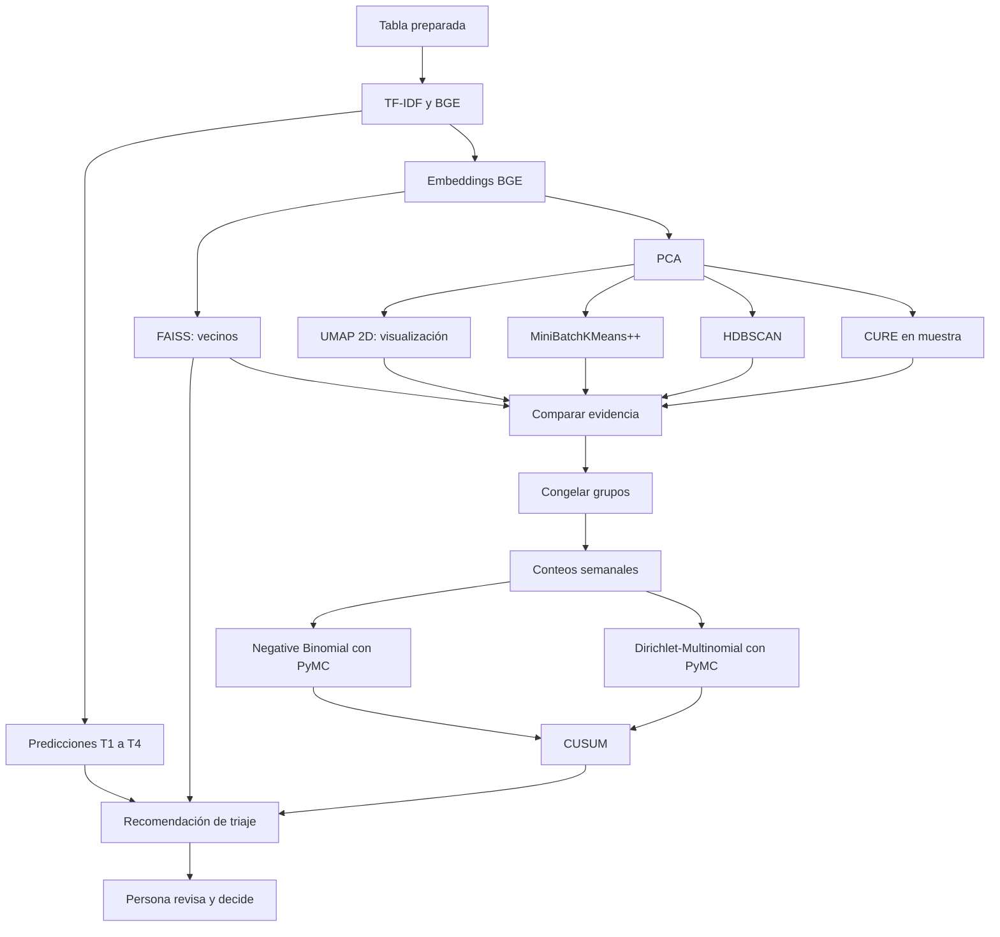

# Triaje de reclamos — rama Modeling

Esta rama nace de `EDA/pipaber` después de completar E0–E10 y P1–P5. Puede
avanzar mientras el pull request de EDA hacia `develop` está en revisión.

## Objetivo

Construir un prototipo reproducible que ayude a una persona a:

- sugerir el motivo de un reclamo;
- estimar resultados históricos registrados por CFPB;
- encontrar reclamos con significado parecido;
- identificar patrones semánticos cuyo volumen o proporción aumenta;
- revisar la evidencia antes de tomar una decisión de triaje.

No afirmaremos detectar fraude confirmado, pérdidas económicas, resolución
bancaria ni el plazo interno de 15 días. Esas etiquetas no están disponibles.

## Entrada aprobada

- Archivo: `data/processed/prepared.parquet`.
- Filas: 3,837,184.
- Columnas: 44.
- Versionamiento de datos: DVC.
- Entrenamiento: `train_2023_2024`.
- Validación temporal: `validation_2025_h1`.
- `holdout_2025_h2`: bloqueado porque no se recuperaron los IDs revisados.
- `ood_2026_partial`: solo podrá usarse para estudiar T1 después de congelar el
  modelo; T2–T4 permanecen bloqueados.

## Objetivos

- **T1 — Motivo:** motivo canónico más probable.
- **T2 — Relief registrado:** compensación monetaria o no monetaria registrada.
- **T3 — Relief monetario:** compensación monetaria registrada.
- **T4 — Respuesta no oportuna:** `Timely response? = No` según CFPB.
- **A1 — Patrón emergente:** grupo semántico cuyo comportamiento temporal merece
  revisión.

## Herramientas y responsabilidades

<!-- markdownlint-disable MD013 -->

| Herramienta | Responsabilidad |
| --- | --- |
| Git | Código, configuración y documentación |
| DVC | Datos, embeddings, índices y otros artefactos grandes |
| MLflow | Parámetros, métricas, gráficos, modelos y comparación de experimentos |
| PyMC | Modelos probabilísticos de volumen y composición temporal |
| HPC con A100 | Embeddings BGE y tareas que demuestren beneficio al usar GPU |

<!-- markdownlint-enable MD013 -->

MLflow será obligatorio desde el primer baseline. Cada ejecución registrará,
como mínimo, el commit Git, hash DVC de los datos, objetivo, periodo, variables,
semilla, parámetros y métricas. Las credenciales y direcciones privadas se
configurarán mediante variables de entorno; no se guardarán en Git.

DVC y MLflow tendrán funciones distintas. DVC conservará los datos grandes y
MLflow permitirá comparar cómo se obtuvo cada resultado sin duplicar el
conjunto completo de reclamos.

## Plan de modelado

- [x] **M0 — Verificar la entrega:** revisar DVC, esquema y periodos; confirmar
  objetivos y restricciones antes de entrenar.
- [x] **M1 — Preparar experimentos:** configurar MLflow, semillas y ejecución
  reproducible local y en HPC.
- [x] **M2 — Congelar la evaluación:** definir el corte interno de calibración,
  las métricas y las vistas completa y sin texto compartido.
- [x] **M3 — Crear referencias simples:** comparar contra frecuencias globales y
  reglas basadas en producto.
- [x] **M4 — Entrenar TF-IDF:** evaluar modelos lineales para T1–T4.
- [x] **M5 — Evaluar BGE:** generar una muestra en la A100 y compararla con
  TF-IDF sobre las mismas filas.
- [ ] **M6 — Preparar el espacio semántico:** reutilizar los embeddings de M5,
  ajustar PCA con la muestra del periodo de ajuste, crear una visualización UMAP
  y validar vecinos con FAISS.
- [ ] **M7 — Comparar métodos de clustering:** evaluar MiniBatchKMeans con
  inicialización k-means++, HDBSCAN y CURE sobre la misma muestra. Comparar
  silhouette, estabilidad, coherencia, ruido, costo y asignación futura.
- [ ] **M8 — Congelar patrones y crear series:** elegir el método, fijar sus
  grupos, generar solo los embeddings faltantes, asignar el corpus elegible y
  construir conteos semanales completos.
- [ ] **M9 — Modelar volumen con PyMC:** usar Negative Binomial para estimar el
  conteo esperado y su incertidumbre.
- [ ] **M10 — Modelar composición con PyMC:** usar Dirichlet-Multinomial para
  comprobar cambios relativos entre patrones.
- [ ] **M11 — Detectar cambios persistentes:** calibrar CUSUM sobre las
  diferencias entre lo observado y lo esperado.
- [ ] **M12 — Integrar el triaje:** combinar predicciones, vecinos y alertas para
  revisión humana.

## Plan semántico M6–M8

PCA, UMAP y clustering tienen responsabilidades distintas:

- **PCA:** reduce dimensiones y ruido antes de comparar los métodos.
- **UMAP 2D:** permite visualizar una muestra; no decide por sí solo los grupos.
- **FAISS:** recupera reclamos históricos cercanos y ayuda a medir novedad.
- **Clustering:** crea los grupos que después se contarán por semana.

M6 reutilizará los 240,000 embeddings de M5: 120,000 de ajuste, 40,000 de
calibración y 80,000 de validación. No volverá a ejecutar BGE sobre esas filas.
PCA y UMAP se ajustarán solo con las 120,000 filas de ajuste y luego
transformarán los periodos posteriores. UMAP 2D se usará para visualización. Si
HDBSCAN necesita una reducción adicional, se comparará PCA
solo contra PCA más UMAP de varias dimensiones; no se usará el gráfico 2D como
única entrada del clustering.

M7 comparará los métodos sobre las mismas filas, representación y semilla:

| Evidencia | Qué revisa |
| --- | --- |
| Silhouette y su gráfico | Separación de cada grupo; cerca de 1 es mejor, 0 indica solapamiento y valores negativos sugieren asignaciones dudosas |
| Estabilidad | Si grupos parecidos reaparecen al cambiar la muestra o semilla |
| Tamaños y ruido | Grupos gigantes, grupos demasiado pequeños y porcentaje sin asignar |
| Coherencia semántica | Si ejemplos y términos representativos describen un problema común |
| Plantillas | Si un grupo existe por significado o por narrativas repetidas |
| Costo | Tiempo, memoria y posibilidad de usar CPU o A100 |
| Asignación futura | Cómo recibirá un grupo un reclamo que llegue después |

El silhouette se calculará sobre una muestra fija porque hacerlo sobre millones
de filas es costoso. No será el único criterio: favorece grupos compactos y
puede evaluar injustamente las formas irregulares que busca HDBSCAN o CURE.

La comparación tendrá tres candidatos:

- **MiniBatchKMeans con k-means++:** referencia escalable que asigna todos los
  reclamos.
- **HDBSCAN:** candidato que permite grupos de distinta densidad y casos sin
  asignar.
- **CURE:** comparación sobre una muestra; solo continuará si su implementación
  puede escalar y asignar reclamos futuros de forma reproducible.

Antes de ejecutar M6–M7 se guardarán en configuración:

- IDs y hash DVC de la muestra común;
- número de componentes PCA y varianza conservada;
- semilla y parámetros de UMAP;
- valores de `k` probados por MiniBatchKMeans;
- tamaños mínimos probados por HDBSCAN;
- número de grupos, representantes y contracción probados por CURE;
- distancia usada para vecinos, clustering y silhouette.

Cada ejecución registrará en MLflow el gráfico de varianza PCA, UMAP 2D,
silhouette, distribución de tamaños, porcentaje de ruido, ejemplos y términos
por grupo, tiempo y memoria. Para HDBSCAN, el silhouette se calculará sobre los
casos asignados y el ruido se reportará por separado. Los parámetros se elegirán
con ajuste y calibración; validación no se usará para modificarlos.

M8 congelará el método elegido antes de usar periodos posteriores. Recién en
esa etapa se generarán por bloques los embeddings que falten para asignar todos
los reclamos elegibles. La tabla semanal incluirá `week`, `cluster_id`,
`complaint_count`,
`unique_text_count`, `weekly_total` y `proportion`. También completará con cero
las semanas sin casos para no confundir ausencia con datos faltantes. Los
conteos se construirán con todos los reclamos elegibles, no con la muestra de
M5.

## Contrato de ejecución M1

`configs/modeling.yaml` define la semilla y las rutas comunes. Cada ejecución
crea un registro pequeño con:

- commit Git y hash DVC;
- objetivo, periodo y vista evaluada;
- variables de entrada y semilla;
- ejecución local o en Khipu;
- parámetros, métricas y artefactos.

Un **artefacto** es un archivo producido por una ejecución, por ejemplo un
gráfico o una tabla de resultados. MLflow guardará los artefactos pequeños. DVC
guardará los archivos grandes, como embeddings o índices FAISS.

Los nodos SLURM de Khipu no tienen internet. Allí se crea primero un registro
JSON en `reports/modeling/runs/`. Después, desde el nodo de acceso, se publica
en MLflow con `src/evaluation/publish_run.py`. Las credenciales permanecen en
`.env` y `.dvc/config.local`; ninguno de esos archivos se versiona.

## Contrato de evaluación M2

Los periodos quedan fijados antes de entrenar:

- **Ajuste:** 2023-01-01 a 2024-09-30; el modelo aprende aquí.
- **Calibración:** 2024-10-01 a 2024-12-31; aquí se eligen parámetros y el
  umbral de decisión.
- **Validación temporal:** 2025-01-01 a 2025-06-30; mide el comportamiento en
  datos posteriores.

Un **umbral** es el punto desde el cual una probabilidad se convierte en una
predicción positiva. Para T2–T4 se elegirá en calibración el umbral que maximice
F1, que equilibra precisión y cobertura. Después permanecerá fijo en
validación.

Se reportarán dos vistas del mismo modelo:

- **Completa:** incluye todos los casos elegibles.
- **Sin texto compartido:** excluye de cada evaluación las narrativas que ya
  aparecieron en periodos usados para aprender.

La vista sin texto compartido será la principal para elegir modelos, porque
reduce el beneficio artificial de memorizar plantillas. Conservamos la vista
completa porque las plantillas también existen en la operación real. El corte
deja 1,067,194 filas para ajuste, 167,973 para calibración sin texto compartido
y 564,813 para validación sin texto compartido.

T1 conserva 90 motivos en ajuste y no aparecen motivos nuevos en calibración o
validación. Sin embargo, algunos motivos tienen muy pocos ejemplos. Sus
resultados individuales se mostrarán como evidencia descriptiva, no como una
estimación estable.

Las métricas quedan definidas así:

- **Macro-F1 (T1):** calcula F1 por motivo y da el mismo peso a cada motivo.
- **Top-3 (T1):** revisa si el motivo correcto aparece entre tres sugerencias.
- **Average precision o precisión promedio (T2–T4):** resume la relación entre
  precisión y cobertura; es más útil que el porcentaje total de aciertos cuando
  hay pocos positivos.
- **Precisión:** de los casos marcados positivos, cuántos eran positivos.
- **Cobertura o recall:** de los positivos reales, cuántos encontró el modelo.
- **Brier score:** mide el error de las probabilidades; un valor menor es mejor.

Las entradas iniciales serán la narrativa normalizada y el producto canónico.
Empresa, estado y fecha quedan como candidatos que deberán demostrar valor. Se
excluyen `Issue`, respuestas de la empresa y cualquier resultado T1–T4 porque
revelarían lo que intentamos predecir.

El detalle reproducible está en
`reports/modeling/evaluation_contract.json`. Seguimos sin tener un test final
intacto: 2025-H1 es validación temporal del prototipo, mientras 2025-H2 y 2026
no se usarán para elegir modelos.

## Resultados de las referencias M3

M3 compara dos referencias que no leen la narrativa:

- **Frecuencia global:** siempre usa el resultado más común del ajuste.
- **Frecuencia por producto:** usa el resultado histórico más común dentro de
  cada producto.

La segunda se parece a una regla sencilla de call center, pero no representa
las reglas privadas de un banco. Fue aprendida únicamente de las frecuencias
CFPB disponibles.

En la validación sin texto compartido, la regla por producto obtuvo:

| Objetivo | Resultado principal |
| --- | ---: |
| T1 — Macro-F1 | 0.0684 |
| T1 — motivo correcto en top-3 | 90.98% |
| T2 — precisión promedio | 0.4509 |
| T3 — precisión promedio | 0.1272 |
| T4 — precisión promedio | 0.1208 |

Para T1, el producto reduce mucho las opciones, pero elegir solo el motivo más
frecuente produce Macro-F1 bajo. Esto justifica probar la narrativa para ordenar
mejor los motivos dentro de cada producto.

Para T3, la regla por producto alcanza 11.82% de precisión y 80.49% de
cobertura en el umbral fijado. Para T4 alcanza 18.35% de precisión y 41.38% de
cobertura. Son referencias útiles, pero aún generan falsos positivos o pierden
casos. Los modelos de texto deberán mejorar este equilibrio y no solo superar
la frecuencia global.

Los resultados completos están en `reports/modeling/baseline_results.json` y
el detalle de T1 por motivo está en
`reports/modeling/baseline_t1_per_class.csv`.

## Resultados de TF-IDF M4

**TF-IDF** representa una narrativa mediante la importancia de sus palabras y
pares de palabras. El modelo M4 combina esa representación con el producto y
usa un clasificador lineal. Un clasificador lineal suma evidencia a favor o en
contra de cada resultado sin construir una red neuronal.

En la validación sin texto compartido:

| Objetivo | Regla por producto | TF-IDF + producto | Decisión |
| --- | ---: | ---: | --- |
| T1 — Macro-F1 | 0.0684 | 0.1984 | Conservar TF-IDF |
| T1 — top-3 | 90.98% | 95.92% | Conservar TF-IDF |
| T2 — precisión promedio | 0.4509 | 0.5744 | Conservar TF-IDF |
| T3 — precisión promedio | 0.1272 | 0.2904 | Conservar TF-IDF |
| T4 — precisión promedio | 0.1208 | 0.0781 | Conservar regla por producto |

La narrativa aporta valor claro para T1–T3. En T3, TF-IDF alcanza 21.49% de
precisión y 54.89% de cobertura, frente a 11.82% y 80.49% de la regla por
producto. Reduce falsos positivos, pero también encuentra menos positivos; la
capacidad real de revisión deberá decidir qué equilibrio conviene.

T4 muestra inestabilidad temporal: TF-IDF superó a la regla por producto en
calibración, pero quedó por debajo en 2025-H1. No promoveremos ese modelo. El
resultado no prueba la causa del cambio; indica que la relación entre palabras
y respuesta no oportuna no fue estable en el periodo posterior.

Los modelos convergieron y se guardaron con DVC:

- Ruta: `artifacts/models/tfidf`.
- Hash DVC: `94536b940d1546580c62b80078e2bbfc.dir`.
- Tamaño: 105,258,065 bytes.
- Ejecución SLURM: 9 minutos 9 segundos y aproximadamente 11.9 GiB de memoria.

Los resultados completos están en `reports/modeling/tfidf_results.json` y el
detalle de T1 por motivo en `reports/modeling/tfidf_t1_per_class.csv`.

## Resultados de BGE M5

**BGE** convierte cada narrativa en un embedding: una lista de números que
representa su significado. M5 comparó BGE y TF-IDF sobre exactamente la misma
muestra temporal:

- 120,000 filas de ajuste;
- 40,000 filas de calibración;
- 80,000 filas de validación.

En la validación sin texto compartido:

| Objetivo | TF-IDF + producto | BGE + producto | Decisión |
| --- | ---: | ---: | --- |
| T1 — Macro-F1 | 0.1968 | **0.2367** | Conservar BGE como candidato |
| T2 — precisión promedio | 0.5662 | 0.5666 | Conservar TF-IDF por simplicidad |
| T3 — precisión promedio | **0.2640** | 0.2576 | Conservar TF-IDF |
| T4 — precisión promedio | **0.0791** | 0.0624 | Conservar regla por producto de M3 |

BGE aporta una mejora clara para sugerir el motivo T1. Para T2 la diferencia es
menor a 0.001 y no justifica usar una representación más costosa. BGE tampoco
mejora T3 ni T4. Por tanto, el prototipo no usará el mismo modelo para todos los
objetivos.

BGE seguirá siendo necesario en M6 para buscar reclamos con significado parecido
y crear grupos semánticos. Ese uso es distinto de predecir T1–T4: una
representación puede aportar buenos vecinos aunque no mejore una clasificación.

Los clasificadores convergieron. BGE-T3 necesitó 38 iteraciones y BGE-T4, 63. El
artefacto quedó registrado con DVC:

- Ruta: `artifacts/models/bge_sample`.
- Hash DVC: `009e3b35e25d9df095cf753e0a05f041.dir`.
- Tamaño: 1,090,649,311 bytes.
- Modelo: `BAAI/bge-large-en-v1.5`, revisión
  `d4aa6901d3a41ba39fb536a557fa166f842b0e09`.

La A100 generó los embeddings iniciales en 29 minutos 56 segundos. La repetición
de los clasificadores reutilizó esos embeddings y terminó en CPU en 4 minutos
19 segundos. Los ocho runs de comparación están publicados en MLflow y el
reporte completo está en `reports/modeling/bge_sample_results.json`.

## Orden de comparación

Dirichlet-Multinomial no creará los grupos. Recibirá grupos ya definidos y
comprobará si cambió su proporción conjunta. Negative Binomial medirá si el
volumen absoluto de un grupo es mayor de lo esperado.

## Evaluación

- T1: Macro-F1, top-3 y resultados por motivo.
- T2–T4: precisión promedio, precisión, cobertura y Brier score.
- Clustering: silhouette en muestra, estabilidad, tamaños, ruido, coherencia,
  tiempo y memoria.
- Patrones temporales: falsas alertas por semana, tiempo de detección y revisión
  de ejemplos.
- Todas las comparaciones usarán las mismas filas y periodos.
- La vista sin texto compartido excluirá narrativas vistas en periodos usados
  como referencia.

No existe un conjunto final intacto: 2025-H1 servirá para validación temporal y
2025-H2 está bloqueado. Los resultados se presentarán como validación de un
prototipo, no como rendimiento final garantizado.

## MLflow y PyMC

Los modelos PyMC requieren registrar más que una sola métrica. Cada ejecución
guardará en MLflow:

- fórmula y variables del modelo;
- priors, que son los supuestos iniciales de las distribuciones;
- número de cadenas, muestras y calentamiento;
- `R-hat`, tamaño efectivo de muestra y divergencias;
- revisión predictiva posterior;
- métricas del backtest temporal;
- resumen de las distribuciones estimadas.

La primera versión usará registro manual para que el código no dependa de una
integración específica entre MLflow y PyMC. Solo construiremos un adaptador
adicional si reduce trabajo real.

## Uso del HPC y la A100

- Los baselines pequeños se validarán localmente.
- La A100 se usará para BGE y, si aporta valor, FAISS con GPU.
- PyMC empezará con una implementación clara y verificable.
- Se probará el backend JAX/NumPyro en la A100 solo si mantiene los mismos
  resultados y mejora el tiempo de muestreo.
- Antes de ejecutar el corpus completo se medirá una muestra y se registrará el
  consumo de tiempo y memoria en MLflow.

Khipu usa SLURM. Los scripts reproducibles y sus instrucciones están en
`scripts/hpc/`.

## Forma de trabajo

1. Empezar por la comparación más simple.
2. Cambiar una decisión experimental a la vez.
3. Registrar cada experimento en MLflow.
4. No consultar H2 ni usar 2026 para escoger modelos.
5. Versionar artefactos grandes con DVC.
6. Ejecutar primero una muestra antes de usar el corpus completo o la A100.
7. No promover un modelo complejo si no demuestra valor.
8. Revisar cada etapa antes de continuar.

## Documentos relacionados

- [Resumen del EDA](docs/resumen-eda.md).
- [Propuesta detallada de modelos](docs/modelos.md).
- [Notebook de preparación](notebooks/02_revision_preparacion.ipynb).
- [Notebook de modelos base](notebooks/03_modelos_base.ipynb).
- [Notebook de comparación BGE](notebooks/04_bge.ipynb).

## Criterio para cerrar esta rama

La rama terminará con:

- experimentos reproducibles y comparables en MLflow;
- modelos evaluados temporalmente;
- artefactos grandes versionados con DVC;
- vecinos y patrones semánticos revisables;
- alertas temporales con incertidumbre explícita;
- límites documentados y decisión humana final.
