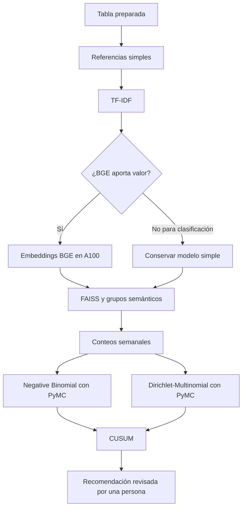

# Triaje de reclamos — rama Modeling

Esta rama nace de `EDA/pipaber` después de completar E0–E10 y P1–P5. Puede
avanzar mientras el pull request de EDA hacia `develop` está en revisión.

## Objetivo

Construir un prototipo reproducible que ayude a una persona a:

- sugerir el motivo de un reclamo;
- estimar resultados históricos registrados por CFPB;
- encontrar reclamos con significado parecido;
- identificar patrones semánticos cuyo volumen o proporción aumenta;
- revisar la evidencia antes de tomar una decisión de triaje.

No afirmaremos detectar fraude confirmado, pérdidas económicas, resolución
bancaria ni el plazo interno de 15 días. Esas etiquetas no están disponibles.

## Entrada aprobada

- Archivo: `data/processed/prepared.parquet`.
- Filas: 3,837,184.
- Columnas: 44.
- Versionamiento de datos: DVC.
- Entrenamiento: `train_2023_2024`.
- Validación temporal: `validation_2025_h1`.
- `holdout_2025_h2`: bloqueado porque no se recuperaron los IDs revisados.
- `ood_2026_partial`: solo podrá usarse para estudiar T1 después de congelar el
  modelo; T2–T4 permanecen bloqueados.

## Objetivos

- **T1 — Motivo:** motivo canónico más probable.
- **T2 — Relief registrado:** compensación monetaria o no monetaria registrada.
- **T3 — Relief monetario:** compensación monetaria registrada.
- **T4 — Respuesta no oportuna:** `Timely response? = No` según CFPB.
- **A1 — Patrón emergente:** grupo semántico cuyo comportamiento temporal merece
  revisión.

## Herramientas y responsabilidades

<!-- markdownlint-disable MD013 -->

| Herramienta | Responsabilidad |
| --- | --- |
| Git | Código, configuración y documentación |
| DVC | Datos, embeddings, índices y otros artefactos grandes |
| MLflow | Parámetros, métricas, gráficos, modelos y comparación de experimentos |
| PyMC | Modelos probabilísticos de volumen y composición temporal |
| HPC con A100 | Embeddings BGE y tareas que demuestren beneficio al usar GPU |

<!-- markdownlint-enable MD013 -->

MLflow será obligatorio desde el primer baseline. Cada ejecución registrará,
como mínimo, el commit Git, hash DVC de los datos, objetivo, periodo, variables,
semilla, parámetros y métricas. Las credenciales y direcciones privadas se
configurarán mediante variables de entorno; no se guardarán en Git.

DVC y MLflow tendrán funciones distintas. DVC conservará los datos grandes y
MLflow permitirá comparar cómo se obtuvo cada resultado sin duplicar el
conjunto completo de reclamos.

## Plan de modelado

- [ ] **M0 — Verificar la entrega:** revisar DVC, esquema y periodos; confirmar
  objetivos y restricciones antes de entrenar.
- [ ] **M1 — Preparar experimentos:** configurar MLflow, semillas y ejecución
  reproducible local y en HPC.
- [ ] **M2 — Congelar la evaluación:** definir el corte interno de calibración,
  las métricas y las vistas completa y sin texto compartido.
- [ ] **M3 — Crear referencias simples:** comparar contra frecuencias globales y
  reglas basadas en producto.
- [ ] **M4 — Entrenar TF-IDF:** evaluar modelos lineales para T1–T4.
- [ ] **M5 — Evaluar BGE:** generar una muestra en la A100 y compararla con
  TF-IDF sobre las mismas filas.
- [ ] **M6 — Buscar patrones semánticos:** crear vecinos FAISS, grupos y una
  medida de novedad.
- [ ] **M7 — Crear series semanales:** congelar grupos y construir conteos sin
  consultar periodos futuros.
- [ ] **M8 — Modelar volumen con PyMC:** usar Negative Binomial y revisar su
  incertidumbre y diagnóstico de muestreo.
- [ ] **M9 — Modelar composición y cambio:** usar Dirichlet-Multinomial como
  comprobación y CUSUM para cambios persistentes.
- [ ] **M10 — Integrar el triaje:** combinar predicciones, vecinos y alertas para
  revisión humana.

## Orden de comparación

Dirichlet-Multinomial no creará los grupos. Recibirá grupos ya definidos y
comprobará si cambió su proporción conjunta. Negative Binomial medirá si el
volumen absoluto de un grupo es mayor de lo esperado.

## Evaluación

- T1: Macro-F1, top-3 y resultados por motivo.
- T2–T4: PR-AUC, precisión, cobertura y calibración.
- Patrones: falsas alertas por semana, tiempo de detección, estabilidad y
  revisión de ejemplos.
- Todas las comparaciones usarán las mismas filas y periodos.
- La vista sin texto compartido excluirá narrativas vistas en periodos usados
  como referencia.

No existe un conjunto final intacto: 2025-H1 servirá para validación temporal y
2025-H2 está bloqueado. Los resultados se presentarán como validación de un
prototipo, no como rendimiento final garantizado.

## MLflow y PyMC

Los modelos PyMC requieren registrar más que una sola métrica. Cada ejecución
guardará en MLflow:

- fórmula y variables del modelo;
- priors, que son los supuestos iniciales de las distribuciones;
- número de cadenas, muestras y calentamiento;
- `R-hat`, tamaño efectivo de muestra y divergencias;
- revisión predictiva posterior;
- métricas del backtest temporal;
- resumen de las distribuciones estimadas.

La primera versión usará registro manual para que el código no dependa de una
integración específica entre MLflow y PyMC. Solo construiremos un adaptador
adicional si reduce trabajo real.

## Uso del HPC y la A100

- Los baselines pequeños se validarán localmente.
- La A100 se usará para BGE y, si aporta valor, FAISS con GPU.
- PyMC empezará con una implementación clara y verificable.
- Se probará el backend JAX/NumPyro en la A100 solo si mantiene los mismos
  resultados y mejora el tiempo de muestreo.
- Antes de ejecutar el corpus completo se medirá una muestra y se registrará el
  consumo de tiempo y memoria en MLflow.

No se asumirán comandos del scheduler del HPC hasta verificar si usa SLURM u
otro sistema.

## Forma de trabajo

1. Empezar por la comparación más simple.
2. Cambiar una decisión experimental a la vez.
3. Registrar cada experimento en MLflow.
4. No consultar H2 ni usar 2026 para escoger modelos.
5. Versionar artefactos grandes con DVC.
6. Ejecutar primero una muestra antes de usar el corpus completo o la A100.
7. No promover un modelo complejo si no demuestra valor.
8. Revisar y aprobar cada etapa antes de continuar.

## Documentos relacionados

- [Resumen del EDA](docs/resumen-eda.md).
- [Propuesta detallada de modelos](docs/modelos.md).
- [Notebook de preparación](notebooks/02_revision_preparacion.ipynb).

## Criterio para cerrar esta rama

La rama terminará con:

- experimentos reproducibles y comparables en MLflow;
- modelos evaluados temporalmente;
- artefactos grandes versionados con DVC;
- vecinos y patrones semánticos revisables;
- alertas temporales con incertidumbre explícita;
- límites documentados y decisión humana final.
