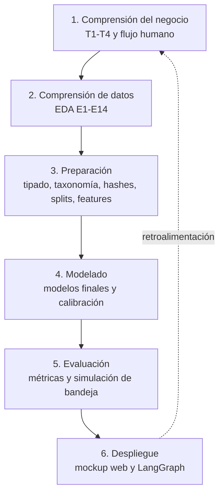
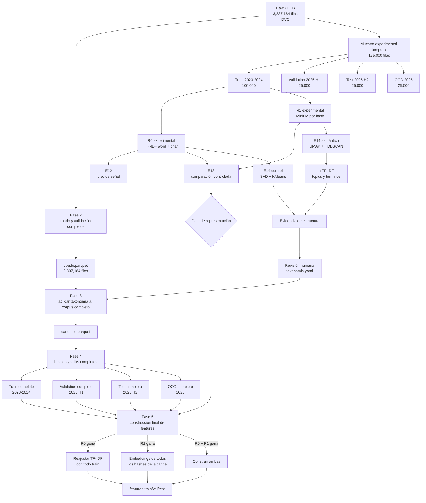
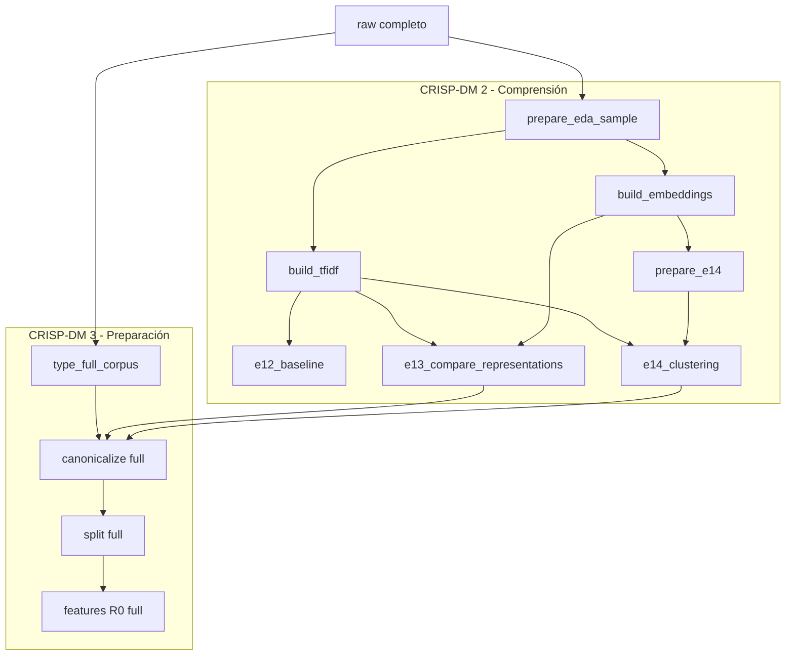
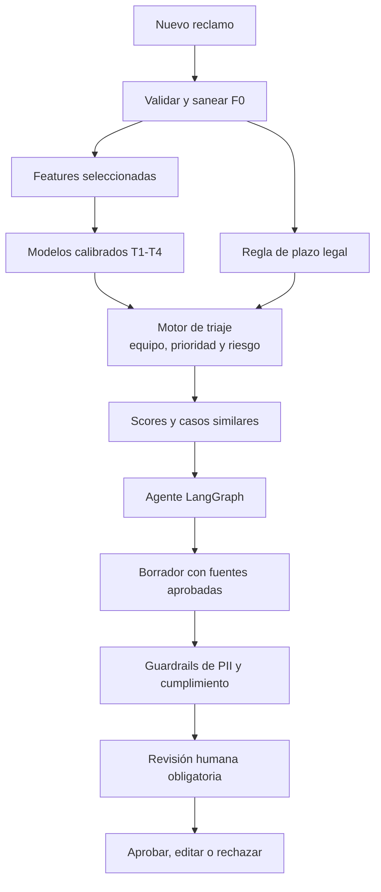

# Triaje automático de reclamos financieros

Sistema de apoyo para clasificar, priorizar y gestionar reclamos financieros a partir de la
información disponible cuando ingresa un caso. El proyecto usa reclamos públicos del
**Consumer Financial Protection Bureau (CFPB)** como proxy y sigue **CRISP-DM** para separar
comprensión, preparación, modelado y despliegue.

> **Resumen para revisión rápida:** el raw completo contiene **3,837,184 reclamos**. La etapa
> 2 de CRISP-DM está cerrada con E1–E14 completos. El gate E13 selecciona TF-IDF R0 como
> representación predictiva principal; MiniLM R1 se conserva para topics, recuperación y
> challengers. El tipado completo ya inició la etapa 3. La muestra de 175k permitió decidir,
> pero no reemplaza las features finales sobre el corpus completo de modelado.

## 1. Valor para el negocio

Al recibir un reclamo, un banco necesita decidir rápidamente quién debe atenderlo, qué casos
requieren revisión prioritaria y cuánto tiempo queda para responder. El sistema propone cuatro
señales, pero mantiene la decisión final en una persona:

| Target | Pregunta | Uso operativo |
|---|---|---|
| **T1** | ¿Cuál es el motivo probable? | Enrutamiento y top-3 de equipos sugeridos |
| **T2** | ¿Cuál es la probabilidad de *relief* registrado? | Priorización como proxy de complejidad |
| **T3** | ¿Cuál es la probabilidad de *relief* monetario? | Ranking de riesgo monetario; no predice monto |
| **T4** | ¿Cuál es el riesgo histórico de respuesta tardía? | Complemento del semáforo de plazo |

T4 no sustituye la regla de vencimiento: el semáforo combina el score predictivo con fecha
límite y días restantes. El dataset no contiene el monto pagado, por lo que T3 no puede estimar
costo económico.

## 2. Estado del proyecto en CRISP-DM



| Etapa CRISP-DM | Estado | Evidencia principal |
|---|---|---|
| 1. Comprensión del negocio | Completada para Informe I | T1–T4, F0/F1/FX y arquitectura humana |
| 2. Comprensión de datos | **Completada** | E1–E14 reproducibles; R0 seleccionado por E13 |
| 3. Preparación | En curso | Tipado completo; taxonomía, splits y features R0 finales pendientes |
| 4. Modelado | No iniciado formalmente | E12 es una sonda diagnóstica, no selección final |
| 5. Evaluación | Diseñada | Split temporal, vista purgada, calibración y métricas de capacidad |
| 6. Despliegue | Diseñado | Streamlit/LangGraph, todavía fuera del Informe I |

El **Informe I** cubre EDA y creación/auditoría de features. La optimización de modelos y la
app pertenecen a entregables posteriores.

## 3. Datos y contrato anti-fuga

El raw contiene 3,837,184 reclamos con narrativa. Está versionado con DVC y nunca se modifica
manualmente.

| Tier | Cuándo existe | Uso permitido |
|---|---|---|
| **F0** | Al ingresar el reclamo | Features desplegables |
| **F1** | Taxonomía histórica CFPB | Etiqueta/diagnóstico; no feature en producción |
| **FX** | Después de gestionar el caso | Targets y evaluación; nunca features |

Ejemplos F1: `Product`, `Issue`. Ejemplos FX: `Company response to consumer`,
`Timely response?`, `Date sent to company`. Usarlos como predictores produciría fuga porque
no se conocen al momento del triaje.

### Resultado del tipado completo

`data/interim/tipado.parquet` contiene **todas las 3,837,184 filas**, no una muestra:

- fechas en `timestamp[ns]` e ID en `int64` único;
- categorías y dominios validados;
- `Tags` convertido en `is_servicemember` e `is_older_adult`;
- nulos informativos con flags explícitos;
- targets T1–T4 derivados y auditados;
- memoria no-texto de 1,470.6 MiB a 227.2 MiB al aplicar categorías: **−84.55%**;
- Parquet Zstandard de 750.17 MiB, publicado en DVC.

## 4. Grafo de transformación de datos

La rama de muestra sirve para experimentar. Sus resultados vuelven al corpus completo como
**decisiones**, no como un dataset final de entrenamiento.



### Muestra frente a corpus completo

```text
Muestra de 175k
    → E12-E14, comparación de costo/señal y decisión de representación

Corpus completo dentro del régimen de modelado
    → taxonomía, hashes, splits y features definitivas
```

Si gana R0, el vocabulario y el IDF se reajustan exclusivamente con **todo el train completo**.
Si gana R1, MiniLM se ejecuta para **todos los hashes únicos** del corpus en alcance; los hashes
ya calculados en la muestra se reutilizan.

Los datos anteriores a 2023 se conservan para análisis histórico. El modelo principal usa
2023–2025; 2026 se mantiene separado como prueba OOD.

## 5. ¿Qué es OOD 2026?

**OOD** significa *Out Of Distribution*. En 2026 cambian fuertemente las prevalencias de T2,
T3 y T4, lo que indica otro proceso generador.

- No se mezcla con train, validation ni test principal.
- No se usa para elegir features, hiperparámetros o umbrales.
- Se aplica al final como prueba de estrés ante deriva.

## 6. Representaciones y experimentos E12–E14

### R0 — TF-IDF

TF-IDF de palabras y caracteres ajustado solo con train. La matriz experimental actual tiene
175,000 filas, 248,473 columnas sparse y está almacenada como `.npz` en DVC.

### R1 — MiniLM local

`sentence-transformers/all-MiniLM-L6-v2`, fijado a una revisión específica. Se calculó una vez
por `hash_narrativa`:

- 129,363 textos únicos de la muestra;
- 384 dimensiones `float32` normalizadas;
- 189.5 MiB;
- procesamiento local, sin API ni costo por token.

El entorno CUDA ya reconoce una GTX 1650 mediante `torch 2.11.0+cu128`. El primer cache R1 se
generó en CPU y su manifiesto lo registra; las futuras codificaciones pueden usar GPU.

### E12 — piso de señal

Usa TF-IDF y modelos lineales escalables. No selecciona el modelo final. Reporta métricas
adecuadas al desbalance y dos vistas:

- **operacional:** permite plantillas recurrentes;
- **purgada:** excluye de evaluación hashes vistos en train.

### E13 — ¿aporta valor R1?

Comparó R0, R1 y R0+R1 sobre las mismas filas, splits y clasificador. R1 solo perdió frente a
R0 en T1–T3 y empató T4. La fusión mejoró modestamente T1, pero empeoró T2–T4 y aumentó
memoria. **Gate: R0 es la feature textual principal; R1 no se escala por defecto.**

### E14 — estructura latente

Se ajustó únicamente con 73,512 textos únicos de train:

1. control R0 → SVD → KMeans;
2. R1 → UMAP 10–15D → HDBSCAN;
3. c-TF-IDF para describir topics sin LLM;
4. estabilidad, ruido, pureza y ARI/NMI;
5. contraste con nombres de empresa enmascarados.

E14 aporta evidencia para proponer la taxonomía; nunca la cambia automáticamente.

## 7. ¿Qué significa deduplicar?

No significa borrar reclamos. Dos eventos pueden compartir una plantilla y tener personas,
empresas o resultados diferentes.

El hash normalizado se usa para:

1. calcular embeddings una sola vez;
2. evitar que plantillas masivas dominen E14;
3. detectar conflictos de producto/issue/targets;
4. medir memorización mediante la vista purgada.

## 8. Pipeline DVC implementado



| Etapa DVC | Salida | Estado |
|---|---|---|
| `type_full_corpus` | `tipado.parquet` + auditoría | Completa |
| `prepare_eda_sample` | muestra, hashes y conflictos | Completa |
| `build_tfidf` | matriz R0, índice y vectorizadores | Completa |
| `e12_baseline` | métricas y predicciones diagnósticas | Completa |
| `build_embeddings` | cache R1, índice y manifiesto | Completa |
| `e13_compare_representations` | gate R0/R1/R0+R1 | Completa |
| `prepare_e14` / `e14_clustering` | clusters, topics y estabilidad | Completa |
| `canonicalize/split/features` | artefactos completos R0 por split | Siguiente |

DVC versiona datos y matrices; Git versiona `dvc.yaml`, `dvc.lock`, `params.yaml`, código,
contratos y documentación.

## 9. Arquitectura futura del sistema



Los modelos y el LLM son componentes separados. LangGraph consume scores y fuentes para
redactar, pero no redefine etiquetas ni envía respuestas automáticamente.

## 10. Reproducibilidad

```bash
uv sync
dvc pull
uv run dvc repro
uv run quarto render reports/informe
```

Estructura principal:

```text
configs/             Contratos, taxonomía y parámetros
data/raw/            Fuente inmutable DVC
data/interim/        Tipado, taxonomía, hashes y splits
data/processed/      Matrices sparse, embeddings e índices
src/data/            Preparación y E14
src/features/        R0, R1 y ensamblado
src/models/          Sondas y modelos T1-T4
src/evaluation/      Métricas, calibración y cortes
reports/artefactos/  CSV pequeños para Quarto
reports/informe/     Informe reproducible
```

Para decisiones, riesgos y métricas detalladas consulta
[`docs/plan-eda-y-transformacion.md`](docs/plan-eda-y-transformacion.md).
