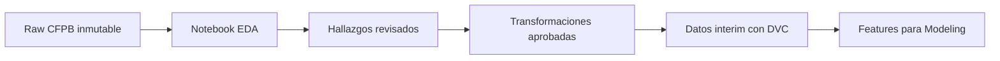

# Triaje de reclamos — rama EDA

Esta rama reconstruye el análisis exploratorio desde `develop` con un flujo simple, reproducible y fácil de revisar.

## Objetivo

Entender qué información contiene el dataset CFPB, qué problemas de calidad tiene y qué transformaciones están justificadas antes de crear modelos.

Esta rama no entrena modelos finales.

## Datos disponibles

- Fuente: Consumer Financial Protection Bureau (CFPB).
- Archivo raw: `data/raw/cfpb_reclamos_narrativa.parquet`.
- Tamaño registrado: 3,837,184 reclamos con narrativa.
- El raw es inmutable y está versionado con DVC.
- No contamos con datos internos de un banco, fraude confirmado, pérdidas ni tiempo bancario de resolución.

## Forma de trabajo

1. Cada paso se implementa de forma visible en `notebooks/01_eda.ipynb`.
2. El notebook se ejecuta de arriba hacia abajo y explica qué pregunta responde cada sección.
3. Solo extraeremos funciones a `src/` cuando exista reutilización real.
4. No avanzaremos al siguiente paso hasta revisar y aprobar el resultado.
5. Las transformaciones aprobadas se declararán en `dvc.yaml`.
6. Git versiona código y documentación; DVC versiona datos y artefactos pesados.

## Plan del EDA

- [ ] **E0 — Verificar el raw:** lectura, filas, columnas, memoria e identidad del archivo.
- [ ] **E1 — Revisar el esquema:** tipos, nulos, dominios y ejemplos.
- [ ] **E2 — Revisar el tiempo:** cobertura, volumen por periodo y 2026 parcial.
- [ ] **E3 — Revisar categorías:** producto, subproducto, issue, empresa y canal de envío.
- [ ] **E4 — Revisar respuestas:** respuesta de la empresa, respuesta oportuna y variables objetivo posibles.
- [ ] **E5 — Revisar narrativas:** longitud, vacíos, idioma aparente y calidad del texto.
- [ ] **E6 — Revisar repetidos:** IDs duplicados, textos idénticos y textos normalizados iguales.
- [ ] **E7 — Revisar desbalance:** frecuencia de las etiquetas candidatas.
- [ ] **E8 — Revisar cambios temporales:** diferencias entre entrenamiento, validación y periodos futuros.
- [ ] **E9 — Acordar transformaciones:** tipado, canonicalización, splits y features justificadas por el EDA.
- [ ] **E10 — Documentar conclusiones:** figuras, tablas, limitaciones y decisiones aprobadas.

## Flujo de datos previsto



La muestra puede usarse para iterar rápidamente, pero las transformaciones aprobadas deberán ejecutarse sobre el corpus completo.

## Git y DVC

Al comenzar una sesión:

```bash
git pull
uv sync
uv run dvc pull
```

Después de un paso aprobado:

```bash
uv run dvc repro
uv run dvc push
git add .
git commit -m "Document EDA step"
git push
```

El raw ya está rastreado mediante `data/raw/cfpb_reclamos_narrativa.parquet.dvc`. No debe agregarse directamente a Git.

## Criterio para cerrar esta rama

El EDA termina cuando podemos explicar con evidencia:

- qué datos tenemos y qué no tenemos;
- qué objetivos son proxies válidos;
- qué columnas pueden existir al recibir un reclamo nuevo;
- cómo se dividirán los periodos sin fuga temporal;
- qué transformaciones y features se crearán;
- qué limitaciones tendrá la interpretación del sistema.