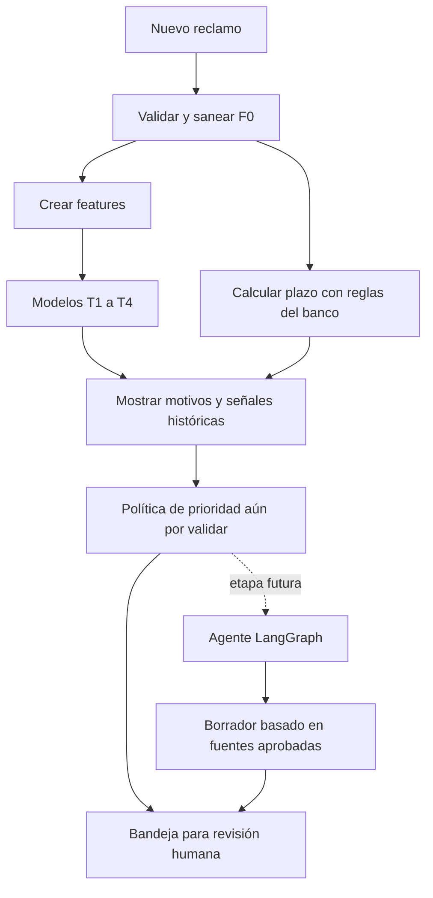
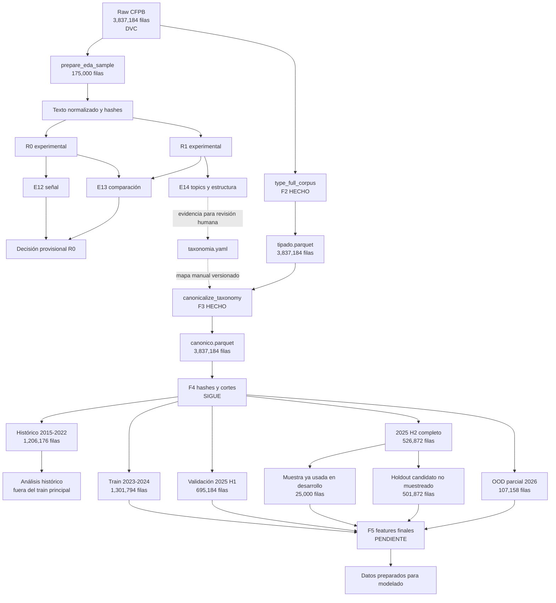

# Triaje automático de reclamos financieros

Proyecto para apoyar la clasificación y revisión de reclamos financieros con la información
disponible cuando entra un caso. Usa un snapshot entregado para el proyecto, basado en datos
públicos del **Consumer Financial Protection Bureau (CFPB)** y filtrado a reclamos con
narrativa.

> **Resumen ejecutivo:** el snapshot contiene **3,837,184 reclamos** entre marzo de 2015 y
> julio de 2026. El entendimiento de los datos está completo. El corpus ya fue tipado y
> canonicalizado sin eliminar filas. La taxonomía actual es un borrador que debe aprobar el
> negocio. Lo siguiente es crear los hashes, cortes temporales y features finales.

## 1. Diccionario del proyecto

Los códigos T, F, R, E y D son nombres internos de este proyecto; no son una nomenclatura
estándar de la industria.

### Qué queremos predecir

| Código | Significado |
|---|---|
| **T1** | Predice hasta tres **motivos canónicos** para revisión. Todavía no existe un mapa aprobado de motivo a equipo. |
| **T2** | Predice si la categoría final de CFPB registra explícitamente una solución o compensación (*relief*) monetaria o no monetaria. |
| **T3** | Predice si la categoría final registra una compensación monetaria. No predice el monto. |
| **T4** | Predice `Timely response? == "No"`. Es un proxy de respuesta no oportuna en CFPB, no un plazo legal bancario. |
| **Relief** | Resultado registrado por CFPB como compensación monetaria o no monetaria. No demuestra quién tenía razón ni mide la calidad de la solución. |

Convención de T2/T3: `Closed with explanation` se etiqueta 0; `Closed with monetary relief`
y `Closed with non-monetary relief` alimentan T2; solo la primera alimenta T3. `Closed` y
`Untimely response` se codifican 0 por convención, aunque son ambiguos. `In progress` y los
nulos se excluyen. E12 verificó que retirar los ambiguos cambia muy poco el resultado de T2.

### Qué información puede ver el modelo

| Código | Cuándo existe | Uso |
|---|---|---|
| **F0** | Al ingresar el reclamo | Puede crear features: narrativa, fecha, empresa, estado, código postal y tags. |
| **F1** | Taxonomía histórica de CFPB | Crea la etiqueta de T1 y sirve para análisis. No se asume disponible en un reclamo nuevo del banco. |
| **FX** | Después de gestionar el caso | Crea targets y permite evaluar. Nunca entra como feature. |

Ejemplos de F1: `Product`, `Sub-product`, `Issue` y `Sub-issue`. Ejemplos de FX:
`Company response to consumer`, `Company public response`, `Date sent to company` y
`Timely response?`.

La letra F también aparece en las fases técnicas:

| Fase | Significado |
|---|---|
| **F2** | Tipar y validar el corpus completo. |
| **F3** | Unir etiquetas históricas bajo una taxonomía estable. |
| **F4** | Crear hashes y cortes temporales sin borrar eventos. |
| **F5** | Construir las features finales con ajustes realizados solo en train. |

### Cómo representamos el texto

| Código | Significado |
|---|---|
| **R0** | TF-IDF (*term frequency–inverse document frequency*): pondera palabras y fragmentos de caracteres según su utilidad en el corpus. |
| **R1** | Embedding MiniLM local: convierte cada narrativa en 384 números que resumen similitud semántica. No usa un servicio externo pagado. |
| **Embedding** | Vector numérico que representa el significado aproximado de un texto. |
| **Topic** | Grupo de términos recurrentes que ayuda a describir un conjunto de narrativas. No es una etiqueta automática. |
| **UMAP 2D** | *Uniform Manifold Approximation and Projection*: proyección para visualizar embeddings en dos ejes. Comunica vecindades, pero no mide por sí sola la calidad. |

### Qué significan los experimentos E1–E14

| Código | Pregunta respondida |
|---|---|
| **E1** | ¿Qué tipos, nulos y tamaños tiene el raw? |
| **E2** | ¿Cómo cambia el volumen por mes? |
| **E3** | ¿Cómo cambian `Product` e `Issue` con el tiempo? |
| **E4** | ¿Qué tan concentradas están las clases? |
| **E5** | ¿Cuántas narrativas se repiten? |
| **E6** | ¿Qué calidad, longitud y enmascaramiento tiene el texto? |
| **E7** | ¿Qué empresas dominan los datos? |
| **E8** | ¿Qué calidad tiene la información geográfica? |
| **E9** | ¿Cómo cambian T2, T3 y T4 en el tiempo? |
| **E10** | ¿Qué variables están permitidas o prohibidas? Es el contrato F0/F1/FX; no genera un archivo propio. |
| **E11** | ¿Cambian los resultados por tags o estado aun controlando el producto? |
| **E12** | ¿Existe señal predictiva con un método simple? |
| **E13** | ¿R1 o R0+R1 mejoran a R0 bajo la misma comparación? |
| **E14** | ¿Qué subtemas aparecen y cuánto dependen de nombres de empresas? |

**D1–D6** son decisiones de diseño documentadas en el plan técnico: definición de targets,
disponibilidad de datos, periodo de modelado, cortes temporales, muestra y representación
del texto.

### Cómo evaluamos y reproducimos

| Término | Significado |
|---|---|
| **CRISP-DM** | *Cross-Industry Standard Process for Data Mining*: proceso que separa comprensión del negocio, comprensión de datos, preparación, modelado, evaluación y despliegue. |
| **EDA** | Análisis exploratorio: entender el dato antes de construir modelos finales. |
| **DVC** | *Data Version Control*: versiona archivos grandes y las transformaciones declaradas en `dvc.yaml`. |
| **Pipeline** | Secuencia reproducible que convierte una entrada en uno o más artefactos. |
| **Raw** | Snapshot original e inmutable del proyecto. |
| **Corpus** | Conjunto completo de reclamos. |
| **Feature** | Variable numérica que recibe un modelo. |
| **Target** | Resultado histórico que el modelo intenta predecir. |
| **Hash de narrativa** | Huella determinista del texto normalizado. Permite detectar textos iguales. |
| **Train** | Periodo usado para ajustar transformaciones y modelos: 2023–2024. |
| **Validación** | Periodo usado para decisiones de desarrollo: enero–junio de 2025. |
| **Test de desarrollo** | Julio–diciembre de 2025. El pipeline lo llama `test`, pero E12/E13 ya se analizaron sobre una muestra de este periodo; no es un holdout final intacto. |
| **Holdout final** | Candidato propuesto: eventos de 2025-H2 que no están en la muestra de 25,000 usada por E12/E13. F4 debe fijar sus IDs y hashes antes de modelar. |
| **OOD 2026 parcial** | *Out of distribution*: prueba de estrés del 1 de enero al 27 de julio de 2026. Su composición es distinta y no representa un año completo. |
| **Vista operacional** | Conserva narrativas recurrentes, como ocurriría en una bandeja real. |
| **Vista purgada** | Retira de la evaluación las narrativas ya vistas en train. |
| **Macro-F1** | Promedio del desempeño dando el mismo peso a cada clase. |
| **PR-AUC** | Área bajo la curva precisión–recall. Para un mismo target y corte temporal se compara con su porcentaje de positivos. No se compara directamente entre T2, T3 y T4. |
| **Calibración** | Verifica si una probabilidad anunciada se parece a la frecuencia observada. |
| **Canonicalizar** | Unir etiquetas históricas equivalentes bajo un nombre estable y versionado. |
| **LangGraph** | Herramienta propuesta para coordinar un futuro agente que redacte borradores; todavía no está implementado. |

## 2. Qué valor busca entregar

El proyecto aún no es una aplicación terminada. El objetivo es que, al llegar un reclamo, una
persona reciba:

1. hasta tres motivos sugeridos por T1;
2. probabilidades históricas de resultados CFPB mediante T2 y T3;
3. un proxy de respuesta no oportuna mediante T4;
4. la fecha límite calculada por reglas del banco;
5. en una etapa posterior, un borrador sustentado en políticas aprobadas.

T2, T3 y T4 son **señales**, no una política de prioridad demostrada. La prioridad final deberá
combinar plazos, capacidad, costos y criterios de equidad, y validarse con una simulación de
la bandeja. La asignación de motivos a equipos también requiere una regla de negocio aprobada.



### Límite de transferencia al banco

CFPB reúne muchas empresas y está dominado recientemente por burós de crédito. En un banco,
la empresa puede ser constante y el proceso de respuesta será diferente. Por ello:

- las probabilidades no deben interpretarse operacionalmente sin validación con datos del banco;
- `Company` y sus menciones en el texto deben probarse con y sin enmascaramiento;
- T4 debe compararse con las reglas y plazos reales de la institución.

## 3. Ruta de los datos

El raw abre dos caminos:

- **experimental:** una muestra permite elegir métodos con menor costo;
- **corpus completo:** conserva todas las filas y producirá los datos de modelado.

La muestra no se convierte en las features finales. Sus resultados solo aportan decisiones.
Las líneas punteadas del diagrama representan decisiones humanas, no dependencias automáticas
de DVC.



### Artefactos principales

| Archivo | Filas | Contenido | Estado |
|---|---:|---|---|
| `data/raw/cfpb_reclamos_narrativa.parquet` | 3,837,184 | Snapshot inmutable entregado para el proyecto | DVC |
| `data/interim/eda_sample.parquet` | 175,000 | Muestra temporal para E12–E14 | Completo |
| `data/interim/tipado.parquet` | 3,837,184 | Tipos, dominios y targets validados | Completo |
| `data/interim/canonico.parquet` | 3,837,184 | Producto y motivo canónicos, conservando etiquetas originales | Completo; mapa en revisión |
| `data/interim/split.parquet` | — | Hashes y cortes completos | Siguiente |
| `data/processed/features_*` | — | Features finales por corte | Pendiente |

## 4. Trabajo realizado y evidencia

### 4.1 Comprensión de datos

E1–E9 y E11–E14 tienen artefactos reproducibles. E10 quedó documentado como contrato
anti-fuga; su prueba automática se implementará en F5.

Hallazgos principales:

- El raw contiene 3,837,184 reclamos con narrativa y 16 columnas.
- Cerca de la mitad de los eventos recientes reutiliza una narrativa o plantilla.
- `Product` e `Issue` cambiaron de nombre a través del tiempo.
- Pocas clases concentran la mayor parte de los casos.
- Las menciones de empresa pueden ser un atajo engañoso para el texto.
- En 2026 cae el volumen y cambia fuertemente la mezcla de productos; se trata como OOD parcial.
- El campo histórico `Consumer disputed?` no está en este snapshot. T2 se redefinió con la
  categoría de respuesta final y se declara como proxy.

El detalle, las figuras y las tablas están en
[`reports/informe/informe.html`](reports/informe/informe.html).

### 4.2 E12: señal diagnóstica con R0

E12 usó una muestra, etiquetas T1 crudas y modelos lineales pequeños. En la vista purgada del
periodo llamado `test` por el pipeline:

| Objetivo | Variante | Casos | Positivos | Resultado |
|---|---|---:|---:|---:|
| T1 | cerca de 90 `Issue` crudos | 22,551 | — | macro-F1 0.223 |
| T1 | top-3 | 22,551 | — | 0.763 |
| T2 | regla principal | 22,545 | 7,693 | PR-AUC 0.453; base 34.1% |
| T3 | modelo directo | 22,545 | 377 | PR-AUC 0.309; base 1.67% |
| T4 | modelo directo | 22,551 | 197 | PR-AUC 0.035; base 0.87% |

Estos resultados **aportan evidencia de señal en esta muestra temporal**, pero no prueban el
desempeño final. No incluyen intervalos de incertidumbre y T3/T4 tienen pocos positivos. En
modelado se deberán reportar intervalos mediante remuestreo agrupado por hash.

### 4.3 E13: elección provisional de representación

E13 comparó R0, R1 y R0+R1 con las mismas filas y el mismo clasificador.

- R1 no superó a R0 en T1–T3 y prácticamente empató T4.
- R0+R1 mejoró un poco T1, pero empeoró T2–T4 y usó más memoria.
- **Decisión provisional:** usar R0 como representación principal en F5.
- R1 se conserva solo en la muestra como candidato para topics, futuros experimentos y una
  posible búsqueda de casos similares que aún no está implementada.

Limitación: la decisión consultó la muestra de 2025-H2 llamada `test`. Por tanto, esa muestra
es evaluación de desarrollo, no un holdout final intacto. F4 debe definir y bloquear la
evaluación final antes de entrenar los modelos definitivos.

### 4.4 E14: estructura del texto

E14 trabajó únicamente con **73,512 narrativas únicas de train**.

- encontró subtemas reconocibles y una estructura central estable;
- cerca de 30% quedó sin grupo claro;
- produjo alrededor de 122 grupos, demasiados para una operación con 25–40 motivos;
- ocultar nombres de empresas cambió parte de la estructura, pero no la explicó por completo.

Conclusión: los grupos ayudan a revisar la taxonomía; nunca asignan automáticamente el target.

### 4.5 F2: tipado completo

`tipado.parquet` conserva las 3,837,184 filas y añade un contrato estable:

- fechas convertidas y validadas;
- ID numérico y único;
- dominios categóricos controlados;
- tags separados en indicadores simples;
- nulos importantes marcados;
- targets T1–T4 derivados;
- reducción de 84.55% en memoria para columnas no textuales.

### 4.6 F3: canonicalización completa, aún en revisión

`configs/taxonomia.yaml` contiene un mapa manual y versionado:

- 21 productos originales → 11 productos canónicos;
- 173 `Issue` originales → 33 motivos canónicos;
- cada etiqueta tiene una única salida;
- una etiqueta nueva detiene el pipeline en vez de caer silenciosamente en “otro”;
- las 33 clases tienen casos en train, validación y test de desarrollo;
- las 3,837,184 filas y las etiquetas originales se conservan para auditoría.

La versión es un **borrador**. Una persona del negocio debe confirmar que los 33 motivos son
útiles para la operación antes de entrenar T1 final.

## 5. Plan CRISP-DM

| Etapa | Pregunta | Estado | Evidencia o siguiente acción |
|---|---|---|---|
| **1. Comprensión del negocio** | ¿Qué decisión se quiere apoyar? | Completa para el Informe I | T1–T4 y revisión humana definidos |
| **2. Comprensión de datos** | ¿Qué contiene el snapshot y cuáles son sus límites? | **Completa** | EDA y E12–E14 documentados |
| **3. Preparación** | ¿Cómo crear datos entrenables sin fuga? | **En curso** | F2/F3 completas; siguen F4/F5 |
| **4. Modelado** | ¿Qué modelos funcionan mejor? | No iniciada formalmente | E12/E13 fueron diagnósticos |
| **5. Evaluación** | ¿Generaliza y mejora una bandeja real? | Parcialmente diseñada | Falta bloquear holdout, calibrar y simular la bandeja |
| **6. Despliegue** | ¿Cómo lo usará una persona? | Diseñada | Mockup web y LangGraph no implementados |

### Lo siguiente

1. Aprobar o ajustar los 33 motivos con una persona del negocio.
2. En F4, separar los 25,000 IDs de 2025-H2 ya usados y bloquear como holdout candidato los
   501,872 restantes. La vista purgada también excluirá hashes vistos en cualquier conjunto
   de desarrollo. No se consultarán sus métricas hasta congelar features y modelos.
3. Implementar F4: hashes y cortes completos, conservando también 2015–2022.
4. Implementar F5: reajustar TF-IDF solo con train y transformar los demás cortes.
5. Probar automáticamente que ninguna feature use FX o información futura.
6. Entrenar, calibrar y comparar los modelos finales T1–T4.
7. Simular la bandeja antes de afirmar que T2–T4 mejoran la priorización.
8. Validar con datos del banco antes de desplegar.
9. Construir el mockup web y después el agente redactor con revisión humana.

## 6. Reglas científicas que deben conservarse

### Sin información futura

Un reclamo nuevo no trae su respuesta final. FX puede crear el target, pero nunca entra como
predictor.

### Orden temporal

No se mueven eventos futuros a train. El corte actual es:

```text
Histórico            2015-03 a 2022-12   análisis, no train principal
Train                2023-01 a 2024-12   ajuste
Validación           2025-01 a 2025-06   desarrollo
Desarrollo H2        25,000 eventos de 2025-H2 ya consultados en E12/E13
Holdout candidato    otros 501,872 eventos de 2025-H2; F4 debe fijar IDs/hashes
OOD parcial          2026-01 a 2026-07; estrés ante cambio de distribución
```

### Repetidos sin borrar eventos

En este proyecto “deduplicar” significa agrupar por hash para controlar repetición. No
significa eliminar reclamos. Dos eventos con el mismo texto pueden tener personas, empresas
o resultados diferentes.

El hash permite calcular embeddings una vez, evitar que una plantilla domine los topics,
detectar contradicciones y comparar la vista operacional con la purgada.

### Muestra distinta de features finales

La muestra de 175,000 filas permitió elegir una representación provisional. En F5, TF-IDF se
volverá a ajustar usando todo el train completo. Validación, desarrollo H2, holdout y OOD solo
se transforman con lo aprendido en train.

## 7. Pipeline: implementado y planificado

| Etapa DVC | Función | Estado |
|---|---|---|
| `prepare_eda_sample` | Muestra temporal, normalización y hashes experimentales | Completa |
| `build_tfidf` | R0 experimental para E12/E13 | Completa |
| `build_embeddings` | R1 local por hash | Completa |
| `e12_baseline` | Piso de señal | Completa |
| `e13_compare_representations` | Comparación R0/R1/R0+R1 | Completa |
| `prepare_e14` | Textos únicos y versión sin empresa | Completa |
| `e14_clustering` | Control R0 reajustado, grupos R1 y topics | Completa |
| `e14_visualization` | UMAP 2D solo para el informe | Completa |
| `type_full_corpus` | `tipado.parquet` | Completa |
| `canonicalize_taxonomy` | `canonico.parquet` | Completa |
| F4 hashes y cortes | `split.parquet` | Planificada; aún no declarada en DVC |
| F5 features | Features por corte | Planificada; aún no declarada en DVC |

DVC garantiza la trazabilidad de las salidas declaradas en `dvc.yaml`. E1–E9 y E11 se
generaron con comandos reproducibles, pero todavía no forman parte de ese DAG.

## 8. Reproducibilidad

```bash
# Instalar el entorno
uv sync

# Recuperar artefactos grandes
dvc pull

# Reproducir las etapas declaradas en DVC
uv run dvc repro

# Ejecutar pruebas
uv run python -m unittest discover -s tests

# Renderizar el informe
quarto render reports/informe/informe.qmd --to html
```

Estructura principal:

```text
configs/             Contratos, taxonomía y parámetros
data/raw/            Snapshot inmutable versionado con DVC
data/interim/        Muestra, tipado, taxonomía y futuros cortes
data/processed/      TF-IDF, embeddings, asignaciones e índices
src/data/            Tipado, canonicalización y preparación
src/features/        Representaciones R0 y R1
src/models/          Sondas y futuros modelos finales
src/evaluation/      Comparaciones, métricas y visualizaciones
reports/artefactos/  Tablas pequeñas para el informe
reports/informe/     Informe Quarto y HTML renderizado
```

### Procedencia pendiente

DVC reproduce exactamente el snapshot recibido, pero el repositorio no incluye la URL de la
consulta CFPB, la fecha de extracción, todos los filtros ni la licencia del snapshot. Antes de
la entrega final se debe solicitar esa metadata al docente y registrarla en `data/README.md`.
Esto separa la reproducibilidad interna del pipeline de la extracción externa original.

Documentos principales:

- [Informe reproducible](reports/informe/informe.html)
- [Plan técnico y registro de decisiones](docs/plan-eda-y-transformacion.md)
- [Pipeline DVC implementado](dvc.yaml)
- [Taxonomía canónica en revisión](configs/taxonomia.yaml)

El README resume el estado ejecutado. El plan técnico conserva mayor detalle y también
propuestas futuras; ante una diferencia de estado, prevalecen `dvc.lock`, los artefactos y
este resumen actualizado.
