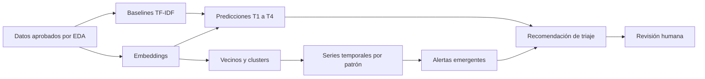

# Triaje de reclamos — rama Modeling

Esta rama desarrollará los modelos únicamente después de aprobar el EDA, las transformaciones y los splits temporales.

## Objetivo

Construir un prototipo de triaje y vigilancia de patrones usando solamente la información disponible en los reclamos CFPB.

No afirmaremos detectar fraude confirmado, medir pérdidas ni predecir el plazo interno de 15 días de un banco, porque esas etiquetas no existen en el dataset.

## Requisito de entrada

Antes de modelar, esta rama debe recibir desde EDA:

- esquema y tipado aprobados;
- taxonomía documentada;
- reglas contra fuga de información;
- splits temporales congelados;
- features disponibles al recibir un reclamo nuevo;
- artefactos de datos versionados con DVC.

## Objetivos del prototipo

- **T1 — Motivo:** predecir el motivo canónico desde la narrativa y campos disponibles.
- **T2 — Relief:** estimar si la respuesta histórica registra algún tipo de solución.
- **T3 — Relief monetario:** estimar si la respuesta histórica registra una solución monetaria; es solo un proxy de reembolso.
- **T4 — Respuesta no oportuna:** estimar el proxy CFPB disponible; no representa el SLA bancario de 15 días.
- **A1 — Patrones emergentes:** detectar narrativas similares cuyo volumen o proporción aumenta de forma inusual.

## Plan de modelado

- [ ] **M0 — Recibir datos aprobados:** comprobar DVC, splits y ausencia de fuga.
- [ ] **M1 — Crear baselines simples:** TF-IDF con regresión logística.
- [ ] **M2 — Evaluar embeddings:** comparar MiniLM y BGE usando las mismas filas y métricas.
- [ ] **M3 — Evaluar clasificación:** medir T1–T4 con cortes temporales y métricas para desbalance.
- [ ] **M4 — Crear patrones semánticos:** vecinos FAISS y microclusters sobre embeddings.
- [ ] **M5 — Describir patrones:** c-TF-IDF y ejemplos representativos.
- [ ] **M6 — Vigilar patrones en el tiempo:** Negative Binomial y CUSUM como baseline.
- [ ] **M7 — Evaluar composición:** Dirichlet-Multinomial como challenger.
- [ ] **M8 — Integrar el triaje:** combinar predicciones y alertas sin convertirlas en decisiones automáticas.
- [ ] **M9 — Documentar límites:** revisión humana, proxies y alcance real del prototipo.

## Flujo previsto



## Forma de trabajo

1. Empezar siempre por el modelo más simple.
2. Cambiar una sola decisión experimental a la vez.
3. No consultar el holdout final para escoger features o modelos.
4. Comparar modelos sobre las mismas filas y splits.
5. Versionar datos, features y modelos pesados con DVC.
6. Versionar código, parámetros, métricas y documentación con Git.
7. No promover un modelo complejo si no mejora claramente al baseline.

## Git y DVC

```bash
git pull
uv sync
uv run dvc pull
uv run dvc repro
uv run dvc push
git add .
git commit -m "Run modeling step"
git push
```

## Criterio para cerrar esta rama

La rama termina con un prototipo reproducible que muestre:

- predicciones calibradas y evaluadas temporalmente;
- ejemplos que expliquen la recomendación;
- patrones semánticos y alertas temporales;
- comparación justa contra baselines simples;
- limitaciones explícitas sobre fraude, reembolso y oportunidad de respuesta.