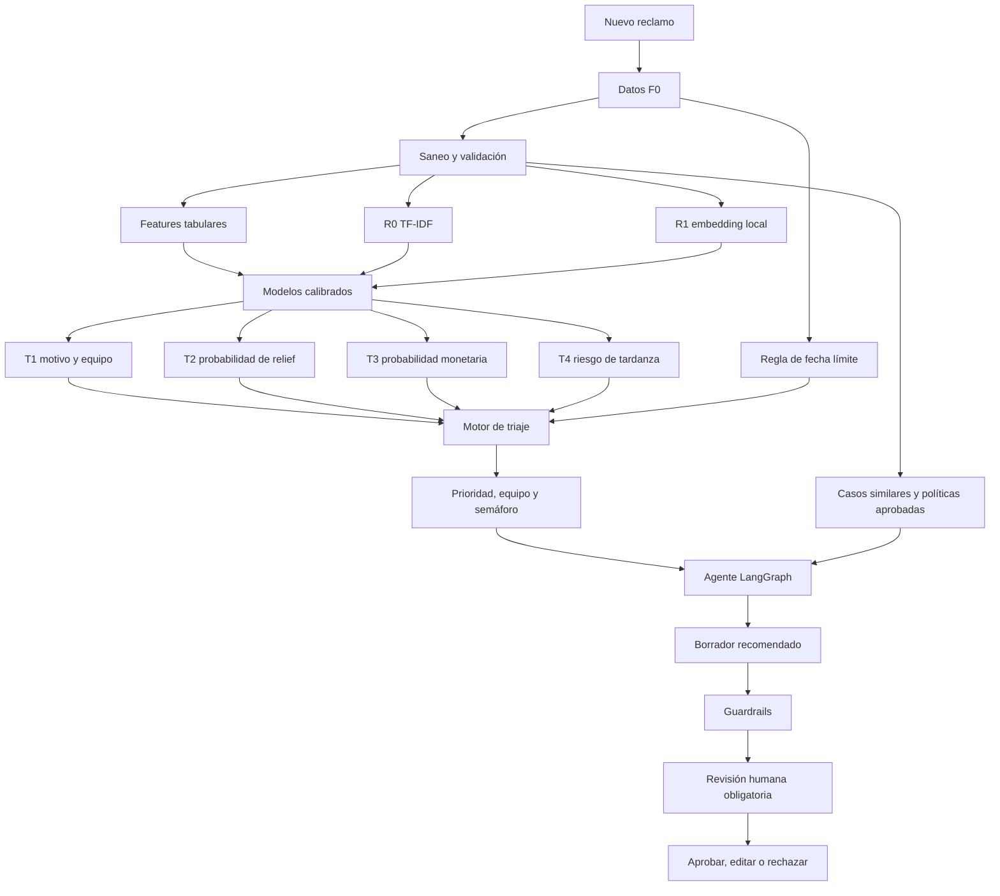
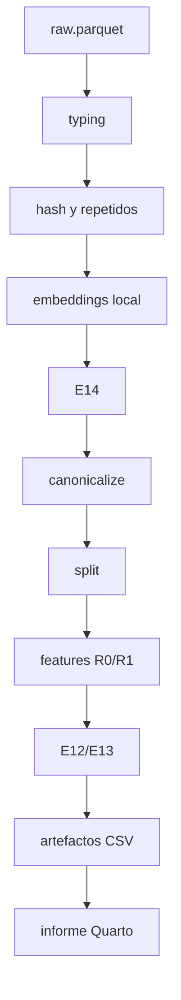

# Triaje automático de reclamos financieros

Sistema de apoyo para clasificar, priorizar y gestionar reclamos financieros a partir de la
narrativa disponible al momento de ingreso. El proyecto utiliza datos históricos del
Consumer Financial Protection Bureau (CFPB) y termina en un mockup web donde un agente
humano conserva la decisión final.

> El dataset CFPB es un proxy del caso de negocio, no evidencia de que el modelo pueda
> desplegarse sin validación en una institución concreta. La transferencia de dominio y el
> efecto de `Company` deben medirse explícitamente.

## Alcance actual

El **Informe I** cubre:

- EDA E1-E14;
- contrato de disponibilidad F0/F1/FX;
- tipado y validación del esquema;
- canonicalización de la taxonomía;
- agrupación de narrativas repetidas y splits temporales;
- features tabulares, TF-IDF R0 y embeddings locales R1;
- DVC para reproducir datos, features y artefactos del informe.

E12 y E13 entrenan modelos pequeños únicamente como sondas para medir señal. La selección
final de modelos, la simulación de bandeja y el agente redactor pertenecen a fases
posteriores.

## Caso de negocio

Cuando llega un reclamo nuevo no conocemos `Product` ni `Issue`. El sistema solo puede usar
información disponible al ingreso —F0— para producir cuatro recomendaciones:

| Target | Pregunta que responde | Uso operativo |
|---|---|---|
| **T1** | ¿Cuál es el motivo probable? | Enrutamiento al equipo correcto |
| **T2** | ¿Cuál es la probabilidad de relief registrado? | Priorización como proxy de complejidad |
| **T3** | ¿Cuál es la probabilidad de relief monetario? | Ranking de riesgo monetario, no estimación de monto |
| **T4** | ¿Cuál es el riesgo histórico de responder tarde? | Complemento predictivo del semáforo |

El semáforo combina T4 con una regla determinista de fecha límite y días restantes. T3 no
estima costo económico porque el dataset no contiene el monto pagado.

## Flujo del sistema



Los modelos T1-T4 y el agente LLM son componentes separados. El agente consume scores y
fuentes, pero no modifica los modelos ni convierte su texto automáticamente en features o
etiquetas.

## Datos disponibles y fuga

| Tier | Disponibilidad | Uso |
|---|---|---|
| **F0** | Al ingresar el reclamo | Features desplegables |
| **F1** | Taxonomía declarada en el histórico CFPB | Etiqueta de T1 y diagnóstico; no feature del mockup |
| **FX** | Después de la gestión o respuesta | Targets y evaluación; nunca features |

Ejemplos FX: `Company response to consumer`, `Timely response?` y `Date sent to company`.
Usarlos como predictores produciría fuga de información.

## Representaciones del texto

- **R0:** TF-IDF de palabras y caracteres, longitud, montos/fechas detectados, bloques
  `XXXX` y señales léxicas deterministas.
- **R1:** embeddings locales, inicialmente `all-MiniLM-L6-v2`, calculados una vez por
  `hash_narrativa`.
- **LLM:** no es R2 ni una feature. Se utiliza después de T1-T4 para redactar un borrador
  sujeto a grounding, guardrails y aprobación humana.

E13 compara F0, R0, R1 y sus combinaciones sobre exactamente las mismas filas y splits.

## ¿Qué significa deduplicar?

La deduplicación es principalmente **agrupación analítica**, no borrado de reclamos. Dos
filas pueden compartir una plantilla y aun así representar personas y outcomes distintos.

El hash del texto se utiliza para:

1. calcular embeddings una sola vez;
2. evitar que miles de copias dominen E14;
3. detectar memorización de plantillas;
4. auditar grupos con productos o targets contradictorios.

Se conservan dos evaluaciones:

- **operacional:** una plantilla de train puede reaparecer en periodos posteriores;
- **texto nuevo:** validación/test purga hashes vistos en train.

La segunda mide generalización; la primera aproxima la bandeja real.

## Orden para cerrar E12-E14 y crear features

```mermaid
flowchart TD
    A[Raw versionado] --> B[Fijar fronteras temporales]
    B --> C[Tipado y targets]
    C --> D[Hash y repetidos]
    D --> E[Muestra solo de train]
    E --> F[Embedding local]
    F --> G[E14 clustering en train]
    G --> H[Congelar taxonomía]
    H --> I[Splits completos]
    I --> J[E12 baseline R0]
    F --> K[E13 R0 frente a R1]
    I --> K
    J --> L[Features F0/R0/R1]
    K --> L
    L --> M[Informe Quarto]
```



- **E12:** word+character TF-IDF y modelo lineal como piso de señal.
- **E13:** comparación controlada de TF-IDF y embedding local.
- **E14:** UMAP/HDBSCAN sobre textos únicos de train, repetido con nombres de empresa
  enmascarados y contrastado con TF-IDF/SVD/KMeans.

El clustering aporta evidencia para la taxonomía; no la modifica automáticamente.

## Pipeline DVC

El parquet crudo ya está versionado con DVC y un remoto DagsHub. Las transformaciones deben
incorporarse a `dvc.yaml` para que datos, parámetros, features y resultados sean
reproducibles.



Persistencia prevista:

```text
data/interim/       Parquets tipados, hashes, taxonomía y splits
data/processed/     Manifiestos y tabulares por split
                     TF-IDF sparse en .npz
                     embeddings en .npy + índice Parquet
models/encoders/    Vocabularios, escaladores y codificadores
reports/artefactos/ CSV pequeños consumidos por Quarto
```

DVC versiona hashes y dependencias; Git versiona `dvc.yaml`, `dvc.lock`, `params.yaml`,
código, configuraciones y documentación.

## Propuestas de modelos

| Target | Baseline | Candidatos posteriores |
|---|---|---|
| T1 | TF-IDF + LogReg/SGD log-loss | R1 + lineal, fusión R0/R1, transformer ligero |
| T2 | logística regularizada y calibrada | LightGBM/CatBoost sobre F0+R1 |
| T3 | logística con pesos | LightGBM, cascada T2→T3, outcome multiclase |
| T4 | logística R0 + historial F0 | LightGBM/CatBoost + calibración temporal |

No se propone una GNN porque el dato no contiene un grafo natural. PyMC puede utilizarse de
forma opcional sobre conteos agregados para tasas jerárquicas e incertidumbre de T3/T4, no
como clasificador de millones de textos.

## Mockup web y agente

La primera versión puede implementarse en Streamlit. La pantalla debería incluir:

- formulario con narrativa y metadatos F0;
- top-3 de T1 y confianza;
- probabilidades calibradas T2-T4;
- fecha límite, días restantes y semáforo;
- casos similares y fuentes aprobadas;
- borrador editable;
- alertas de grounding/PII;
- acciones aprobar, editar y rechazar.

LangGraph coordinará saneo, inferencia, recuperación, redacción, validación y una
interrupción de revisión humana. El agente no tendrá permiso para enviar respuestas.

## Estructura

```text
configs/             Contratos, taxonomía, features, embeddings y modelos
data/raw/            Fuente inmutable versionada con DVC
data/interim/        Transformaciones intermedias
data/processed/      Features entrenables
src/data/            Tipado, taxonomía, repetidos, splits y E14
src/features/        R0, R1 y ensamblado
src/models/          Baselines y modelos T1-T4
src/evaluation/      Métricas, calibración, cortes y simulación
reports/artefactos/  Resultados pequeños por etapa
reports/informe/     Informe Quarto
```

## Reproducibilidad actual

```bash
uv sync
dvc pull
uv run python -m src.data.profile
uv run python -m src.data.agregados
uv run python -m src.data.narrativa
uv run python -m src.evaluation.slices
uv run quarto render reports/informe
```

Cuando se implemente el DAG de transformaciones, la ejecución principal será:

```bash
uv run dvc repro
uv run quarto render reports/informe
```

Consulta `docs/plan-eda-y-transformacion.md` para las decisiones, gates, riesgos y métricas
detalladas.
