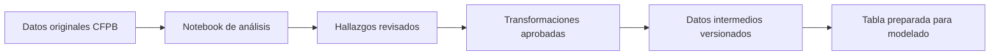

# Triaje de reclamos — rama EDA

Este documento resume el **análisis exploratorio de datos (EDA)**: la
revisión que hacemos antes de transformar información o entrenar modelos.

## Objetivo

Entender qué información contiene el conjunto de reclamos CFPB, qué problemas
de calidad tiene y qué transformaciones están justificadas antes de crear
modelos.

Esta rama no entrena modelos finales.

**Estado:** EDA E0–E10 y preparación P1–P5 completados.

## Datos disponibles

- Fuente: Consumer Financial Protection Bureau (CFPB).
- Archivo original, sin modificaciones —llamado `raw` por el equipo técnico—:
  `data/raw/cfpb_reclamos_narrativa.parquet`.
- Formato Parquet: formato eficiente para guardar tablas grandes.
- Tamaño registrado: 3,837,184 reclamos con narrativa.
- El archivo original es inmutable: no se modifica.
- DVC conserva las versiones de los datos grandes; Git conserva código y
  documentación.
- No contamos con datos internos de un banco, fraude confirmado, pérdidas ni
  tiempo bancario de resolución.

## Forma de trabajo

1. El EDA está en `notebooks/01_eda.ipynb` y la preparación reproducible en
   `notebooks/02_revision_preparacion.ipynb`.
2. Los notebooks se ejecutan de arriba hacia abajo y explican qué pregunta
   responde cada sección.
3. Solo extraeremos funciones a `src/` cuando exista reutilización real.
4. No avanzaremos al siguiente paso hasta revisar y aprobar el resultado.
5. Las transformaciones aprobadas se declararán en `dvc.yaml`.
6. Git conserva el historial del código y la documentación; DVC conserva el
   historial de los archivos de datos grandes.

## Plan del EDA

- [x] **E0 — Verificar el archivo original:** filas, columnas, tamaño e identidad.
- [x] **E1 — Revisar las columnas:** tipos, valores ausentes y categorías observadas.
- [x] **E2 — Revisar el tiempo:** cobertura, volumen por periodo y 2026 parcial.
- [x] **E3 — Revisar categorías:** producto, subproducto, motivo, empresa y
  canal de envío.
- [x] **E4 — Revisar respuestas:** resultados históricos que podrían predecirse.
- [x] **E5 — Revisar narrativas:** longitud, vacíos, idioma aparente y calidad
  del texto.
- [x] **E6 — Revisar repeticiones:** IDs duplicados, textos iguales, posibles
  plantillas y concentraciones puntuales.
- [x] **E7 — Revisar clases poco frecuentes:** proporción de casos positivos y
  negativos.
- [x] **E8 — Revisar cambios temporales:** diferencias entre periodos
  anteriores y posteriores.
- [x] **E9 — Acordar transformaciones:** tipos correctos, agrupación de
  categorías equivalentes, divisiones temporales y variables de entrada.
- [x] **E10 — Documentar conclusiones:** figuras, tablas, limitaciones y
  decisiones aprobadas.

## Plan de preparación de datos

La preparación convierte los datos originales en una tabla lista para la rama
de modelado. Cada paso se revisa antes de continuar.

- [x] **P1 — Corregir tipos:** validar las columnas y convertir las fechas a un
  tipo de fecha real.
- [x] **P2 — Normalizar narrativas:** conservar el texto original, crear una
  versión comparable y calcular un identificador estable de cada texto.
- [x] **P3 — Ordenar la taxonomía:** definir un mapa estable de productos y
  motivos, y detectar categorías nuevas.
- [x] **P4 — Crear objetivos y periodos:** derivar T1–T4, indicar qué filas son
  elegibles para cada objetivo y separar los periodos de evaluación.
- [x] **P5 — Generar la tabla preparada:** validar y publicar el archivo que
  recibirá la rama `Modeling/pipaber`.

## Entrega preparada

- Archivo: `data/processed/prepared.parquet`.
- Contenido: 3,837,184 filas y 44 columnas.
- Periodos: contexto 2015–2022, entrenamiento 2023–2024, validación 2025-H1,
  reserva 2025-H2 y 2026 parcial.
- `2025-H2` está bloqueado para evaluación: no se recuperaron los 25,000 IDs
  revisados previamente ni se pueden identificar sus grupos de texto.
- En 2026 puede evaluarse T1; T2–T4 quedan bloqueados hasta definir cuánto
  tiempo deben madurar sus resultados.
- DVC versiona el archivo. La rama no contiene TF-IDF, BGE, FAISS ni modelos.

## Flujo de datos implementado



Puede usarse una muestra pequeña para experimentar rápidamente, pero las
transformaciones aprobadas deberán ejecutarse sobre el conjunto completo.

## Documentos de lectura rápida

- [Resumen ejecutivo del EDA](docs/resumen-eda.md).
- [Propuesta de modelos, alertas y aplicación](docs/modelos.md).

La propuesta de modelos registra opciones futuras; no implica que ya hayan
sido validadas.

## Git y DVC

Esta sección contiene instrucciones para el equipo técnico; no es necesaria
para interpretar los hallazgos.

Al comenzar una sesión:

```bash
git pull
uv sync
uv run dvc pull
```

Después de un paso aprobado:

```bash
uv run dvc repro
uv run dvc push
git add .
git commit -m "Document EDA step"
git push
```

El archivo original ya está rastreado mediante
`data/raw/cfpb_reclamos_narrativa.parquet.dvc`. No debe agregarse directamente
a Git.

## Cierre de esta rama

El EDA y la preparación se consideran cerrados porque podemos explicar con
evidencia:

- qué datos tenemos y qué no tenemos;
- qué resultados disponibles pueden servir como aproximaciones a lo que
  interesa al negocio;
- qué columnas estarán disponibles al recibir un reclamo nuevo;
- cómo separar periodos sin compartir información entre aprendizaje y evaluación;
- qué transformaciones y variables de entrada se crearán;
- qué limitaciones tendrá la interpretación del sistema.
