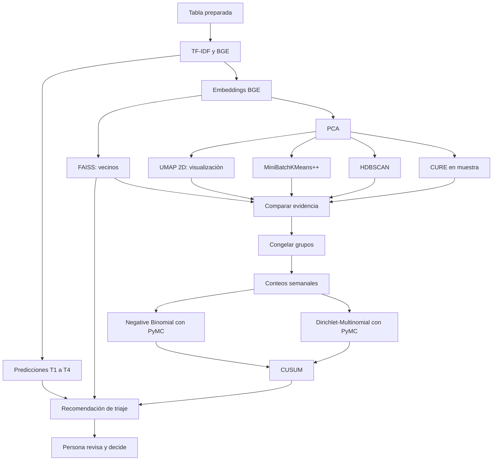

# Triaje de reclamos — rama Modeling

Esta rama nace de `EDA/pipaber` después de completar E0–E10 y P1–P5. Puede
avanzar mientras el pull request de EDA hacia `develop` está en revisión.

## Objetivo

Construir un prototipo reproducible que ayude a una persona a:

- sugerir el motivo de un reclamo;
- estimar resultados históricos registrados por CFPB;
- encontrar reclamos con significado parecido;
- identificar patrones semánticos cuyo volumen o proporción aumenta;
- revisar la evidencia antes de tomar una decisión de triaje.

No afirmaremos detectar fraude confirmado, pérdidas económicas, resolución
bancaria ni el plazo interno de 15 días. Esas etiquetas no están disponibles.

## Entrada aprobada

- Archivo: `data/processed/prepared.parquet`.
- Filas: 3,837,184.
- Columnas: 44.
- Versionamiento de datos: DVC.
- Entrenamiento: `train_2023_2024`.
- Validación temporal: `validation_2025_h1`.
- `holdout_2025_h2`: bloqueado porque no se recuperaron los IDs revisados.
- `ood_2026_partial`: solo podrá usarse para estudiar T1 después de congelar el
  modelo; T2–T4 permanecen bloqueados.

## Objetivos

- **T1 — Motivo:** motivo canónico más probable.
- **T2 — Relief registrado:** compensación monetaria o no monetaria registrada.
- **T3 — Relief monetario:** compensación monetaria registrada.
- **T4 — Respuesta no oportuna:** `Timely response? = No` según CFPB.
- **A1 — Patrón emergente:** grupo semántico cuyo comportamiento temporal merece
  revisión.

## Herramientas y responsabilidades

<!-- markdownlint-disable MD013 -->

| Herramienta | Responsabilidad |
| --- | --- |
| Git | Código, configuración y documentación |
| DVC | Datos, embeddings, índices y otros artefactos grandes |
| MLflow | Parámetros, métricas, gráficos, modelos y comparación de experimentos |
| PyMC | Modelos probabilísticos de volumen y composición temporal |
| HPC con A100 | Embeddings BGE y tareas que demuestren beneficio al usar GPU |

<!-- markdownlint-enable MD013 -->

MLflow será obligatorio desde el primer baseline. Cada ejecución registrará,
como mínimo, el commit Git, hash DVC de los datos, objetivo, periodo, variables,
semilla, parámetros y métricas. Las credenciales y direcciones privadas se
configurarán mediante variables de entorno; no se guardarán en Git.

DVC y MLflow tendrán funciones distintas. DVC conservará los datos grandes y
MLflow permitirá comparar cómo se obtuvo cada resultado sin duplicar el
conjunto completo de reclamos.

## Plan de modelado

- [x] **M0 — Verificar la entrega:** revisar DVC, esquema y periodos; confirmar
  objetivos y restricciones antes de entrenar.
- [x] **M1 — Preparar experimentos:** configurar MLflow, semillas y ejecución
  reproducible local y en HPC.
- [x] **M2 — Congelar la evaluación:** definir el corte interno de calibración,
  las métricas y las vistas completa y sin texto compartido.
- [x] **M3 — Crear referencias simples:** comparar contra frecuencias globales y
  reglas basadas en producto.
- [x] **M4 — Entrenar TF-IDF:** evaluar modelos lineales para T1–T4.
- [x] **M5 — Evaluar BGE:** generar una muestra en la A100 y compararla con
  TF-IDF sobre las mismas filas.
- [x] **M5B — Comparar con todo el ajuste:** entrenar TF-IDF y BGE, con y sin
  producto, con todas las filas de ajuste y elegir por objetivo en calibración.
- [x] **M6 — Preparar el espacio semántico:** reutilizar los embeddings de M5,
  ajustar PCA con la muestra del periodo de ajuste, crear una visualización UMAP
  y validar vecinos con FAISS.
- [x] **M7 — Comparar métodos de clustering:** evaluar MiniBatchKMeans con
  inicialización k-means++, HDBSCAN y CURE sobre la misma muestra. Comparar
  silhouette, estabilidad, coherencia, ruido, costo y asignación futura.
- [x] **M8 — Congelar patrones y crear series:** elegir el método, fijar sus
  grupos, generar solo los embeddings faltantes, asignar el corpus elegible y
  construir conteos semanales completos.
- [x] **M9 — Modelar volumen con PyMC:** NB-R4-H v3, una Negative Binomial
  con las participaciones de las 4 semanas anteriores y una dispersión por
  cluster, superó al mejor baseline. La validación queda para la confirmación
  final.
- [x] **M10 — Modelar composición con PyMC:** DM-R4, una Dirichlet-Multinomial
  con las participaciones de las 4 semanas anteriores y una concentración
  global, superó al mejor baseline. La validación queda para la confirmación
  final.
- [ ] **M11 — Detectar cambios persistentes:** calibrar CUSUM sobre las
  diferencias entre lo observado y lo esperado.
- [ ] **M12 — Integrar el triaje:** combinar predicciones, vecinos y alertas para
  revisión humana.

## Plan semántico M6–M8

PCA, UMAP y clustering tienen responsabilidades distintas:

- **PCA:** reduce dimensiones y ruido antes de comparar los métodos.
- **UMAP 2D:** permite visualizar una muestra; no decide por sí solo los grupos.
- **FAISS:** recupera reclamos históricos cercanos y ayuda a medir novedad.
- **Clustering:** crea los grupos que después se contarán por semana.

M6 reutilizará los 240,000 embeddings de M5: 120,000 de ajuste, 40,000 de
calibración y 80,000 de validación. No volverá a ejecutar BGE sobre esas filas.
PCA y UMAP se ajustarán solo con las 120,000 filas de ajuste y luego
transformarán los periodos posteriores. UMAP 2D se usará para visualización. Si
HDBSCAN necesita una reducción adicional, se comparará PCA
solo contra PCA más UMAP de varias dimensiones; no se usará el gráfico 2D como
única entrada del clustering.

M7 comparará los métodos sobre las mismas filas, representación y semilla:

<!-- markdownlint-disable MD013 -->

| Evidencia | Qué revisa |
| --- | --- |
| Silhouette y su gráfico | Separación de cada grupo; cerca de 1 es mejor, 0 indica solapamiento y valores negativos sugieren asignaciones dudosas |
| Estabilidad | Si grupos parecidos reaparecen al cambiar la muestra o semilla |
| Tamaños y ruido | Grupos gigantes, grupos demasiado pequeños y porcentaje sin asignar |
| Coherencia semántica | Si ejemplos y términos representativos describen un problema común |
| Plantillas | Si un grupo existe por significado o por narrativas repetidas |
| Costo | Tiempo, memoria y posibilidad de usar CPU o A100 |
| Asignación futura | Cómo recibirá un grupo un reclamo que llegue después |

<!-- markdownlint-enable MD013 -->

El silhouette se calculará sobre una muestra fija porque hacerlo sobre millones
de filas es costoso. No será el único criterio: favorece grupos compactos y
puede evaluar injustamente las formas irregulares que busca HDBSCAN o CURE.

La comparación tendrá tres candidatos:

- **MiniBatchKMeans con k-means++:** referencia escalable que asigna todos los
  reclamos.
- **HDBSCAN:** candidato que permite grupos de distinta densidad y casos sin
  asignar.
- **CURE:** comparación sobre una muestra; solo continuará si su implementación
  puede escalar y asignar reclamos futuros de forma reproducible.

Antes de ejecutar M6–M7 se guardarán en configuración:

- IDs y hash DVC de la muestra común;
- número de componentes PCA y varianza conservada;
- semilla y parámetros de UMAP;
- valores de `k` probados por MiniBatchKMeans;
- tamaños mínimos probados por HDBSCAN;
- número de grupos, representantes y contracción probados por CURE;
- distancia usada para vecinos, clustering y silhouette.

Cada ejecución registrará en MLflow el gráfico de varianza PCA, UMAP 2D,
silhouette, distribución de tamaños, porcentaje de ruido, ejemplos y términos
por grupo, tiempo y memoria. Para HDBSCAN, el silhouette se calculará sobre los
casos asignados y el ruido se reportará por separado. Los parámetros se elegirán
con ajuste y calibración; validación no se usará para modificarlos.

M8 congeló el método elegido antes de usar periodos posteriores. En esa etapa
se generaron por bloques los embeddings faltantes para asignar todos los
reclamos elegibles. La tabla semanal incluye `week`, `cluster_id`,
`complaint_count`, `unique_text_count`, `weekly_total` y `proportion`. También
completa con cero las semanas sin casos para no confundir ausencia con datos
faltantes. Los conteos se construyeron con todos los reclamos elegibles, no con
la muestra de M5.

## Contrato de ejecución M1

`configs/modeling.yaml` define la semilla y las rutas comunes. Cada ejecución
crea un registro pequeño con:

- commit Git y hash DVC;
- objetivo, periodo y vista evaluada;
- variables de entrada y semilla;
- ejecución local o en Khipu;
- parámetros, métricas y artefactos.

Un **artefacto** es un archivo producido por una ejecución, por ejemplo un
gráfico o una tabla de resultados. MLflow guardará los artefactos pequeños. DVC
guardará los archivos grandes, como embeddings o índices FAISS.

Los nodos SLURM de Khipu no tienen internet. Allí se crea primero un registro
JSON en `reports/modeling/runs/`. Después, desde el nodo de acceso, se publica
en MLflow con `src/evaluation/publish_run.py`. Las credenciales permanecen en
`.env` y `.dvc/config.local`; ninguno de esos archivos se versiona.

## Contrato de evaluación M2

Los periodos quedan fijados antes de entrenar:

- **Ajuste:** 2023-01-01 a 2024-09-30; el modelo aprende aquí.
- **Calibración:** 2024-10-01 a 2024-12-31; aquí se eligen parámetros y el
  umbral de decisión.
- **Validación temporal:** 2025-01-01 a 2025-06-30; mide el comportamiento en
  datos posteriores.

Un **umbral** es el punto desde el cual una probabilidad se convierte en una
predicción positiva. Para T2–T4 se elegirá en calibración el umbral que maximice
F1, que equilibra precisión y cobertura. Después permanecerá fijo en
validación.

Se reportarán dos vistas del mismo modelo:

- **Completa:** incluye todos los casos elegibles.
- **Sin texto compartido:** excluye de cada evaluación las narrativas que ya
  aparecieron en periodos usados para aprender.

La vista sin texto compartido será la principal para elegir modelos, porque
reduce el beneficio artificial de memorizar plantillas. Conservamos la vista
completa porque las plantillas también existen en la operación real. El corte
deja 1,067,194 filas para ajuste, 167,973 para calibración sin texto compartido
y 564,813 para validación sin texto compartido.

T1 conserva 90 motivos en ajuste y no aparecen motivos nuevos en calibración o
validación. Sin embargo, algunos motivos tienen muy pocos ejemplos. Sus
resultados individuales se mostrarán como evidencia descriptiva, no como una
estimación estable.

Las métricas quedan definidas así:

- **Macro-F1 (T1):** calcula F1 por motivo y da el mismo peso a cada motivo.
- **Top-3 (T1):** revisa si el motivo correcto aparece entre tres sugerencias.
- **Average precision o precisión promedio (T2–T4):** resume la relación entre
  precisión y cobertura; es más útil que el porcentaje total de aciertos cuando
  hay pocos positivos.
- **Precisión:** de los casos marcados positivos, cuántos eran positivos.
- **Cobertura o recall:** de los positivos reales, cuántos encontró el modelo.
- **Brier score:** mide el error de las probabilidades; un valor menor es mejor.

Las entradas iniciales serán la narrativa normalizada y el producto canónico.
Empresa, estado y fecha quedan como candidatos que deberán demostrar valor. Se
excluyen `Issue`, respuestas de la empresa y cualquier resultado T1–T4 porque
revelarían lo que intentamos predecir.

El detalle reproducible está en
`reports/modeling/evaluation_contract.json`. Seguimos sin tener un test final
intacto: 2025-H1 es validación temporal del prototipo, mientras 2025-H2 y 2026
no se usarán para elegir modelos.

## Resultados de las referencias M3

M3 compara dos referencias que no leen la narrativa:

- **Frecuencia global:** siempre usa el resultado más común del ajuste.
- **Frecuencia por producto:** usa el resultado histórico más común dentro de
  cada producto.

La segunda se parece a una regla sencilla de call center, pero no representa
las reglas privadas de un banco. Fue aprendida únicamente de las frecuencias
CFPB disponibles.

En la validación sin texto compartido, la regla por producto obtuvo:

| Objetivo | Resultado principal |
| --- | ---: |
| T1 — Macro-F1 | 0.0684 |
| T1 — motivo correcto en top-3 | 90.98% |
| T2 — precisión promedio | 0.4509 |
| T3 — precisión promedio | 0.1272 |
| T4 — precisión promedio | 0.1208 |

Para T1, el producto reduce mucho las opciones, pero elegir solo el motivo más
frecuente produce Macro-F1 bajo. Esto justifica probar la narrativa para ordenar
mejor los motivos dentro de cada producto.

Para T3, la regla por producto alcanza 11.82% de precisión y 80.49% de
cobertura en el umbral fijado. Para T4 alcanza 18.35% de precisión y 41.38% de
cobertura. Son referencias útiles, pero aún generan falsos positivos o pierden
casos. Los modelos de texto deberán mejorar este equilibrio y no solo superar
la frecuencia global.

Los resultados completos están en `reports/modeling/baseline_results.json` y
el detalle de T1 por motivo está en
`reports/modeling/baseline_t1_per_class.csv`.

## Resultados de TF-IDF M4

**TF-IDF** representa una narrativa mediante la importancia de sus palabras y
pares de palabras. El modelo M4 combina esa representación con el producto y
usa un clasificador lineal. Un clasificador lineal suma evidencia a favor o en
contra de cada resultado sin construir una red neuronal.

En la validación sin texto compartido:

| Objetivo | Regla por producto | TF-IDF + producto | Decisión |
| --- | ---: | ---: | --- |
| T1 — Macro-F1 | 0.0684 | 0.1984 | Conservar TF-IDF |
| T1 — top-3 | 90.98% | 95.92% | Conservar TF-IDF |
| T2 — precisión promedio | 0.4509 | 0.5744 | Conservar TF-IDF |
| T3 — precisión promedio | 0.1272 | 0.2904 | Conservar TF-IDF |
| T4 — precisión promedio | 0.1208 | 0.0781 | Conservar regla por producto |

La narrativa aporta valor claro para T1–T3. En T3, TF-IDF alcanza 21.49% de
precisión y 54.89% de cobertura, frente a 11.82% y 80.49% de la regla por
producto. Reduce falsos positivos, pero también encuentra menos positivos; la
capacidad real de revisión deberá decidir qué equilibrio conviene.

T4 muestra inestabilidad temporal: TF-IDF superó a la regla por producto en
calibración, pero quedó por debajo en 2025-H1. No promoveremos ese modelo. El
resultado no prueba la causa del cambio; indica que la relación entre palabras
y respuesta no oportuna no fue estable en el periodo posterior.

Los modelos convergieron y se guardaron con DVC:

- Ruta: `artifacts/models/tfidf`.
- Hash DVC: `94536b940d1546580c62b80078e2bbfc.dir`.
- Tamaño: 105,258,065 bytes.
- Ejecución SLURM: 9 minutos 9 segundos y aproximadamente 11.9 GiB de memoria.

Los resultados completos están en `reports/modeling/tfidf_results.json` y el
detalle de T1 por motivo en `reports/modeling/tfidf_t1_per_class.csv`.

## Resultados de BGE M5

**BGE** convierte cada narrativa en un embedding: una lista de números que
representa su significado. M5 comparó BGE y TF-IDF sobre exactamente la misma
muestra temporal:

- 120,000 filas de ajuste;
- 40,000 filas de calibración;
- 80,000 filas de validación.

En la validación sin texto compartido:

<!-- markdownlint-disable MD013 -->

| Objetivo | TF-IDF + producto | BGE + producto | Decisión |
| --- | ---: | ---: | --- |
| T1 — Macro-F1 | 0.1968 | **0.2367** | Conservar BGE como candidato |
| T2 — precisión promedio | 0.5662 | 0.5666 | Conservar TF-IDF por simplicidad |
| T3 — precisión promedio | **0.2640** | 0.2576 | Conservar TF-IDF |
| T4 — precisión promedio | **0.0791** | 0.0624 | Conservar regla por producto de M3 |

<!-- markdownlint-enable MD013 -->

BGE aporta una mejora clara para sugerir el motivo T1. Para T2 la diferencia es
menor a 0.001 y no justifica usar una representación más costosa. BGE tampoco
mejora T3 ni T4. Por tanto, el prototipo no usará el mismo modelo para todos los
objetivos.

BGE seguirá siendo necesario en M6 para buscar reclamos con significado parecido
y crear grupos semánticos. Ese uso es distinto de predecir T1–T4: una
representación puede aportar buenos vecinos aunque no mejore una clasificación.

Los clasificadores convergieron. BGE-T3 necesitó 38 iteraciones y BGE-T4, 63. El
artefacto quedó registrado con DVC:

- Ruta: `artifacts/models/bge_sample`.
- Hash DVC: `009e3b35e25d9df095cf753e0a05f041.dir`.
- Tamaño: 1,090,649,311 bytes.
- Modelo: `BAAI/bge-large-en-v1.5`, revisión
  `d4aa6901d3a41ba39fb536a557fa166f842b0e09`.

La A100 generó los embeddings iniciales en 29 minutos 56 segundos. La repetición
de los clasificadores reutilizó esos embeddings y terminó en CPU en 4 minutos
19 segundos. Los ocho runs de comparación están publicados en MLflow y el
reporte completo está en `reports/modeling/bge_sample_results.json`.

## Resultados de M5B con todo el ajuste

Las decisiones de M4 y M5 miraron la validación. M5B las reemplaza usando solo
calibración. Entrenó cada representación con las 1,067,194 filas de ajuste; BGE
usa los embeddings de M8. Después aplicó una regla aprobada antes de entrenar:
una representación más compleja se elige solo si mejora al menos 5% y el
intervalo bootstrap por semanas queda entero sobre 0.

En la calibración sin texto compartido:

<!-- markdownlint-disable MD013 -->

| Objetivo | Regla por producto | TF-IDF texto | TF-IDF + producto | BGE texto | BGE + producto | Elegido |
| --- | ---: | ---: | ---: | ---: | ---: | --- |
| T1 — Macro-F1 | 0.0762 | 0.1406 | 0.2142 | 0.1582 | **0.2397** | BGE + producto |
| T2 — precisión promedio | 0.4536 | **0.6094** | 0.6119 | 0.6056 | 0.6104 | TF-IDF texto |
| T3 — precisión promedio | 0.1739 | **0.3640** | 0.3699 | 0.3347 | 0.3512 | TF-IDF texto |
| T4 — precisión promedio | 0.0313 | 0.0471 | **0.0551** | 0.0305 | 0.0417 | TF-IDF + producto |

<!-- markdownlint-enable MD013 -->

- BGE solo mejora T1. En T2 y T3 el producto suma menos de 5%, así que basta
  con el texto.
- En T4, TF-IDF + producto ganó en calibración, pero M4 ya lo había visto por
  debajo de la regla por producto en 2025-H1. Se mantiene la elección de la
  regla y se marca que su validación no es una prueba independiente.
- La validación se usará una sola vez, en la confirmación final.

El detalle está en `reports/modeling/representation_decision.md`. Los modelos
están en DVC (`artifacts/models/representation_comparison`) y hay un run de
MLflow por objetivo.

## Resultados del espacio semántico M6

M6 reutilizó los 240,000 embeddings de M5. PCA y UMAP aprendieron únicamente
con las 120,000 filas de ajuste; calibración y validación solo fueron
transformadas.

PCA redujo cada embedding de 1,024 a 256 dimensiones:

| Componentes | Variación conservada |
| ---: | ---: |
| 32 | 58.09% |
| 64 | 70.95% |
| 128 | 82.86% |
| 256 | 92.42% |

La **variación conservada** resume cuánta información estadística del embedding
original permanece después de reducir dimensiones. Las 256 dimensiones
conservan 92.42% y serán la representación común inicial de M7.

UMAP mostró superposición entre ajuste, calibración y validación. No aparece una
separación temporal total, aunque existen casos aislados y zonas asociadas a
productos. El gráfico sirve para explorar; no demuestra por sí solo que los
grupos sean correctos.

FAISS creó un índice exacto con las 120,000 filas de ajuste. Se consultaron
1,000 narrativas sin texto compartido de cada periodo posterior:

| Medida | Calibración | Validación |
| --- | ---: | ---: |
| Similitud mediana del vecino más cercano | 0.9245 | 0.9177 |
| Percentil 5 de similitud | 0.8447 | 0.8386 |
| Mismo producto | 82.7% | 77.1% |
| Mismo motivo T1 | 47.7% | 37.4% |

Una similitud cercana a 1 indica embeddings muy próximos. Los resultados
confirman que FAISS recupera vecinos semánticos cercanos, pero el acuerdo T1
muestra que el vecino más cercano no debe usarse como clasificador por sí solo.
Servirá como evidencia para el agente y como apoyo para estudiar novedad.

La búsqueda FAISS coincidió exactamente con el cálculo directo en las consultas
de control. El artefacto quedó registrado con DVC:

- Ruta: `artifacts/models/semantic_space`.
- Hash DVC: `08662a82971a71666b06c9ccf8120d7f.dir`.
- Tamaño: 741,782,513 bytes.
- Ejecución SLURM: 4 minutos 19 segundos y aproximadamente 2.45 GiB.

El run `m6-semantic-space` está publicado en MLflow. El reporte y los gráficos
están en `reports/modeling/semantic_space_results.json`,
`reports/modeling/semantic_pca_variance.png` y
`reports/modeling/semantic_umap_2d.png`.

## Resultados de clustering M7

M7 ajustó un UMAP de 15 dimensiones con las 120,000 filas de ajuste y comparó
12 configuraciones sobre la misma muestra de 20,000 reclamos. La validación no
se utilizó.

| Método seleccionado | Silhouette | Estabilidad ARI | Resultado |
| --- | ---: | ---: | --- |
| MiniBatchKMeans, `k=40` | 0.1376 | 0.6260 | Aceptado como prototipo |
| HDBSCAN | 0.5455 | 1.0000 | Rechazado |
| CURE | 0.4093 | 0.4307 | Rechazado |

El **ARI** mide si aparecen grupos parecidos al repetir el método sobre muestras
diferentes. Un valor de 1 representa acuerdo completo y 0 indica que el acuerdo
no supera lo esperado por azar.

El silhouette alto no fue suficiente para aceptar HDBSCAN o CURE:

- **HDBSCAN** produjo solo 2 grupos, dejó 48.91% como ruido y su adaptador solo
  pudo asignar 62.63% de calibración.
- **CURE** colocó 99.21% de los reclamos en un único grupo. Su estabilidad fue
  0.4307 y su mejora sobre la coincidencia esperada de vecinos fue casi nula.

MiniBatchKMeans con `k=40` fue el único que pasó todos los criterios congelados:

- ningún reclamo quedó sin grupo;
- el grupo más grande contiene 13.89% de la muestra;
- 71.01% de los diez vecinos BGE comparten grupo, frente a 7.15% esperado solo
  por los tamaños;
- 98.99% de calibración quedó dentro de las distancias observadas en ajuste;
- ningún grupo quedó dominado en más de 50% por una sola plantilla.

La evidencia es útil pero moderada: silhouette es 0.1376, 28.96% de la muestra
tiene silhouette negativo y la estabilidad ARI es 0.6260. Por eso hablaremos de
una **partición de trabajo**, no de 40 categorías naturales confirmadas.

M8 generó los embeddings faltantes y volvió a ajustar `k=40` con todos los
reclamos elegibles del periodo de ajuste. Las 120,000 filas fueron la muestra
disponible para escoger el método, no el límite del entrenamiento final.

El artefacto quedó registrado con DVC:

- Ruta: `artifacts/models/clustering_comparison`.
- Hash DVC: `425408aa84d0e2a44b8c5becd467e724.dir`.
- Tamaño: 345,751,521 bytes.
- Ejecución SLURM: 26 minutos 29 segundos y aproximadamente 2.68 GiB.

El run `m7-cluster-comparison` está publicado en MLflow. Los resultados están en
`reports/modeling/clustering_results.json` y
`reports/modeling/clustering_candidates.csv`.

## Resultados de patrones semánticos M8

M8A completó los embeddings BGE de 1,996,978 reclamos elegibles. Reutilizó las
240,000 filas de M5 y generó las 1,756,978 restantes. El artefacto completo
quedó registrado en DVC:

- Ruta: `artifacts/models/bge_full`.
- Hash DVC: `3ff36a299da1f2e19a00a4bce49f18ad.dir`.
- Tamaño: 8,286,444,032 bytes.

El arreglo de ajuste se guarda en dos partes para respetar el límite por archivo
del remoto DVC; al leerlo se comporta como un único arreglo.

M8B ajustó MiniBatchKMeans con `k=40` únicamente con las 1,067,194 filas de
ajuste. Calibración y validación solo recibieron asignaciones. La señal de
novedad usa el percentil 99 de las distancias observadas en ajuste:

| Periodo | Filas | Casos nuevos | Tasa de novedad |
| --- | ---: | ---: | ---: |
| Ajuste | 1,067,194 | 9,374 | 0.88% |
| Calibración | 234,600 | 2,534 | 1.08% |
| Validación | 695,184 | 5,329 | 0.77% |

Ningún grupo quedó vacío. El menor contiene 1,947 reclamos, la mediana es 9,254
y el mayor contiene 176,716, equivalente a 16.56% del ajuste. Estos 40 grupos
son una partición operativa para contar patrones; no representan categorías
naturales confirmadas.

La salida contiene 5,360 filas semanales: 5,120 corresponden a semanas
completas y 240 a seis semanas parciales. Las combinaciones sin reclamos se
completaron con cero. El artefacto quedó registrado en DVC:

- Ruta: `artifacts/models/weekly_patterns`.
- Hash DVC: `87be2a97daa3b169bbd65850a64c89a6.dir`.
- Tamaño: 255,273,918 bytes.

Los reportes principales están en
`reports/modeling/weekly_patterns_results.json`,
`reports/modeling/weekly_counts.csv` y
`reports/modeling/cluster_summary.csv`.

## Resultados de volumen semanal M9

M9 ajustó PyMC únicamente con 91 semanas completas de `fit`, equivalentes a
3,640 combinaciones semana-cluster. Las 12 semanas de calibración y 25 de
validación se predijeron sin actualizar el posterior. El total semanal observado
se usa como exposición, por lo que el resultado es un pronóstico condicionado al
volumen general.

Se publicaron dos intentos en MLflow:

<!-- markdownlint-disable MD013 -->

| Intento | R-hat máximo | ESS bulk mínimo | Divergencias | Cobertura 80% | Cobertura 95% | WIS calibración | WAPE calibración | Decisión |
| --- | ---: | ---: | ---: | ---: | ---: | ---: | ---: | --- |
| Tasas independientes V1 | 1.03 | 140 | 0 | 69.79% | 87.08% | 86.01 | 30.77% | Rechazado |
| `normalized_softmax_v2` | 1.01 | 263 | 0 | 70.00% | 87.71% | 89.06 | 31.34% | Rechazado |

<!-- markdownlint-enable MD013 -->

**R-hat** comprueba si las cadenas produjeron distribuciones parecidas; se exigió
como máximo 1.01. **ESS** es el número efectivo de muestras independientes; se
exigió al menos 400. V2 pasó R-hat, ESS de cola, divergencias, cobertura 80%, WIS
y WAPE, pero falló ESS bulk y la cobertura 95% mínima de 88%.

V1 mejoraba el baseline, pero sus medias podían sumar entre 106.99% y 113.07% del
total semanal durante calibración. V2 corrigió este problema con `softmax`: sus
40 medias suman el total semanal con un error máximo de `8.9e-16`, atribuible al
redondeo numérico. También redujo la fracción predictiva previa de conteos
imposibles de 0.93% a 0.0075%.

En calibración, V2 mejoró 35.88% el WIS y 9.09% el WAPE frente al baseline
Poisson. No obstante, no se cambió el umbral para aceptar un resultado cercano.
Las alternativas no lineales exploradas mejoraron algunos clusters, pero
empeoraron la calibración global y no justificaron un tercer modelo más complejo.

La validación no se usó para escoger ni ajustar el modelo. Allí V2 mejoró 1.99%
el WIS, pero su WAPE fue 65.14% frente a 53.08% del baseline. Por tanto, M9 queda
completado como experimento, pero Negative Binomial no se promueve para uso
posterior y se conserva el baseline como referencia.

El posterior V2 quedó registrado con DVC:

- Ruta: `artifacts/models/negative_binomial`.
- Hash DVC: `ada511fc7ac612613faf9f02133fc2a6.dir`.
- Tamaño: 15,169,110 bytes.
- Ejecución SLURM: 23 minutos 58 segundos y aproximadamente 1.14 GiB.

Runs de MLflow:

- V1 rechazado: `3aff4cea426f435ab50b41788de998ff`.
- V2 rechazado: `fb71dac0a0ae40b4be9ff2628637bcfa`.

Los resultados están en `reports/modeling/negative_binomial_results.json`, las
predicciones en `reports/modeling/negative_binomial_predictions.csv` y el detalle
de métricas en `reports/modeling/negative_binomial_metrics.csv`.

### Continuación de M9

Después de V1 y V2 se compararon, en calibración, modelos con participaciones
fijas y con las participaciones de semanas anteriores. B1-R4 y B1-R13 son
baselines deterministas que usan las 4 o 13 semanas previas. En los nombres,
R4 indica esa ventana de 4 semanas y H, una dispersión por grupo; la tabla de
nombres está en `models_plan.md` §4:

<!-- markdownlint-disable MD013 -->

| Modelo | WIS | WAPE | Cobertura 95% | Decisión |
| --- | ---: | ---: | ---: | --- |
| B1 fijo (Poisson) | 138.89 | 34.48% | 16.5% | Baseline |
| B1 PyMC | 138.75 | 34.48% | 16.3% | Baseline del pipeline |
| NB-V3 (estática, `alpha` global) | 92.57 | 34.69% | 94.0% | Rechazado |
| B1-R4 | 43.11 | 12.47% | 42.1% | Mejor baseline |
| B1-R13 | 64.84 | 17.56% | 32.1% | Baseline |
| NB-R4 (`alpha` global) | 47.72 | 13.68% | 95.6% | Rechazado |
| **NB-R4-H v3 (`alpha` por cluster)** | **32.42** | 12.66% | 95.6% | **Aceptado** |

<!-- markdownlint-enable MD013 -->

La composición cambia de una semana a otra, por lo que las participaciones
recientes predicen mucho mejor que las fijas. NB-R4-H v3 conserva el punto de
B1-R4 y añade intervalos calibrados: reduce el WIS 24.7%, con un bootstrap
semanal que confirma la mejora, y no empeora de forma significativa el WAPE.
La regla de promoción y cada decisión están en `models_plan.md` y en
`reports/modeling/weekly_counts/<modelo>/decision.md`. La validación no se abrió
para estos modelos; se usará una sola vez en la confirmación final.

## Resultados de composición semanal M10

M9 mira cada grupo por separado. M10 mira los 40 juntos: predice cómo se reparte
cada semana entre los grupos, de modo que si uno sube, otros tienen que bajar.
La métrica principal es el log score conjunto, que mide qué tan probable era la
composición observada completa (mayor es mejor). En calibración:

<!-- markdownlint-disable MD013 -->

| Modelo | Log score por semana | Cobertura 80% y 95% | Decisión |
| --- | ---: | ---: | --- |
| B2, Multinomial con mezcla fija | −1770.2 | 9.4% y 16.7% | Baseline |
| B2-R4, Multinomial con las 4 semanas anteriores | −460.9 | 28.5% y 41.3% | Mejor baseline |
| DM-V1, Dirichlet-Multinomial con mezcla fija | −246.0 | 66.3% y 87.1% | Referencia, rechazada por cobertura |
| **DM-R4, Dirichlet-Multinomial con las 4 semanas anteriores** | **−210.1** | **89.2% y 95.4%** | **Aceptado** |

<!-- markdownlint-enable MD013 -->

DM-R4 mejora a B2-R4 en 250.8 por semana, con un bootstrap semanal que
confirma la mejora (IC 95% [205.1, 295.8]). Una sola concentración alcanza: la
cobertura es estable en grupos pequeños, medianos y grandes. Por eso no hizo
falta la versión logística-normal con una volatilidad por grupo. Las decisiones
están en `reports/modeling/weekly_composition/<modelo>/decision.md`.

## Confirmación final en validación

Con todos los modelos congelados, la validación (2025-H1) se usó una sola vez,
con reglas fijadas antes de abrirla (`models_plan.md` §22): cada modelo debía
seguir superando a su referencia con un intervalo bootstrap por semanas entero a
su favor.

<!-- markdownlint-disable MD013 -->

| Pieza | Modelo | Referencia | Resultado |
| --- | ---: | ---: | --- |
| T1 — Macro-F1, BGE + producto | 0.2267 | 0.0684 | Confirmado |
| T2 — precisión promedio, TF-IDF texto | 0.5704 | 0.4509 | Confirmado |
| T3 — precisión promedio, TF-IDF texto | 0.2695 | 0.1272 | Confirmado |
| T4 — precisión promedio, TF-IDF + producto | 0.0781 | 0.1208 | No confirmado: se usa la regla por producto |
| M9 — WIS, NB-R4-H v3 frente a B1-R4 | 133.6 | 164.2 | Confirmado |
| M10 — log score conjunto, DM-R4 frente a B2-R4 | −251.7 | −3337.9 | Confirmado |

<!-- markdownlint-enable MD013 -->

Los clasificadores bajan algo respecto de calibración, pero mantienen una
ventaja clara sobre la regla por producto. En M9, la cobertura de 95% quedó en
88.7%, justo sobre el mínimo, así que conviene vigilarla en producción. El
detalle está en `reports/modeling/final_confirmation.md`.

Después, T4 salió del triaje: responder a tiempo depende del proceso del banco y
no del texto del reclamo. M12 mostrará en su lugar los días hábiles que faltan
para el plazo de respuesta, 15 desde el registro o 45 con extensión, sin contar
feriados nacionales (`models_plan.md` §23).

## Orden de comparación

```mermaid
flowchart TD
    A[Tabla preparada] --> B[TF-IDF y BGE]
    B --> C[Predicciones T1 a T4]
    B --> D[Embeddings BGE]

    D --> E[FAISS: vecinos]
    D --> F[PCA]
    F --> G[UMAP 2D: visualización]
    F --> H[MiniBatchKMeans++]
    F --> I[HDBSCAN]
    F --> J[CURE en muestra]

    E --> K[Comparar evidencia]
    G --> K
    H --> K
    I --> K
    J --> K

    K --> L[Congelar grupos]
    L --> M[Conteos semanales]
    M --> N[Negative Binomial con PyMC]
    M --> O[Dirichlet-Multinomial con PyMC]
    N --> P[CUSUM]
    O --> P

    C --> Q[Recomendación de triaje]
    E --> Q
    P --> Q
    Q --> R[Persona revisa y decide]
```

Dirichlet-Multinomial no creará los grupos. Recibirá grupos ya definidos y
comprobará si cambió su proporción conjunta. Negative Binomial medirá si el
volumen absoluto de un grupo es mayor de lo esperado.

## Evaluación

- T1: Macro-F1, top-3 y resultados por motivo.
- T2–T4: precisión promedio, precisión, cobertura y Brier score.
- Clustering: silhouette en muestra, estabilidad, tamaños, ruido, coherencia,
  tiempo y memoria.
- Patrones temporales: falsas alertas por semana, tiempo de detección y revisión
  de ejemplos.
- Todas las comparaciones usarán las mismas filas y periodos.
- La vista sin texto compartido excluirá narrativas vistas en periodos usados
  como referencia.

No existe un conjunto final intacto: 2025-H1 servirá para validación temporal y
2025-H2 está bloqueado. Los resultados se presentarán como validación de un
prototipo, no como rendimiento final garantizado.

## MLflow y PyMC

Los modelos PyMC requieren registrar más que una sola métrica. Cada ejecución
guardará en MLflow:

- fórmula y variables del modelo;
- priors, que son los supuestos iniciales de las distribuciones;
- número de cadenas, muestras y calentamiento;
- `R-hat`, tamaño efectivo de muestra y divergencias;
- revisión predictiva posterior;
- métricas del backtest temporal;
- resumen de las distribuciones estimadas.

La primera versión usará registro manual para que el código no dependa de una
integración específica entre MLflow y PyMC. Solo construiremos un adaptador
adicional si reduce trabajo real.

## Uso del HPC y la A100

- Los baselines pequeños se validarán localmente.
- La A100 se usará para BGE y, si aporta valor, FAISS con GPU.
- PyMC empezará con una implementación clara y verificable.
- Se probará el backend JAX/NumPyro en la A100 solo si mantiene los mismos
  resultados y mejora el tiempo de muestreo.
- Antes de ejecutar el corpus completo se medirá una muestra y se registrará el
  consumo de tiempo y memoria en MLflow.

Khipu usa SLURM. Los scripts reproducibles y sus instrucciones están en
`scripts/hpc/`.

## Forma de trabajo

1. Empezar por la comparación más simple.
2. Cambiar una decisión experimental a la vez.
3. Registrar cada experimento en MLflow.
4. No consultar H2 ni usar 2026 para escoger modelos.
5. Versionar artefactos grandes con DVC.
6. Ejecutar primero una muestra antes de usar el corpus completo o la A100.
7. No promover un modelo complejo si no demuestra valor.
8. Revisar cada etapa antes de continuar.

## Documentos relacionados

- [Resumen del EDA](docs/resumen-eda.md).
- [Propuesta detallada de modelos](docs/modelos.md).
- [Notebook de preparación](notebooks/02_revision_preparacion.ipynb).
- [Notebook de modelos base](notebooks/03_modelos_base.ipynb).
- [Notebook de comparación BGE](notebooks/04_bge.ipynb).
- [Notebook del espacio semántico](notebooks/05_espacio_semantico.ipynb).
- [Notebook de comparación de clustering](notebooks/06_comparacion_clustering.ipynb).

## Criterio para cerrar esta rama

La rama terminará con:

- experimentos reproducibles y comparables en MLflow;
- modelos evaluados temporalmente;
- artefactos grandes versionados con DVC;
- vecinos y patrones semánticos revisables;
- alertas temporales con incertidumbre explícita;
- límites documentados y decisión humana final.
