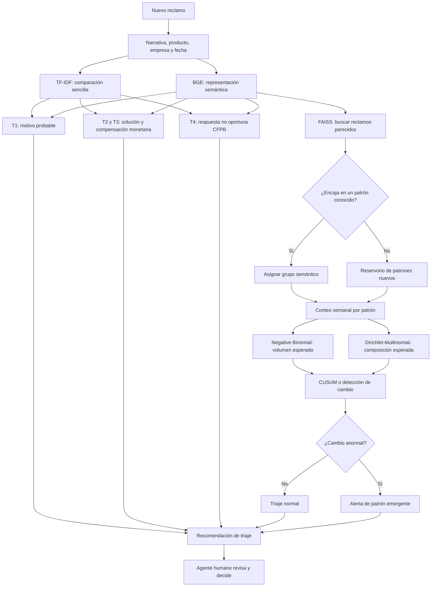

# Propuesta de modelos para el triaje

<!-- markdownlint-disable MD013 MD060 -->

Este documento registra la propuesta de modelado. No significa que todos los
modelos serán implementados. Cada opción deberá superar una comparación simple
y demostrar valor con datos que no fueron usados para entrenarla.

## Alcance real

El sistema busca **apoyar al agente humano**, no reemplazarlo. Con los datos
CFPB disponibles podemos construir un prototipo para:

- sugerir el motivo de un reclamo;
- estimar resultados históricos registrados por CFPB;
- recuperar reclamos con significado parecido;
- descubrir grupos de narrativas relacionadas;
- alertar cuando un patrón aumenta de forma inusual.

No podemos afirmar que detectamos fraude confirmado, pérdidas económicas, el
tiempo real de resolución de un banco ni su plazo interno de 15 días. Esas
etiquetas no existen en el archivo.

## Diccionario de resultados

| Nombre | Resultado propuesto | Límite |
|---|---|---|
| **T1** | Motivo CFPB (`Issue`) más probable | No equivale al equipo interno de un banco |
| **T2** | Probabilidad de alguna solución o compensación registrada | Puede usarse como señal auxiliar |
| **T3** | Probabilidad de compensación monetaria registrada | Es una aproximación a reembolso, no un reembolso bancario confirmado |
| **T4** | Probabilidad de respuesta no oportuna según CFPB | No mide resolución ni el plazo bancario de 15 días |
| **A1** | Alerta de patrón semántico emergente | Un patrón atípico no implica fraude |

Una **variable de entrada** es información disponible cuando llega el reclamo.
Un **objetivo** es el resultado histórico que intentamos predecir.

`Issue`, `Company response to consumer`, `Company public response` y
`Timely response?` no pueden entrar como variables del modelo que intenta
predecirlas, porque revelarían el resultado.

## Valor esperado

Los centros de atención suelen usar reglas para clasificar reclamos conocidos.
La propuesta añade una segunda capa:

1. Sugiere categorías para reducir clasificación manual.
2. Muestra probabilidades y reclamos históricos parecidos.
3. Identifica casos que no encajan bien en patrones conocidos.
4. Detecta aumentos de grupos semánticos relacionados.
5. Entrega evidencia al agente para que tome la decisión final.

El principal valor adicional frente a reglas estáticas es encontrar reclamos
parecidos aunque usen palabras diferentes y advertir cuándo aumentan juntos.

## Flujo propuesto

En el archivo actual, `Submitted via` siempre vale `Web`. Por tanto, ese campo
no aporta información al modelo. Podría ser útil en una futura aplicación si
el banco dispone de varios canales reales.

## Representación del texto

### TF-IDF: comparación inicial

**TF-IDF** representa cada narrativa mediante la importancia de sus palabras.
Es rápido, económico y suele funcionar bien cuando ciertas palabras están muy
relacionadas con una categoría.

Se evaluó con un clasificador logístico lineal entrenado por descenso de
gradiente. En 2025-H1 sin texto compartido mejoró la regla por producto para
T1–T3, pero no para T4. Un modelo posterior solo se justifica si mejora estas
referencias por objetivo.

### BGE: representación semántica

Un **embedding** es una lista de números que intenta representar el significado
del texto. Narrativas con significado parecido deberían quedar cerca aunque no
usen exactamente las mismas palabras.

Modelo candidato: `BAAI/bge-large-en-v1.5`.

La A100 disponible se utilizó para generar embeddings sobre una muestra
temporal. M5 comparó BGE y TF-IDF sobre las mismas filas y periodos.

En la validación sin texto compartido, BGE mejoró Macro-F1 de 0.1968 a 0.2367
para T1. En T2 prácticamente empató con TF-IDF y en T3–T4 quedó por debajo. La
decisión es usar BGE como candidato para T1 y para similitud semántica, no como
reemplazo general de TF-IDF.

Las narrativas largas requieren decidir si se recortan o se dividen en
fragmentos. E5 encontró que 8.43% supera 400 palabras.

## Modelos por componente

| Componente | Referencia | Decisión actual | Razón |
|---|---|---|---|
| T1 — motivo | TF-IDF + producto | BGE + producto | BGE mejoró Macro-F1 en M5 |
| T2 — alguna solución | Regla por producto | TF-IDF + producto | BGE empató, pero cuesta más |
| T3 — compensación monetaria | Regla por producto | TF-IDF + producto | TF-IDF superó a BGE |
| T4 — no oportuna CFPB | Frecuencia global | Regla por producto | Los modelos de texto fueron menos estables |
| Reducción y visualización | Embedding BGE | PCA y UMAP 2D | Reducir ruido y revisar visualmente el espacio semántico |
| Vecinos similares | No aplica | FAISS | Búsqueda rápida entre millones de embeddings |
| Grupos semánticos | HDBSCAN y CURE | MiniBatchKMeans con `k=40` | Único método que pasó separación, estabilidad, tamaño y asignación futura |
| Descripción del grupo | Palabras frecuentes | c-TF-IDF | Explicar cada grupo con términos representativos |
| Volumen temporal | Media histórica | Negative Binomial con PyMC | Estimar el conteo esperado y su incertidumbre |
| Composición temporal | Proporción histórica | Dirichlet-Multinomial con PyMC | Detectar cambios relativos entre todos los grupos |
| Cambio persistente | Regla por exceso semanal | CUSUM o BOCPD | Detectar aumentos pequeños que continúan varias semanas |

Un modelo **calibrado** produce probabilidades interpretables. Por ejemplo, de
100 casos con probabilidad cercana a 20%, aproximadamente 20 deberían resultar
positivos.

### Decisión después de M5

| Objetivo | Modelo conservado | Razón |
|---|---|---|
| T1 | BGE + producto | Mejoró Macro-F1 en 0.0399 sobre la misma muestra |
| T2 | TF-IDF + producto | BGE mejoró menos de 0.001 y cuesta más |
| T3 | TF-IDF + producto | Superó a BGE en precisión promedio |
| T4 | Regla por producto | Tanto TF-IDF como BGE quedaron por debajo de M3 |

La decisión se toma por objetivo. No se fuerza un único modelo para todo el
triaje. BGE continúa hacia M6 porque los embeddings también permiten recuperar
vecinos y formar grupos; esa utilidad no depende de ganar T2–T4.

El experimento usó 120,000 filas de ajuste, 40,000 de calibración y 80,000 de
validación. Los clasificadores convergieron y el artefacto está en DVC con hash
`009e3b35e25d9df095cf753e0a05f041.dir`.

## Descubrimiento de patrones

### FAISS y vecinos cercanos

FAISS permite buscar rápidamente qué reclamos históricos tienen embeddings
más cercanos al reclamo nuevo.

Esto aporta dos señales:

- **similitud:** el reclamo se parece a un patrón conocido;
- **novedad:** está lejos de los reclamos históricos comparables.

También ofrece una explicación útil al agente: puede mostrar ejemplos
históricos similares sin depender únicamente de una probabilidad.

### PCA y UMAP

M6 reutilizó los embeddings generados en M5 y no volvió a ejecutar BGE. PCA se
ajustó con las 120,000 filas de ajuste y transformó después las 40,000 de
calibración y 80,000 de validación.

**PCA** reduce las dimensiones de los embeddings y elimina parte del ruido. Se
ajustará únicamente con el periodo de ajuste y luego transformará los periodos
posteriores sin volver a aprender.

**UMAP** creará una visualización bidimensional sobre una muestra fija. El
resultado permite observar solapamientos, casos aislados y grupos dominados por
plantillas, pero no demuestra por sí solo que un clustering sea correcto. Las
distancias del gráfico 2D están distorsionadas y no se usarán como único insumo
del clustering.

Si HDBSCAN necesita una reducción adicional, se comparará:

- clustering directamente sobre PCA;
- clustering sobre PCA más UMAP de varias dimensiones.

El UMAP de dos dimensiones permanecerá reservado para visualización.

### Resultado de M6

PCA redujo los embeddings de 1,024 a 256 dimensiones y conservó 92.42% de la
variación. Con 128 componentes conservaba 82.86%. M7 comenzará con las 256
dimensiones para comparar todos los métodos sobre la misma representación.

La visualización UMAP mostró amplia superposición entre ajuste, calibración y
validación. También mostró zonas relacionadas con productos y casos aislados,
pero no se usará como prueba de que existe un cluster.

FAISS indexó las 120,000 filas de ajuste y recuperó vecinos para 1,000 consultas
sin texto compartido de calibración y 1,000 de validación. La similitud mediana
del vecino más cercano fue 0.9245 y 0.9177, respectivamente. En validación, el
77.1% compartió producto y el 37.4% compartió T1.

Esto justifica conservar FAISS para mostrar evidencia y estudiar novedad, pero
no usar el vecino más cercano como sustituto del clasificador. El artefacto está
en DVC con hash `08662a82971a71666b06c9ccf8120d7f.dir`.

### Comparación de grupos semánticos

Un **grupo semántico** reúne narrativas con significado parecido. Se evaluarán
tres alternativas sobre las mismas filas:

- **MiniBatchKMeans con k-means++:** referencia escalable que exige un número de
  grupos y asigna todos los reclamos;
- **HDBSCAN:** permite grupos con densidades distintas y puede dejar casos sin
  asignar como ruido;
- **CURE:** representa un grupo con varios puntos y puede capturar formas
  irregulares, pero primero debe demostrar que puede escalar y asignar reclamos
  futuros.

La comparación incluirá:

1. gráfico de silhouette y promedio sobre una muestra fija;
2. estabilidad al cambiar la muestra o semilla;
3. distribución de tamaños y porcentaje de ruido;
4. ejemplos cercanos y términos c-TF-IDF por grupo;
5. presencia de plantillas exactas o casi exactas;
6. tiempo, memoria y facilidad para asignar nuevos reclamos.

El **silhouette** compara qué tan cerca está un caso de su propio grupo frente a
los otros grupos. Valores cercanos a 1 indican separación, cerca de 0 indican
solapamiento y valores negativos sugieren una asignación dudosa. No será el
único criterio porque suele favorecer grupos compactos y puede penalizar las
formas irregulares de HDBSCAN o CURE.

### Resultado de M7

Se compararon 12 configuraciones sobre las mismas 20,000 filas de ajuste y un
UMAP común de 15 dimensiones.

MiniBatchKMeans con `k=40` fue el único método aceptado. Obtuvo silhouette
0.1376, estabilidad ARI 0.6260, ningún caso sin grupo y 98.99% de cobertura al
aplicar su regla de novedad en calibración. El grupo más grande representa
13.89% de la muestra.

HDBSCAN obtuvo silhouette 0.5455, pero formó solo 2 grupos y marcó 48.91% como
ruido. El valor alto describe únicamente la parte que decidió agrupar; no
compensa la baja cobertura.

CURE obtuvo silhouette 0.4093, pero colocó 99.21% de los reclamos en un solo
grupo. Su estabilidad ARI fue 0.4307. Por eso también fue rechazado.

La elección de k-means es operacional, no una afirmación de que existan 40
categorías naturales. Su silhouette es moderado y 28.96% de los casos evaluados
tiene silhouette negativo. M8 deberá ajustar nuevamente `k=40` con todas las
120,000 filas de ajuste y conservar una señal separada de novedad.

El artefacto M7 está en DVC con hash
`425408aa84d0e2a44b8c5becd467e724.dir`.

c-TF-IDF ayudará a describir cada grupo mediante las palabras que lo distinguen
de los demás. No determina fraude ni reemplaza la revisión humana.

E6 mostró que muchos textos son plantillas exactas o casi exactas. Antes de
generar alertas, se comprobará si esas plantillas dominan un grupo. Se
reportarán tanto el conteo de reclamos como el número de textos normalizados
diferentes.

## Modelos temporales

Los modelos temporales se aplican **después** de crear grupos semánticos. No
procesan directamente millones de embeddings: reciben conteos por grupo y
semana.

### Negative Binomial

La distribución **Negative Binomial** modela cuántos reclamos esperamos para un
grupo. Permite más variación que una distribución Poisson simple, algo común en
reclamos con picos y campañas.

Pregunta principal:

> ¿Este patrón tiene más reclamos de los esperados en términos absolutos,
> considerando el volumen general?

PyMC puede estimar el valor esperado, diferencias entre grupos y la
incertidumbre de la estimación.

### Dirichlet-Multinomial

La **Dirichlet-Multinomial** modela cómo se reparte el total semanal entre los
diferentes grupos.

Pregunta principal:

> ¿Cambió la proporción que representa este patrón dentro de todos los
> reclamos?

No crea los grupos. Recibe grupos ya definidos mediante embeddings y analiza
su composición conjunta.

### Por qué se usan juntas

| Modelo | Pregunta |
|---|---|
| Negative Binomial | ¿El conteo del patrón es mayor que el esperado? |
| Dirichlet-Multinomial | ¿El patrón ocupa una proporción inusual del total? |

Ejemplo:

- Históricamente llegan 10,000 reclamos semanales.
- Un patrón representa 0.5%, aproximadamente 50 reclamos.
- Esta semana aparecen 120, es decir, 1.2% del total.

Negative Binomial detectaría el exceso de 50 a 120. Dirichlet-Multinomial
confirmaría que la participación aumentó de 0.5% a 1.2%.

Si el volumen total se duplicara a 20,000 y el patrón subiera a 100, su
participación seguiría siendo 0.5%. Al considerar el volumen total, ninguno de
los dos modelos debería tratar ese aumento proporcional como una alerta por sí
solo.

### CUSUM y detección de cambio

**CUSUM** acumula desviaciones pequeñas respecto de lo esperado. Puede detectar
un aumento persistente que no parece extremo en una sola semana.

Otra opción es **Bayesian Online Change-Point Detection (BOCPD)**, que estima la
probabilidad de que haya comenzado un comportamiento nuevo. Se comparará solo
después de construir una referencia temporal sencilla.

## Cómo una alerta cambia el triaje

| Situación | Acción sugerida |
|---|---|
| Patrón conocido y estable | Triaje normal |
| Reclamo aislado y novedoso | Revisión manual; no elevar automáticamente |
| Patrón conocido con crecimiento anormal | Agrupar casos y alertar a un equipo especializado |
| Grupo dominado por una plantilla habitual | Evitar una alerta automática hasta validar su importancia |
| Patrón nuevo que continúa creciendo | Priorizar investigación y considerar una nueva regla |

Una alerta no afirma fraude. Informa al agente que varios reclamos pueden estar
relacionados y que conviene revisarlos juntos.

## Orden de experimentación

1. Terminar EDA, transformaciones y divisiones temporales.
2. Entrenar TF-IDF + regresión logística para T1–T4.
3. Comparar BGE usando las mismas filas y métricas.
4. Reutilizar los embeddings de M5 y validar vecinos FAISS.
5. Ajustar PCA en el periodo de ajuste y crear una visualización UMAP.
6. Comparar MiniBatchKMeans++, HDBSCAN y CURE con la misma muestra.
7. Elegir y congelar grupos usando silhouette, estabilidad, coherencia y costo.
8. Generar los embeddings faltantes, asignar el corpus elegible y crear conteos
   semanales completos.
9. Probar Negative Binomial como modelo temporal principal.
10. Probar Dirichlet-Multinomial como comprobación de composición.
11. Calibrar CUSUM para detectar cambios persistentes.
12. Integrar las señales en una recomendación revisada por una persona.

## Evaluación

Las divisiones respetarán el tiempo:

- ajuste: 2023-01-01 a 2024-09-30;
- calibración: 2024-10-01 a 2024-12-31;
- validación temporal: 2025-01-01 a 2025-06-30.

Se reportará una vista completa y otra que excluye textos ya vistos en periodos
usados para aprender. La vista sin texto compartido será la principal para
elegir modelos.

- **T1:** Macro-F1, top-3 y F1 por motivo.
- **T2–T4:** average precision, precisión, cobertura y Brier score.
- **Clustering:** silhouette sobre una muestra fija, estabilidad, tamaños,
  porcentaje de ruido, coherencia semántica, tiempo y memoria.
- **Patrones temporales:** revisión humana, tiempo hasta detectar un crecimiento
  y cantidad de falsas alertas por semana.

Para T2–T4, el umbral se elegirá maximizando F1 en la calibración sin texto
compartido. Luego permanecerá fijo durante la validación.

A partir de esta nueva rama, ningún modelo será elegido usando 2025-H2 o 2026.
Sin embargo, un experimento anterior ya consultó una muestra de 25,000 casos de
2025-H2. Esos IDs y todos los registros que compartan sus grupos de texto
deberán excluirse de una evaluación final intacta. El tamaño elegible se
calculará después de esa exclusión. Si la lista no puede recuperarse, 2025-H2
se declarará contaminado y no se presentará como evaluación final intacta.

2026 seguirá separado porque su cobertura es parcial. Como la fecha de
extracción no está documentada, T2–T4 no se evaluarán allí hasta definir cuánto
tiempo debe pasar para considerar que la respuesta histórica ya maduró. T1 y la
disponibilidad de entradas sí podrán estudiarse.

## Aplicación web futura

La aplicación puede mostrar:

- motivo probable y alternativas;
- probabilidades T2–T4 con sus límites;
- reclamos históricos similares;
- grupo semántico y evolución semanal;
- explicación de la alerta;
- decisión y comentario del agente humano.

Después del triaje, un agente construido con LangGraph podría redactar una
respuesta sugerida usando información aprobada. Esa respuesta siempre deberá
ser revisada por una persona antes de enviarse.
