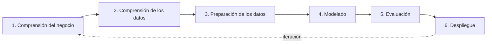
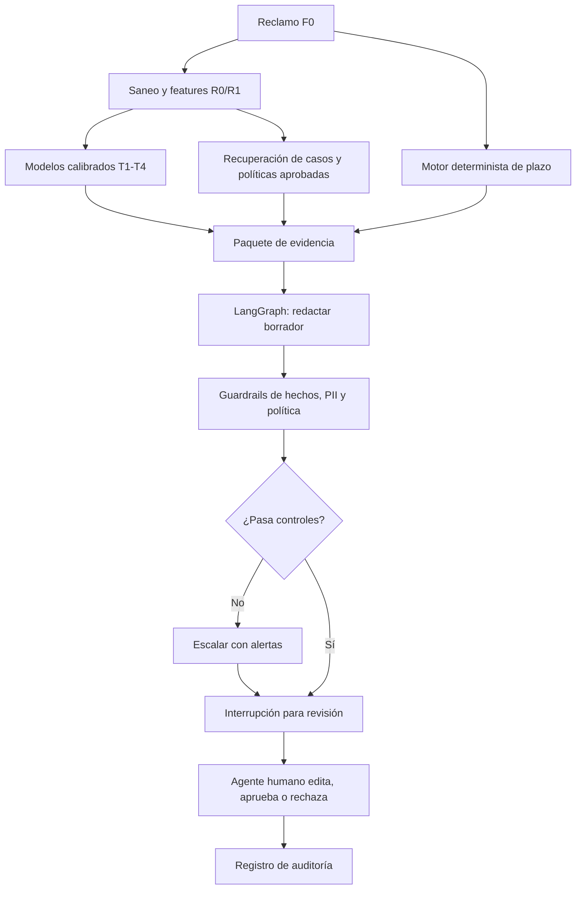

# Plan de EDA y transformación de datos — Triaje de reclamos financieros

**Objetivo:** llevar `data/raw/cfpb_reclamos_narrativa.parquet` (3,837,184 × 16, todo `str`)
a un dataset entrenable en `data/processed/`, con los targets que el caso de negocio
realmente puede pagar, sin fugas y con validación temporal; después, exponer los modelos
en un mockup web de apoyo a la decisión.

**Alcance del Informe I:** EDA completo (E1-E14) + creación y auditoría de features
(Fases 2-5). E12 y E13 entrenan modelos pequeños únicamente como **sondas diagnósticas**
para comparar representaciones; el entrenamiento y selección final de T1-T4 pertenece al
Informe II. El agente redactor y el mockup se diseñan ahora, pero no forman parte de las
features ni del entregable del Informe I.

## Encaje en CRISP-DM y estado actual



- **1. Comprensión del negocio:** suficientemente cerrada para el Informe I con D1-D6,
  T1-T4 y la arquitectura humano-en-el-bucle. Se revisará cuando exista información del
  banco sobre capacidad, costos y plazos reales.
- **2. Comprensión de los datos:** etapa activa. E1-E11 están producidas; falta cerrar
  E12-E14 y registrar sus resultados en Quarto.
- **3. Preparación de los datos:** diseñada, todavía no completada. Se adelanta solo la
  infraestructura mínima —tipado, cortes temporales, hash y muestra de train— que E12-E14
  necesitan para no producir fuga. Después se completan Fases 2-5.
- **4-6. Modelado, evaluación y despliegue:** fuera del trabajo inmediato. TabPFN, PyMC,
  simulación, app y LangGraph pertenecen a esas etapas, no al cierre del EDA.

**Caso de negocio (de las slides):** la jefa de atención al cliente necesita que cada
reclamo entrante llegue (a) clasificado por motivo, (b) priorizado por riesgo, (c) con
semáforo de plazo legal, (d) con borrador de respuesta. El oficial de cumplimiento
necesita causas raíz por producto y mes. El mockup representa una herramienta de apoyo:
el agente humano conserva la decisión y aprueba o edita cualquier texto antes de enviarlo.
El CFPB es un proxy de ese entorno; una institución concreta deberá validar la transferencia
de dominio y repetir la ablación con/sin `Company`.

---

## 0. Lo que el negocio pide → lo que el dato permite entrenar

| Necesidad de negocio | Modelo | Target | Tasa base (2025) |
|---|---|---|---|
| Clasificar y enrutar por motivo | **T1** multiclase | `motivo_canonico` (de `Issue`, solo etiqueta histórica) | top-1 = 31.4% |
| Priorizar por probabilidad de relief registrado | **T2** binaria | `relief` = `Company response to consumer` ∈ {monetary, non-monetary} | 36.8% |
| Probabilidad de relief monetario | **T3** binaria | `relief_monetario` | 1.2% |
| Riesgo de incumplir el plazo | **T4** binaria | `fuera_plazo` = `Timely response? == "No"` | 0.9% |
| Semáforo operativo | Regla + T4 | días restantes por regla + probabilidad T4 | — |
| Borrador de respuesta | Agente LLM LangGraph, posterior a T1-T4 | — | requiere fuentes aprobadas, guardrails y rúbrica |
| Causas raíz por producto/mes | Agregación, no modelo | — | — |

**Bloqueante de alcance (D1):** las slides prometen "riesgo de disputa" con el campo
*Disputa del consumidor*. Ese campo **no está** en las 16 columnas (el CFPB dejó de
publicar `Consumer disputed?` en 2017). O se pide la columna al docente, o el objetivo
se redefine como T2 (`relief` = la respuesta final registró relief monetario o no
monetario) y se declara como **proxy** en la slide. Recomendación: T2, con ese nombre
preciso y sin interpretarlo como obligación, validez o disputa.

### D1b — Regla de etiquetado de T2/T3, caso por caso (medido en E1)

`Company response to consumer` no es binaria: tiene **6 valores y 9 nulos**. Escribir
`relief = respuesta.isin([...])` sin más convierte tres casos ambiguos en ceros silenciosos.
Conteos sobre las 3,837,184 filas:

| Valor | Filas | T2 `relief` | T3 `relief_monetario` | Por qué |
|---|---|---|---|---|
| `Closed with explanation` | 2,548,866 | 0 | 0 | resuelto sin compensar |
| `Closed with non-monetary relief` | 1,175,215 | **1** | 0 | compensación no económica |
| `Closed with monetary relief` | 98,150 | **1** | **1** | compensación económica |
| `Untimely response` | 11,092 | 0 | 0 | la empresa no respondió a tiempo; **no** es ausencia de relief, es ausencia de respuesta — se etiqueta 0 pero se marca con un flag y se reporta su métrica aparte |
| `Closed` | 3,741 | 0 | 0 | categoría heredada, sin detalle de resultado; 0 por convención, documentado |
| `In progress` | 111 | **excluir** | **excluir** | censura a la derecha explícita: aún no hay resultado. Codificarlo como 0 mete ruido dirigido |
| nulo | 9 | **excluir** | **excluir** | sin etiqueta |

Tasas resultantes sobre el total histórico: `relief` = **33.19%**, `relief_monetario` =
**2.56%**. (Las tasas de 2025 de la tabla de arriba, 36.8% y 1.2%, son del régimen
reciente; la diferencia es la deriva de D3, no un error.) `Timely response? == "No"` =
**42,615 filas = 1.11%** histórico.

Regla operativa: `In progress` y los nulos **se excluyen de train, val y test** de T2/T3, y
el conteo de filas excluidas se registra. Para T4 no aplica: `Timely response?` no tiene
nulos. Como `Untimely response` y `Closed` no prueban ausencia de relief, E12 debe añadir
una sensibilidad que los excluya y comparar prevalencia, PR-AUC y calibración contra la
convención principal; si la conclusión cambia, T2 no está suficientemente identificado.

---

## 1. Decisiones de diseño que condicionan todo lo demás

### D2 — Contrato de disponibilidad (anti-fuga). Es la decisión más importante.

| Tier | Campos | Uso permitido |
|---|---|---|
| **F0 — ingreso** | `Date received`, `Consumer complaint narrative`, `Company`, `State`, `ZIP code`, `Tags` | features de todos los modelos |
| **F1 — declarado en formulario** | `Product`, `Sub-product`, `Issue`, `Sub-issue` | **etiqueta** de T1; feature solo en variantes marcadas "con taxonomía declarada" (en la bandeja del banco no existe) |
| **FX — post-respuesta, PROHIBIDO como feature** | `Date sent to company`, `Company response to consumer`, `Company public response`, `Timely response?` | solo targets y diagnóstico |
| **Clave** | `Complaint ID` (3.8 M únicos) | trazabilidad, nunca feature |
| **Fuera** | `Submitted via` (un solo valor: `Web`) | varianza cero, se elimina |

Consecuencia: **no hay ninguna variable numérica de origen**. Toda feature numérica se
construye desde F0 (longitud de narrativa, densidad de `XXXX`, frecuencia histórica de
la empresa, mes, etc.). En particular, *días de gestión* (`Date sent to company` −
`Date received`) es FX: no se conoce al momento de triar, así que queda como variable de
diagnóstico, no como feature.

### D3 — Ventana de entrenamiento: régimen actual, no historia completa

La taxonomía y la tasa base se rompen entre 2022 y 2024:

- `Credit reporting` (2015-17) → `…credit repair services…` (2017-23) → `…or other personal consumer reports` (2023-26).
- `relief`: 20% (2015) → 11% (2020) → 46% (2024) → 37% (2025).
- Volumen: 2025 concentra 1.22 M filas (32% del total); 2023+ = 2.63 M (69%).

**Decisión:** dataset principal = **2023-01 a 2025-12** (2.52 M filas). La historia
2015-2022 se conserva como experimento de deriva con etiquetas canonicalizadas, no como
train por defecto. **2026 queda fuera** por la razón de D3b.

### D3b — 2026 es otro régimen, no un año incompleto (medido en E2/E3/E9)

La pregunta que D4 dejaba abierta —¿la anomalía de 2026 es censura o cambio de
composición?— está resuelta, y la respuesta obliga a mover el test. Tres evidencias
independientes:

1. **El campo de censura está vacío.** De los 107,158 reclamos de 2026, exactamente **uno**
   está marcado `In progress`. Si el problema fuera que los casos siguen abiertos, ese
   contador sería enorme.
2. **El volumen no decae, se quiebra.** 2025-12 cierra con 56,510 reclamos y 2026-01 con
   22,211: **−61% en un mes**, seguido de una meseta de 10-22 mil durante seis meses. Un
   rezago de publicación produce una cola que se desvanece en 1-2 meses, no un escalón
   seguido de meseta.
3. **Cambia la mezcla, no solo la cantidad.** Es el argumento decisivo: la familia
   *credit reporting* pasa de **75% del año en 2025 a 4% en 2026**, mientras
   *debt collection* sube de 8% a 34% y *checking or savings account* de 4% a 18%. Un
   rezago retrasa todos los tipos por igual y **conserva la mezcla**.

Conclusión: 2026 es un **proceso generador distinto**. El dato no dice por qué; hay que
verificar con fuentes externas qué cambió en la operación o en la política de publicación
del CFPB. **El diseño ya no depende de esa respuesta**: 2026 queda fuera del entrenamiento
y de la evaluación principal en régimen, pero se conserva como stress test OOD parcial. El informe final debería
poder nombrar la causa en vez de solo describirla.

### D4 — Split temporal, nunca aleatorio; dos lecturas de repetidos

- `train` 2023-01 → 2024-12 · `val` 2025-01 → 2025-06 · `test` 2025-07 → **2025-12**.
  2026 no se mezcla con esa métrica: se conserva como stress test OOD separado.
- El 39.1% histórico comparte narrativa con otra fila (2.58 M textos únicos / 3.84 M
  filas). Una plantilla que reaparece después del corte puede ser producción real, no fuga.
  Por eso se reportan dos vistas temporales: **operacional**, que conserva recurrencias, y
  **texto nuevo**, que purga de val/test los hashes vistos en train.
- La vista purgada mide generalización sin memorización; la operacional estima el desempeño
  de la bandeja. Ninguna mueve filas futuras hacia train ni usa un split aleatorio.
- Censura a la derecha: el quiebre 2026 no es censura según D3b. Dentro de 2023-2025 se
  revisa el último mes por rezago normal de consolidación.

### D5 — Muestra de desarrollo

175 k filas temporales: 100 k de train y 25 k de validación, 2025-H2 y OOD 2026. Sirve para
comparar métodos; las features finales se reajustan sobre el corpus completo. Versionada con DVC.

### D6 — Dos representaciones del texto; el LLM no es una feature

El pipeline predictivo compara únicamente dos niveles. El agente generativo queda aguas
abajo y nunca crea variables para T1-T4.

| Nivel | Qué es | Costo marginal | Corre sin red |
|---|---|---|---|
| **R0** | TF-IDF de palabras/caracteres + derivadas numéricas | CPU, minutos | sí |
| **R1** | Embeddings de oración locales por defecto; API solo como experimento futuro | CPU/GPU-hora | local sí |

Reglas de R1:

1. **Solo ve la narrativa F0.** El texto embebido no incluye `Product`/`Issue` (F1) ni
   ningún campo FX.
2. **Se calcula una vez por `hash_narrativa`, no por fila.** El vector se cachea y se
   reutiliza en E13, E14, features y recuperación de casos similares.
3. **Modelo pineado y versionado.** Nombre, revisión, estrategia de truncado/chunking y
   dimensión se declaran en `configs/embeddings.yaml` y en los metadatos DVC.
4. **Saneo previo.** R1 local evita egreso de datos; cualquier comparación futura por API
   exige enmascarar PII residual y registrarlo en `docs/data_card.md`.

El **agente LangGraph** no se denomina R2: consume la narrativa saneada, los scores
calibrados de T1-T4, el plazo calculado por reglas, políticas aprobadas y casos similares.
Produce un borrador para revisión humana. Su texto no vuelve automáticamente al dataset
como feature ni como etiqueta.

---

## 2. Fase 1 — EDA (`notebooks/01_eda_*.ipynb`, figuras a `reports/figures/`)

Cada bloque produce **una figura o tabla reutilizable en las slides**. Cada etapa deja un
CSV pequeño en `reports/artefactos/` y el informe de Quarto lo grafica; el informe nunca
lee el parquet. Estado al día de hoy: **E1-E9 y E11-E14 completos**, E10 es el contrato F0/F1/FX y
la comprensión de datos está cerrada. F2/F3 del corpus completo también están ejecutadas.

| # | Pregunta | Entregable |
|---|---|---|
| E1 | Perfil de tipos, nulos, cardinalidad, memoria | ✅ hecho — `reports/artefactos/e01_tabla_tipos.csv` (16 filas), vía `uv run python -m src.data.profile` |
| E2 | Volumen por mes y cobertura temporal | ✅ hecho — `e02_volumen_mensual.csv`; el quiebre de 2026-01 (−61%) es el hallazgo de D3b |
| E3 | Deriva de taxonomía: `Product`/`Issue` × año | ✅ hecho — `e03_producto_anio.csv`, `e03_issue_anio.csv`; heatmap en el informe |
| E4 | Desbalance por nivel | ✅ hecho — `e04_pareto_issue.csv`. Histórico: `Issue` top-1 31.4%, top-10 78.6%, 84 de 173 con <1000 filas. **En el régimen 2023-2025 solo sobreviven 92 de las 173 etiquetas**, el top-1 sube a 36.8% y bastan 6 clases para el 80%: el mapa canónico se construye sobre esas 92 |
| E5 | Duplicados y plantillas | ✅ hecho — `e05_plantillas.csv`, vía `uv run python -m src.data.narrativa`. Con hash del texto **normalizado**, 41.4% de las filas está en un grupo repetido (52.5% dentro del régimen) y la plantilla mayor tiene 30,110 copias. Sobre el texto crudo son 39.1% y 27,496: la diferencia es espaciado, y la definición que impide fuga es la normalizada |
| E6 | Narrativa | ✅ hecho — `e06_narrativa.csv`, misma pasada que E5. Longitud (media 1,022 car., p50 669, p99 5,873) confirmada; 69.5% de los textos trae bloques `XXXX` y el 6.0% de todos los caracteres es enmascarado. Idioma: español < 0.01%, no hace falta detector. **PII residual ≠ 0** (25,335 textos del régimen con correo, URL o cadenas de 6+ dígitos): la regla 4 de D6 queda confirmada como obligatoria |
| E7 | Empresas | ✅ hecho — `e07_empresas.csv`. Histórico: top-5 = 64.3%, top-50 = 84.3%, 3,908 de 6,831 con <10 reclamos. **En el régimen la concentración empeora: los tres burós de crédito son el 71.7%** (contra 60.7% histórico) y quedan 4,371 empresas. Riesgo nuevo: el modelo puede aprender *de qué empresa* se habla en vez de *qué problema*; E14 debe repetirse con los nombres enmascarados |
| E8 | Geografía | ✅ hecho — `e08_geografia.csv`. Confirmado: 861,165 valores con `X` (22.4% histórico). **Corrección: las 290 filas no son malformadas, son nulas**, y están todas fuera del régimen — no existe ningún `ZIP code` con una forma distinta de `NNNNN`, `NNNXX` o `XXXXX`. El prefijo de 3 dígitos se deriva en el 98.4% de las filas del régimen y baja la cardinalidad de 6,935 a **876** |
| E9 | Targets candidatos y su deriva | ✅ hecho — `e09_tasas_anuales.csv`, `e09_tasas_producto.csv` |
| E10 | Auditoría de fuga | tabla F0/F1/FX acordada por el equipo |
| E11 | Sesgo | ✅ hecho — `e11_sesgo.csv`, vía `uv run python -m src.evaluation.slices`. Estandarización directa por producto. La sospecha se confirma **y deja residuo**: en el régimen, `Older American` pasa de 9.85% vs 1.38% (7.1×) a 3.07% vs 1.55% (2.0×) al ajustar — la mezcla explica ~82% de la brecha, no toda. `State` en cambio se explica casi entero (rango T2 de 4.7 pp a 2.5 pp). Consecuencia: cortes por `Tags` obligatorios en la Fase 6 |
| E12 | Piso de señal | TF-IDF word+char + modelo lineal sobre 100 k filas: macro-F1/top-3 para T1 y PR-AUC/calibración para T2-T4; incluye sensibilidad de T2 |
| E13 | ¿Vale un embedding? | mismas filas, splits y clasificador: F0/R0 frente a R1 local y sus combinaciones; delta de métrica, memoria y latencia |
| E14 | Estructura latente y topics | embedding → UMAP 10-15D → HDBSCAN + c-TF-IDF/BERTopic; topics por tiempo/producto, estabilidad, contingencias y contraste con empresa enmascarada |

**Salida de fase:** `docs/data_card.md` con esquema, fuente, límites conocidos y
decisiones D1-D6 registradas.

**Orden para cerrar E12-E14 sin circularidad:** preparar primero las fronteras temporales,
normalizar/hashar la narrativa y tomar una muestra solo desde train; generar R1 local una
vez; ejecutar E14 sobre train para aportar evidencia al mapa; congelar la taxonomía; correr
E12 y E13 sobre el mismo split. El clustering y la canonicalización nunca miran las
narrativas ni contingencias de validación/test para tomar decisiones.

**Definición de EDA terminado:** E1-E14 tienen artefacto, método, parámetros, figura/tabla y
conclusión incorporados a `reports/informe/informe.qmd`; la muestra, hashes, embedding local
y resultados son reproducibles mediante DVC. Hasta cumplirla no se prueban modelos finales
ni nuevas familias de features.

**Freeze de alcance para cerrar el EDA:** BERTopic/c-TF-IDF entra ahora como parte de E14.
Von Mises, TabPFN, PyMC, KumoRFM, esquema relacional, app y LangGraph quedan registrados en
sus fases futuras y no son dependencias de E12-E14 ni del cierre de comprensión de datos.

---

## 3. Fase 2 — Tipado y contrato de esquema → `data/interim/tipado.parquet`

`src/data/typing.py` + `configs/dtypes.yaml`:

- `Date received`, `Date sent to company` → `datetime64[ns]` (formato `%Y-%m-%d`, validado).
- `Timely response?` → `bool`.
- 9 categóricas de baja cardinalidad → `category`.
- `Company`, `ZIP code` → `category` (alta cardinalidad; el encoding viene en features).
- `Complaint ID` → `int64` si es numérico puro, con test de unicidad.
- `Consumer complaint narrative` → `string[pyarrow]`.
- `Tags` → **dos booleanas** (`es_militar`, `es_adulto_mayor`). E1 confirma que la
  descomposición es exacta y cerrada: solo hay 3 valores no nulos —
  `Servicemember` (240,176), `Older American` (98,630) y
  `Older American, Servicemember` (28,826). Resultado: `es_militar` 269,002 filas (7.01%),
  `es_adulto_mayor` 127,456 (3.32%), sin tag 90.42%.
- Nulos explícitos: `Tags` 90.4%, `Company public response` 46.8%, `Sub-issue` 8.7% →
  categoría `SIN_DATO` más un flag booleano donde el nulo sea informativo.

Efecto medido: las 15 columnas no-narrativa pasan de **1.54 GB → 0.29 GB (−81%)**.

Validación con `pandera`: tipos, rangos de fecha, dominio de categóricas, unicidad de ID.
El pipeline falla si el contrato se rompe.

---

## 4. Fase 3 — Canonicalización de taxonomía → `data/interim/canonico.parquet`

`src/data/canonicalize.py` + `configs/taxonomia.yaml` (mapa versionado, revisado a mano).

1. `producto_canonico`: 21 etiquetas crudas → ~11 (unifica las tres variantes de
   *credit reporting*, las dos de *credit card*, las de *payday/personal loan*).
2. `motivo_canonico`: 173 `Issue` → ~25-40 clases con volumen suficiente; las 84
   etiquetas con <1000 filas se agrupan o van a `OTRO` (documentar la regla).
3. Test de regresión obligatorio: **cada etiqueta canónica debe existir en train y en
   test**. Sin esto, entrenar en 2023-24 y evaluar en 2025 produce métricas absurdas.
4. Guardar la trazabilidad `etiqueta_cruda → canónica` para el tablero de cumplimiento.

### 4.5 ¿Y si el mapa lo descubre un clustering? (UMAP + HDBSCAN)

Pregunta abierta del equipo. Respuesta corta: **el clustering no reemplaza el mapa, lo
justifica.** El mapa tiene que ser determinista, versionado y estable en el tiempo — una
etiqueta cruda cae siempre en la misma canónica, hoy y en la corrida del mes que viene. Un
clustering es estocástico, sensible a hiperparámetros y se mueve cuando cambia la muestra:
si `taxonomia.yaml` dependiera de él, la taxonomía cambiaría sola entre corridas y el test
de regresión de §4.3 dejaría de significar nada. Pero como **evidencia** para decidir el
mapa a mano, es lo mejor que hay, y con el embedding local no cuesta nada.

Receta, en este orden:

1. Sobre **textos únicos** (dedup de la Fase 4 primero) de la muestra de desarrollo,
   100-300 k. Sin dedup, la plantilla de 27,496 repeticiones se convierte en su propio
   cluster y arrastra la estructura entera.
2. Embedding local R1 (§6.2). Costo cero y es el mismo artefacto que ya se necesita.
3. `UMAP(n_components=10..15, metric="cosine", random_state=...)` → `HDBSCAN`. **Dos UMAP
   distintos:** uno de 10-15 dimensiones para clusterizar, y uno de 2 dimensiones *solo*
   para la figura. Clusterizar sobre las 2D del gráfico es el error clásico: esa proyección
   está optimizada para verse bien, no para preservar densidad.
4. Tabla de contingencia cluster × `Product` crudo y cluster × `Issue` crudo.

Cuatro lecturas, cada una con una acción concreta sobre `taxonomia.yaml`:

| Patrón en la contingencia | Lectura | Acción |
|---|---|---|
| Las tres variantes de *credit reporting* caen en el mismo cluster | el texto confirma que son el mismo producto | unificar en el mapa, con la figura como respaldo en la slide |
| Dos `Issue` distintos ocupan el mismo cluster sin frontera | ninguna feature de texto los va a separar | fusionarlos en la canónica, o aceptar el techo y declararlo |
| Un `Product` se parte limpio en varios clusters | la etiqueta declarada mezcla cosas distintas | candidato a subdividir, o señal de que `Sub-product` sí aporta |
| Cluster denso que no corresponde a ninguna etiqueta | causa raíz que la taxonomía del CFPB no captura | insumo directo del tablero del oficial de cumplimiento |

Métricas, para no discutir mirando el gráfico: ARI y NMI entre clusters y
`producto_canonico` propuesto (cuánto de la taxonomía declarada sostiene el texto),
pureza por cluster, % de puntos marcados como ruido por HDBSCAN, y **estabilidad**:
repetir con 3 semillas y 2 tamaños de muestra. Si el ARI entre corridas es bajo, la
estructura no es real y no se usa como argumento de nada.

Tres advertencias que decidirán si esto sirve o no:

- **Los embeddings de estas narrativas capturan *de quién* se reclama tanto como *de
  qué*.** Con top-5 empresas = 64.3% del volumen, es muy posible que los clusters salgan
  "Equifax / Experian / TransUnion" en vez de "tipo de problema". Contraste obligatorio:
  repetir con los nombres de empresa enmascarados y ver si los clusters cambian. Si
  cambian mucho, ese hallazgo vale más que el clustering original.
- **Control barato:** SVD del TF-IDF + KMeans sobre los mismos textos. Si el embedding no
  produce clusters más coherentes que eso, tampoco va a mejorar al clasificador — y el
  gate de §6.4 queda medio resuelto gratis, antes de gastar un peso.
- **BERTopic es parte de E14**, no una extensión futura: reutiliza embedding, UMAP y
  HDBSCAN, y añade c-TF-IDF para nombrar cada cluster. Se generan topics por tiempo y por
  producto, documentos representativos y una tabla de términos. No se usa ningún LLM para
  poner nombres. El topic puede evaluarse después como feature, pero no entra a F5 sin una
  ablación ajustada solo en train.

**Consecuencia de orden — esto invierte una dependencia del plan.** Los embeddings locales
R1 dejan de ser un paso de la Fase 5 y se calculan **temprano, sobre la muestra de
desarrollo**, porque la Fase 3 los necesita como insumo. La vía de API sigue donde estaba,
detrás del gate de §6.4.

---

## 5. Fase 4 — Repetidos, deduplicación analítica y splits → `data/interim/split.parquet`

`src/data/dedupe.py`, `src/data/split.py`.

**Deduplicar no significa borrar reclamos.** Varias filas pueden contener exactamente la
misma narrativa —por ejemplo, una plantilla— y aun así corresponder a personas, empresas o
desenlaces distintos. La etapa agrupa textos para evitar optimismo y cómputo repetido:

1. `hash_narrativa` = SHA-1 del texto normalizado. El embedding se calcula una sola vez por
   hash; `n_plantilla_previo` cuenta solo repeticiones conocidas hasta la fecha de la fila.
2. Auditar por hash la cantidad de empresas, productos y etiquetas T1-T4 distintas. Un
   grupo con targets contradictorios no se colapsa a una fila para entrenar outcomes.
3. Conservar la vista **completa** para representar volumen real y una vista **por texto**
   para clustering/análisis. El peso `1/n_grupo` responde a rendimiento por narrativa única,
   no por reclamo; ambas lecturas se reportan por separado.
4. Mantener siempre cortes temporales. Evaluación A, operacional: permite que una plantilla
   vista en train reaparezca después. Evaluación B, generalización: purga de val/test los
   hashes ya vistos en train. La segunda es la métrica primaria anti-memorización; la primera
   muestra el comportamiento esperado en la bandeja real.
5. Registrar filas purgadas y conflictos de etiqueta. Cerca-duplicados por similitud coseno
   o MinHash/LSH son una extensión, justificada por el gap entre ambas evaluaciones.

---

## 6. Fase 5 — Features → matrices sparse/densas + manifiestos Parquet

`src/features/`, todo `fit` **solo en train**, serializado en `models/encoders/`.

- **Texto R0** (`text.py`): normalización de `XXXX`, minúsculas, TF-IDF de palabras
  (1-2 gramas, `min_df=5`) y caracteres (3-5 gramas). Derivadas numéricas:
  `n_caracteres`, `n_palabras`, `ratio_mayusculas`, `n_xxxx`, `n_montos`, `n_fechas`,
  `tiene_amenaza_legal` (léxico) y `n_plantilla_previo`. R1 se detalla en §6.2.
- **Categóricas** (`categorical.py`): one-hot para baja cardinalidad; para `Company` y
  `ZIP-3`, codificación por frecuencia y por target con *smoothing* y **calculada solo
  con datos anteriores al periodo de la fila** (evita fuga temporal); bucket `OTRA` para
  la cola de 3,908 empresas con <10 reclamos.
- **Temporales** (`temporal.py`): mes, día de semana, año, semanas desde el inicio del
  régimen, indicador de picos de volumen. No incluye *días de gestión* (es FX). La versión
  inicial usa mes categórico y codificación seno/coseno; bases circulares de Von Mises quedan
  como ablación posterior, no como requisito de F5.
- **Ensamblado** (`build.py`): matriz por tier — `F0` (producción) y `F0+F1`
  (referencia superior, no desplegable) — y por representación (tabular / R0 / R1 /
  R0+R1), seleccionado desde `configs/features.yaml`. `Tags` se conserva siempre para
  auditoría; usarlo para priorización requiere una decisión explícita de gobernanza.
- **Persistencia:** metadatos, IDs y tabulares en Parquet; TF-IDF como matrices CSR `.npz`;
  embeddings en `.npy`/`float16` con índice `hash_narrativa`. No densificar TF-IDF ni
  guardarlo como miles de columnas Parquet.

Salida validada con `pandera` y una prueba automática que **falla si aparece cualquier
columna FX** en la matriz de features.

### 6.1 Transformaciones temporales opcionales

Si seno/coseno deja señal estacional no lineal en los residuos del baseline, se compara con
bases de Von Mises sobre mes o día del año. No se aplica por defecto: con doce meses, una
variable categórica ya es una referencia fuerte, y los árboles pueden aprender esa
periodicidad sin la transformación. La comparación pertenece a una ablación posterior de
features, después de cerrar E12-E14.

### 6.2 R1 — Embeddings de oración (`src/features/embeddings.py`)

**Decisión para el Informe I:** comenzar con `all-MiniLM-L6-v2`, porque el EDA encuentra
un corpus prácticamente en inglés y sus 384 dimensiones permiten iterar barato. Comparar
después un E5/BGE inglés de tamaño base si R1 muestra señal. No se llama a OpenAI ni a
Gemini en esta fase. Una API queda como experimento futuro y solo sobre la muestra si el
modelo local supera el gate.

| Opción | Modelo | Dim | Precio de referencia | Notas |
|---|---|---|---|---|
| **Local — vía por defecto** | `all-MiniLM-L6-v2` / `multilingual-e5-base` / `bge-m3` | 384 / 768 / 1024 | GPU-hora | sin egreso de datos, determinista, el artefacto entra en DVC |
| **API Google — comparación** | `gemini-embedding-001` vía `langchain-google-genai` | 3072, truncable (Matryoshka) | ~US$0.15 por 1M tokens | ver las dos notas de abajo antes de correrlo |

Dos parámetros de Gemini que hay que fijar y documentar, porque cambian el resultado:

- `output_dimensionality`: truncar a 768 y **re-normalizar** el vector. 3072 dimensiones no
  aportan nada a LightGBM y multiplican por 4 el tamaño del artefacto.
- `task_type`: define el espacio de salida. `CLASSIFICATION` para las features de T1-T4;
  `RETRIEVAL_DOCUMENT` / `SEMANTIC_SIMILARITY` para los vecinos del agente redactor. Son
  dos artefactos distintos si se usan los dos; elegir uno y declararlo si solo se usa uno.

**Costo de una pasada completa (orden de magnitud; verificar precio vigente antes de
presupuestar):** ~1.75 M textos únicos en el régimen 2023+ × ~260 tokens de media
(1,022 caracteres) ≈ **455 M tokens** ≈ **US$68**. Sobre una muestra de desarrollo de 300 k:
~US$12. Este es solo un cálculo de referencia; la muestra local ejecutada tiene 175 k y no usó API. La API de lotes baja eso a la mitad si la latencia no importa. El nivel gratuito
tiene límite de solicitudes por minuto: sirve para probar el código, no para producir el
artefacto — a ese ritmo la pasada completa tarda días.

Ingeniería, en orden de importancia:

- **Truncar a 512 tokens** (cubre ~p90). Para el p99 (5,873 caracteres) hay dos opciones:
  ventanas con promedio, o quedarse con los primeros 512. Elegir una y documentarla — un
  reclamo largo suele poner los hechos al inicio.
- **Persistencia separada:** `.npy` en `float16` indexado por `hash_narrativa`, nunca
  columnas anchas dentro del parquet de features. El *join* se hace por hash.
- **Reducción:** PCA/SVD ajustado **solo en train** a 128-256 dimensiones para LightGBM;
  los modelos lineales y el kNN pueden consumir el vector completo.
- **Resiliencia:** reintentos con backoff, límite de concurrencia y checkpoint cada N
  lotes. Una pasada de 1.75 M textos no se rehace por un 429.
- **Usos más allá de las features:** (a) vecinos más cercanos → "reclamos similares
  resueltos así", insumo directo del agente redactor de §0; (b) clustering → tablero de
  causas raíz del oficial de cumplimiento; (c) cerca-duplicados por similitud coseno, que
  complementa o reemplaza el MinHash/LSH pendiente de §5.4.

### 6.3 El LLM queda fuera de la matriz de features

No se crea R2. El LLM pertenece al mockup web (§9), después de la inferencia de T1-T4.
Esta separación permite medir qué aporta el aprendizaje supervisado, evita pagar una
extracción masiva y hace que el agente pueda cambiar de proveedor sin regenerar el dataset.
El agente puede resumir para redactar, pero ese resumen es estado efímero y auditable de la
interacción; no una columna de entrenamiento.

### 6.4 Gate de decisión: ¿paga el enriquecimiento?

Ablación sobre la misma muestra, el mismo split y el mismo clasificador:

| Configuración | T1 macro-F1 | T2/T3/T4 PR-AUC | Memoria/latencia | Corre sin red |
|---|---|---|---|---|
| F0 tabular | | | referencia | sí |
| R0 texto | referencia | referencia | matriz sparse | sí |
| F0 + R0 | | | | sí |
| R1 local | | | vector denso | sí |
| F0 + R1 | | | | sí |
| F0 + R0 + R1 | | | | sí |
| R1 API, futuro | | | costo y red | no |

**Regla declarada antes de correr la ablación** (para no racionalizar el resultado
después): un nivel entra al pipeline de producción solo si mejora la métrica primaria en
**≥ 2 puntos absolutos** sobre el nivel anterior *y* su costo por 1000 reclamos es
sostenible al volumen real de la bandeja. El resultado se registra aunque sea negativo:
"probamos embeddings y no mejoraron TF-IDF" es un hallazgo publicable, y es más honesto
que elegir la tecnología por moda. La comparación por API no pertenece al Informe I.

---

## 7. Fase 6 — Propuestas de modelos y métricas

`src/models/`, `src/evaluation/`. La clase de modelo depende de la representación: los
lineales son fuertes sobre TF-IDF sparse; los árboles tienen sentido sobre tabulares y
embeddings densos. No se propone una GNN: el dato no trae un grafo natural y construir
aristas artificiales por empresa/producto añade complejidad y riesgo de atajo sin una
hipótesis de negocio comprobable.

| Target | Baseline obligatorio | Candidatos posteriores | Métrica primaria |
|---|---|---|---|
| **T1 motivo** | word+char TF-IDF + LogReg/`SGDClassifier(log_loss)` | R1 + lineal; fusión R0/R1; transformer ligero afinado si hay GPU | macro-F1 |
| **T2 relief registrado** | logística regularizada y calibrada | LightGBM/CatBoost sobre F0+R1; late fusion; T1 OOF como ablación | PR-AUC + Brier/log loss |
| **T3 relief monetario** | logística con pesos, prevalencia natural en evaluación | LightGBM; cascada T2→T3; outcome multiclase {sin relief, no monetario, monetario} | PR-AUC + recall@capacidad |
| **T4 tardanza** | logística R0 + tasas históricas F0 | LightGBM/CatBoost tabular+R1; tasa jerárquica por empresa/producto | recall@capacidad + calibración |

Reglas de comparación:

- T3 no estima costo: sin monto observado solo produce `P(relief_monetario)`. Comparar el
  modelo directo contra `P(relief) × P(monetario | relief)` y contra un outcome multiclase;
  así se evita que dos clasificadores independientes den `P(T3) > P(T2)`.
- T4 estima riesgo histórico de tardanza. El semáforo del mockup combina esa probabilidad
  con un motor determinista de fecha límite/días restantes; el ML no inventa el plazo legal.
- No usar SMOTE sobre texto sparse. Usar pesos de clase o submuestreo solo en train y
  calibrar sobre prevalencia natural.
- Si probabilidades de T1 alimentan T2-T4, en train deben ser predicciones temporales
  out-of-fold; nunca predicciones in-sample.
- Ajustar umbrales por capacidad y costo, no fijarlos en 0.5. Para T3/T4 reportar
  precision@k, recall@k y lift del porcentaje de bandeja que el equipo puede revisar.
- Reportar Brier, log loss y curvas de confiabilidad: para priorizar, una probabilidad bien
  calibrada importa tanto como el ranking.

**Evaluación por cortes, obligatoria:** motivo/producto, mes, estado, top empresas vs cola,
`Tags`, narrativas largas y evaluación con/sin `Company`. El último corte distingue señal
transferible de un atajo basado en los grandes burós. Mantener 2026 como stress test OOD parcial
separado de la evaluación en régimen 2025; no mezclar ambas métricas.

**Predicción selectiva:** curva de abstención → "% de reclamos con recomendación confiable
con precisión ≥ 0.90". Los demás continúan a revisión humana, que en el mockup es siempre
la autoridad final.

### 7.1 ¿Tiene sentido PyMC?

Sí como **complemento de incertidumbre**, no como clasificador principal de millones de
textos. No se usa PyMC para TF-IDF multiclase ni para reemplazar LogReg/LightGBM.

Experimento opcional y acotado:

- agregar conteos por `mes × producto × empresa`;
- ajustar un beta-binomial o logístico jerárquico para T3/T4 con *partial pooling*;
- producir tasas base e intervalos posteriores para grupos con poco volumen;
- comparar esas tasas como baseline/calibrador frente a la frecuencia con smoothing.

También puede reforzar E11 cuantificando la incertidumbre de brechas por `Tags` después de
controlar por producto/empresa. Si el tiempo del capstone es limitado, se prioriza primero
calibración frecuentista; PyMC queda detrás de un gate porque aporta rigor de incertidumbre,
no necesariamente mejor predicción individual. **No se instala ni ejecuta para el Informe I.**

### 7.2 TabPFN como challenger, no como feature del EDA

TabPFN se registra para el Informe II. Se probará sobre una muestra temporal y una matriz
densa acotada —F0 + derivadas numéricas + R1—, nunca sobre el TF-IDF sparse completo ni los
2.5 M de filas de una vez. Se compara contra LogReg y LightGBM/CatBoost con las mismas filas.
Sus predicciones pueden entrar a un ensemble mediante scores out-of-fold; sus embeddings
internos no se agregan como features por defecto. Antes de cualquier uso bancario se revisan
la versión vigente, límites de escala y licencia comercial; no se fija TabPFN 2.5 desde ahora.

---

## 8. Fase 7 — Métrica de negocio: simulación de la bandeja

Es la evidencia que cierra el caso y se puede calcular sobre el periodo de test:

1. Fijar capacidad: N reclamos atendibles por día (parámetro).
2. Política A = FIFO (el "hoy" de la slide). Política B = orden por riesgo del modelo.
3. Medir: % de reclamos de alto riesgo atendidos dentro del plazo, días hasta primer
   contacto del decil de riesgo alto, reclamos `fuera_plazo` evitados.
4. Traducir a dinero con un costo unitario de multa como parámetro explícito.

Salida: `reports/simulacion_bandeja.md` + figura. Con eso la slide financiera deja de ser
una afirmación y pasa a ser un número con supuestos declarados.

---

## 9. Fase 8 — Mockup web y agente redactor con LangGraph

El mockup puede implementarse primero en Streamlit: un formulario F0, una tarjeta por score,
el semáforo, casos similares y un editor de borrador. La inferencia predictiva ocurre antes
del LLM y puede funcionar sin red; el agente consume sus resultados, pero no los modifica.



Nodos mínimos: validación/saneo, inferencia T1-T4, recuperación, redacción, verificación y
`interrupt` humano. El agente no puede enviar respuestas por sí solo. Debe registrar versión
de modelos/prompt, fuentes recuperadas, scores, borrador y edición final; no puede inventar
montos, fechas, acciones realizadas, responsabilidad ni compromisos. Narrativa y documentos
recuperados se tratan como contenido no confiable frente a *prompt injection*.

El CFPB aporta narrativas y outcomes, pero no un corpus suficiente de respuestas privadas
aprobadas. Para un borrador defendible, el mockup necesita una colección separada y
versionada de políticas, plantillas y ejemplos autorizados. Los vecinos R1 ayudan a buscar
casos parecidos, pero no son precedentes legales ni prueban que "se respondió así".

Evaluación con 100-200 casos y dos revisores: fidelidad factual, grounding en fuentes,
cumplimiento, PII, compromisos indebidos, utilidad y porcentaje de edición humana.

**Persistencia en esta fase:** hasta construir la app, los datos siguen siendo artefactos
Parquet versionados con DVC y matrices auxiliares versionadas por la misma herramienta. No
se normaliza el CFPB en tablas relacionales solo para probar un modelo. El esquema relacional
y KumoRFM se reconsideran en despliegue únicamente si el banco aporta relaciones reales
—clientes, cuentas, transacciones, contactos y acciones—; dividir un único parquet en varias
tablas no crea señal relacional.

---

## 10. Estructura de código y reproducibilidad

```text
configs/     dtypes.yaml · taxonomia.yaml · split.yaml · features.yaml · model_*.yaml
             embeddings.yaml · clustering.yaml · agent.yaml
src/data/    load_raw.py · typing.py · canonicalize.py · dedupe.py · split.py
             cluster_evidence.py
src/features/text.py · categorical.py · temporal.py · embeddings.py · build.py
src/models/  baseline.py · train.py · cascade.py · bayesian_rates.py
src/evaluation/metrics.py · slices.py · calibration.py · simulation.py · ablation.py · report.py
src/agent/   graph.py · state.py · retrieval.py · guardrails.py · prompts/
app/         streamlit_app.py
src/reporting.py           catálogo de etapas, carga de artefactos y estilo de figuras
tests/       test_schema.py · test_no_leakage.py · test_taxonomia.py · test_split.py
             test_agent_guardrails.py · test_agent_graph.py
reports/artefactos/        un CSV pequeño por etapa: lo que el informe grafica
reports/informe/           informe.qmd -> informe.html (autocontenido) + informe.pdf
```

### El informe es el entregable, el plan es el registro de decisiones

Este documento registra **por qué** se hace cada cosa; `reports/informe/informe.qmd`
reporta **qué salió**. La regla que los mantiene baratos de producir: cada etapa deja un
CSV de pocos KB en `reports/artefactos/` y el informe **nunca lee el parquet de 1.6 GB**.
Renderizar cuesta segundos, funciona sin el dato crudo, y las secciones cuya etapa aún no
corrió se marcan solas como pendientes en vez de romper la compilación. El catálogo de
etapas vive en `src/reporting.py`: agregar una etapa al informe es agregar una fila ahí.

`dvc.yaml` encadena
`tipado → hash/repetidos → muestra_train → embeddings_local → E14 → canonico → split →
features_R0/R1 → E12/E13 → report` para el Informe I; después añade `train → evaluate →
simulation`. Cada etapa declara `deps`, `outs`, `params` y `metrics`, y `dvc.lock` fija los
hashes exactos. DVC no muestra un diff fila por fila: garantiza qué versión de datos,
código, configuración y artefactos produjo cada resultado.

`embeddings_local` es una etapa propia, cacheada por `hash_narrativa` + versión del modelo:
reconstruir features o E14 no vuelve a calcular vectores. El agente web no forma parte del
DAG de features; sus prompts/políticas se versionan en Git/DVC según tamaño y sus secretos
se leen de variables de entorno.

Dependencias nuevas respecto del `pyproject.toml` actual, agrupadas: `pandera` y
`scikit-learn` (núcleo); `sentence-transformers`, `umap-learn`, `hdbscan` y `bertopic` para
R1/E14 —o `sklearn.cluster.HDBSCAN` cuando aplique—. `lightgbm`/`catboost`/`tabpfn` y `pymc`
pertenecen al Informe II; `streamlit`, `langgraph`, un adaptador del proveedor LLM y
`pydantic` pertenecen al mockup. Solo se instalan ahora las dependencias necesarias para
cerrar E12-E14 y preparar F2-F5.

---

## 11. Orden de ejecución y riesgos

**Orden real del Informe I:** D1 → E1-E11 → fijar fronteras temporales → tipado mínimo →
hash/repetidos → muestra de train → embedding local → E14 solo sobre train → congelar
canonicalización → construir splits → features R0/R1 → E12 → E13 → auditoría de fuga →
render del informe. Después: modelos finales → calibración/cortes → simulación → mockup y
agente LangGraph.

Dependencias duras: los repetidos se agrupan antes del clustering; E14 y cualquier decisión
de taxonomía solo ven train; R1 se genera una vez y se reutiliza; E12/E13 usan exactamente
las mismas filas y splits; nada de API antes de demostrar valor local.

### Próximo bloque de implementación — F4 y F5

1. Revisar con negocio el borrador de 33 motivos en `taxonomia.yaml`.
2. Separar los 25,000 IDs de 2025-H2 ya consultados en E12/E13.
3. Bloquear como holdout candidato los eventos restantes de 2025-H2 y sus hashes.
4. Construir hashes y splits completos, conservando 2015-2022 como histórico.
5. Reajustar R0 solo con train completo y transformar los demás cortes.
6. Auditar que ninguna feature use FX o información futura.

**No objetivos de este bloque:** optimizar modelos finales, Von Mises, TabPFN, PyMC,
embeddings de API, base relacional, KumoRFM, Streamlit o LangGraph.

| Riesgo | Señal temprana | Mitigación |
|---|---|---|
| El target de la slide no existe | ya confirmado | D1: proxy `relief`, declarado como proxy |
| Fuga por campos post-respuesta | métricas sospechosamente altas | `test_no_leakage.py` |
| Memorización de plantillas | gap operacional vs texto nuevo | reportar evaluación temporal natural y purgada por hash |
| Deriva de etiquetas y de tasa base | clases ausentes en test | régimen 2023+, split temporal, PSI mensual |
| Cambio de régimen en 2026 | tasa base, volumen y mezcla se mueven juntos | evaluación en régimen 2025 + stress OOD parcial 2026; confirmar causa externa |
| Sesgo por `Tags`/`State` | diferencias sin controlar por producto | cortes estratificados en cada evaluación |
| Costo de iteración (3.8 M filas) | notebooks que no terminan | muestra de 175 k + etapas DVC cacheadas |
| Gasto de API sin techo | el mockup llama al agente repetidamente | límite por sesión, cache, modelo pequeño y presupuesto en `agent.yaml` |
| Agente confunde scores con hechos | afirma que habrá compensación o retraso | prompt y UI dicen probabilidad; grounding y revisión humana obligatoria |
| Alucinación del borrador | inventa monto, fecha, acción o compromiso | validadores deterministas, citas a fuentes, fail closed y auditoría |
| Dependencia de red del agente | no hay API LLM | T1-T4 y la bandeja siguen funcionando; redacción manual como fallback |
| PII enviada a un tercero | narrativas con datos residuales fuera de `XXXX` | saneo antes del agente y registro de egreso en `docs/data_card.md` |
| Clustering usado como mapa y no como evidencia | la taxonomía canónica cambia entre corridas | `taxonomia.yaml` se edita a mano; el clustering solo produce una propuesta, una figura y las métricas de §4.5 |
| Clusters que reflejan la empresa y no el problema | top-5 empresas = 64.3% del volumen | repetir el clustering con nombres de empresa enmascarados y comparar el ARI entre ambas corridas |
