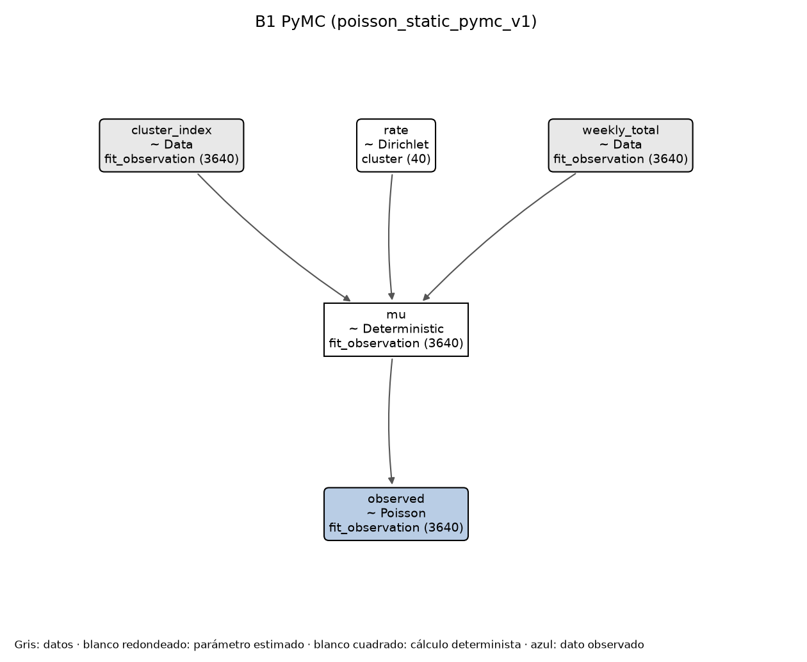
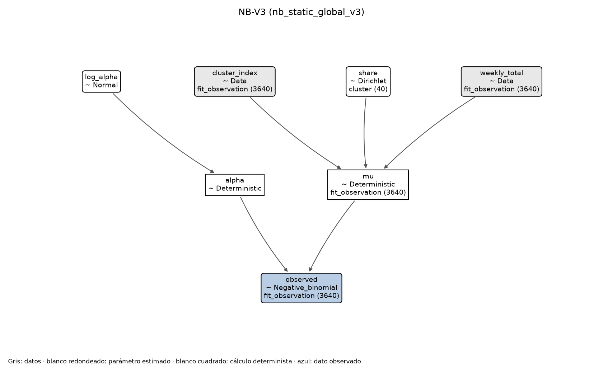
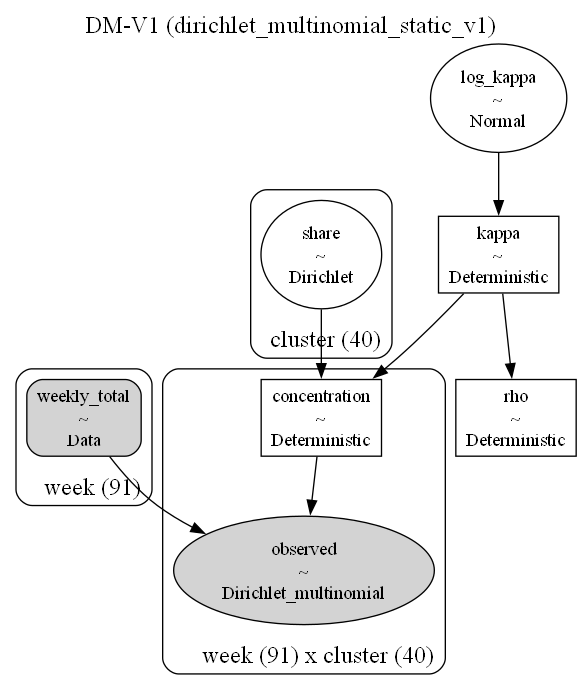
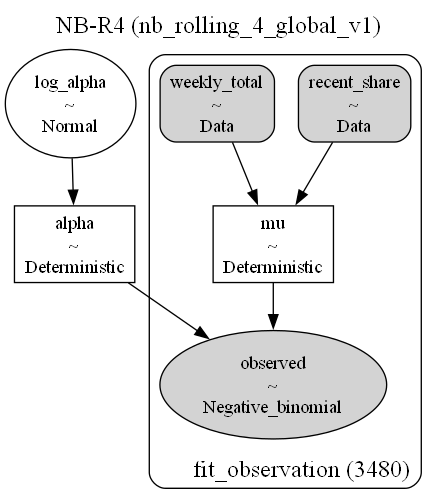
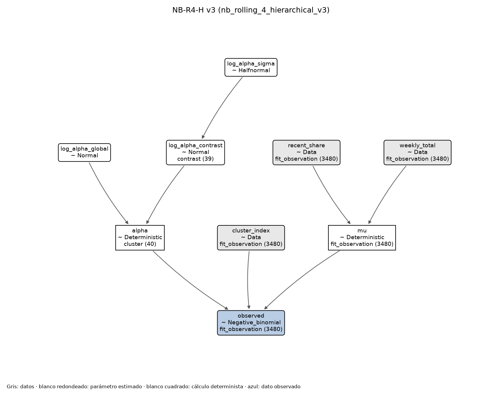
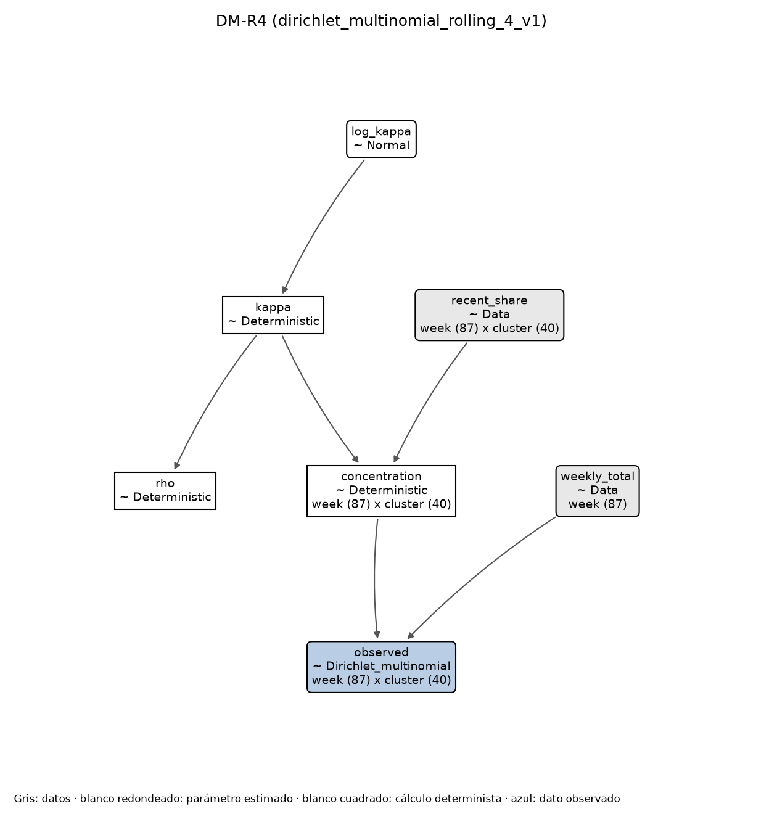

# Plan ejecutable de modelos semanales

> Documento de traspaso para que otro agente pueda continuar el trabajo sin
> contexto adicional. No iniciar un entrenamiento completo hasta completar la
> checklist de preparación y congelar las decisiones indicadas aquí.

## 1. Objetivo y alcance

Este plan cubre los modelos semanales de M9 y M10:

- **M9:** modelos de conteos por cluster condicionados al total semanal
  observado.
- **M10:** modelos conjuntos de composición que generan vectores de conteos cuya
  suma es exactamente el total semanal.
- Todos los candidatos deben implementarse con **PyMC**.
- Los entrenamientos completos deben ejecutarse en **Khipu**.
- Cada ejecución debe registrarse en **MLflow**. Los nodos SLURM no tienen
  internet: deben escribir un registro offline y publicarlo desde el nodo de
  acceso.
- Los artefactos grandes deben versionarse con **DVC**.

### Aclaración esencial sobre el objetivo

Los modelos actuales usan el total semanal observado, `weekly_total = N_t`, como
exposición. Por tanto, no pronostican por sí solos el volumen total futuro.
Pronostican la distribución del total entre 40 clusters:

$$
\mu_{c,t} = N_t p_{c,t}.
$$

Antes de usar estos modelos en producción se debe responder y documentar:

- [x] ¿`N_t` estará disponible al momento de predecir? Sí. Decisión del
      2026-09-27: los modelos se usarán para alertas al cierre de cada semana,
      cuando `N_t` ya se conoce.
- [x] No se crea por ahora un hito para pronosticar `N_t`. Se reabre si se
      necesita pronosticar la semana siguiente antes de conocer su total.
- [x] No describir M9/M10 como pronóstico autónomo de volumen mientras usen el
      `weekly_total` observado.

Esta decisión no bloquea los experimentos condicionales descritos abajo.

## 2. Estado actual del repositorio

Estado verificado el 2026-09-26:

- Rama: `Modeling/pipaber`.
- Último commit sincronizado: `0fed42d` (`Normalize model source hashes`).
- `origin/Modeling/pipaber` apunta al mismo commit.
- La suite completa pasó en Linux/Khipu: **99 de 99 pruebas**.
- Comando usado en Linux:

  ```bash
  PYTENSOR_FLAGS=cxx= MPLBACKEND=Agg \
    python -m unittest discover -s tests -v
  ```

- `PYTENSOR_FLAGS=cxx=` es obligatorio en Khipu porque el sistema no tiene
  `Python.h`; desactiva la compilación C de PyTensor.
- El entry point actual funciona:

  ```bash
  python -m src.models.weekly_counts.run --help
  ```

### Trabajo del usuario que no debe tocarse

- [ ] No modificar, restaurar, formatear ni incluir en commits
      `notebooks/03_modelos_base.ipynb`.
- El notebook tiene cambios locales del usuario y debe permanecer fuera de los
  commits de modelos.

### Estado especial de Khipu

El clon principal existente en:

```text
/home/piero.palacios/capstone-claims-triage
```

contiene resultados, logs y cambios locales de M8/M9. Al momento de escribir
este documento estaba detrás de `origin` y no estaba limpio.

- [ ] No ejecutar `git reset --hard`.
- [ ] No ejecutar `git clean`.
- [ ] No hacer `git pull` hasta revisar y preservar sus archivos locales.
- [ ] Para validaciones limpias, usar un clon nuevo o un `git worktree` separado.
- Existe un worktree de validación creado por el agente en:

  ```text
  /home/piero.palacios/capstone-claims-triage-validation-b139b12
  ```

  Aunque el nombre contiene un commit anterior, su `HEAD` fue actualizado y
  validado en `0fed42d`.

## 3. Contrato de datos congelado

Todos los candidatos deben utilizar exactamente el mismo panel semanal:

| Elemento | Valor |
|---|---:|
| Clusters | 40 |
| Semanas completas de `fit` | 91 |
| Semanas completas de calibración | 12 |
| Semanas completas de validación | 25 |
| Escala temporal | 365.25 días |
| Hash DVC de patrones | `87be2a97daa3b169bbd65850a64c89a6.dir` |
| SHA-256 de conteos | `35c5503b0b9b2a4b9e47984294683d27987b3c7824ae41de642c0a47cefd1ce1` |

Archivos relevantes:

- `reports/modeling/weekly_counts.csv`
- `artifacts/models/weekly_patterns.dvc`
- `configs/modeling.yaml`
- `src/models/weekly_counts/data.py`
- `src/models/weekly_counts/contracts.py`

### Checklist de integridad de datos

Antes de cualquier piloto o entrenamiento completo:

- [ ] Confirmar que los hashes anteriores no cambiaron.
- [ ] Confirmar que existen exactamente 40 filas por semana completa.
- [ ] Confirmar que `cluster_id` contiene exactamente los valores 0 a 39.
- [ ] Confirmar que no hay duplicados de `(week, cluster_id)`.
- [ ] Confirmar que `complaint_count >= 0`.
- [ ] Confirmar que, para cada semana,
      `sum(complaint_count) == weekly_total`.
- [ ] Confirmar las 91/12/25 semanas completas esperadas.
- [ ] Excluir semanas parciales.
- [ ] Ajustar el posterior únicamente con `fit`.
- [ ] No usar calibración ni validación para construir priors con información
      futura.
- [ ] No abrir validación para tomar decisiones de diseño.

## 4. Plan autorizado de candidatos

### Cómo leer los nombres

Cada nombre corto junta piezas:

| Pieza | Qué significa | Ejemplo |
|---|---|---|
| B1, B2 | Baselines: referencias simples, sin variación adicional. B1 predice cada grupo por separado (M9); B2 reparte la semana entre los 40 grupos a la vez (M10) | B1-R4, B2 |
| NB | Negative Binomial: conteo de cada grupo con más variación que una Poisson (M9) | NB-R4 |
| DM | Dirichlet-Multinomial: reparte el total de la semana entre los 40 grupos, con variación adicional (M10) | DM-R4 |
| V1, V2, V3 | Versión del diseño, con participaciones fijas o con tendencia lineal | NB-V3, DM-V1 |
| R4, R13 | *Rolling*, ventana móvil: el centro de la predicción es la participación del grupo en las 4 (o 13) semanas completas anteriores | DM-R4, B1-R13 |
| H | Jerárquico: una dispersión por grupo, con un prior común | NB-R4-H |
| v1, v2, v3 al final | Versión de la implementación del mismo modelo | NB-R4-H v3 |

Ejemplo de R4: si en las 4 semanas completas anteriores llegaron 400 reclamos y
130 fueron del grupo B, la participación reciente de B es 130 / 400 = 32.5%. Si
la semana nueva cierra con 120 reclamos, el centro de la predicción de B es
120 × 32.5% = 39. El modelo suma 1 reclamo a cada grupo para evitar
participaciones de cero (§7.9); con miles de reclamos por semana, el cambio es
mínimo. La ventana avanza cada semana: la semana 6 usa las semanas 2 a 5.

Así, **DM-R4** es una Dirichlet-Multinomial con la ventana de 4 semanas, y
**NB-R4-H v3** es la tercera implementación de una Negative Binomial con esa
ventana y una dispersión por grupo.

| Etapa | ID | Modelo | Tendencia | Dispersión | ¿Los draws suman $N_t$? | Estado |
|---|---|---|---|---|---|---|
| M9 | B1 | Poisson con participaciones fijas | No | Poisson | No | Analítico como referencia; PyMC ejecutado como baseline del pipeline |
| M9 | NB-V1 | Negative Binomial independiente | Lineal | Jerárquica por cluster | No | Ejecutado y rechazado |
| M9 | NB-V2 | Negative Binomial normalizada con `softmax` | Lineal | Jerárquica por cluster | No; solo las medias | Ejecutado y rechazado |
| M9 | NB-V3 | Negative Binomial estática | No | Global | No; solo las medias | Ejecutado y rechazado por WAPE |
| M9 | NB-V4 | Negative Binomial estática | No | Jerárquica por cluster | No; solo las medias | Descartado el 2026-09-27: con media estática no puede superar a B1-R4 |
| M9 | NB-R4 | Negative Binomial con participaciones de las 4 semanas anteriores | Local, ventana móvil | Global | No; solo las medias | Ejecutado y rechazado; gate de `alpha` por cluster cumplido |
| M9 | NB-R4-H | NB-R4 con `alpha` por cluster | Local, ventana móvil | Jerárquica por cluster | No; solo las medias | v3 aceptado: candidato elegido de M9 (v1: falló el gate de ESS; v2: JAX se cae) |
| M10 | B2 | Multinomial estática | No | Sin dispersión adicional | Sí | Baseline, calculado dentro de cada run de DM |
| M10 | B2-R4 | Multinomial con participaciones de las 4 semanas anteriores | Local, ventana móvil | Sin dispersión adicional | Sí | Mejor baseline de M10 |
| M10 | DM-V1 | Dirichlet-Multinomial estática | No | Global $\kappa$ | Sí | Referencia; ejecutada y rechazada por cobertura |
| M10 | DM-R4 | Dirichlet-Multinomial con participaciones de las 4 semanas anteriores | Local, ventana móvil | Global $\kappa$ | Sí | Aceptado: modelo elegido de M10 |
| M10 | DM-V2 | Dirichlet-Multinomial normalizada | Lineal | Global inicialmente | Sí | Descartado el 2026-09-27: la tendencia lineal no capta la deriva semanal |

### Correspondencia con implementaciones existentes

| ID | ID técnico / archivo | Estado técnico |
|---|---|---|
| B1 analítico | `src/models/weekly_counts/fixed_poisson_reference.py` | Implementado y usado en backtests |
| B1 PyMC | `poisson_static_pymc_v1` | Ejecutado como baseline del pipeline; MLflow `0ddb96b9f9c645bdb8e8a687cedf09cc` |
| NB-V1 | `nb_independent_linear_v1` | Reconstruido desde la especificación de MLflow |
| NB-V2 | `nb_softmax_linear_v2` | Verificado como equivalente al run histórico |
| NB-V3 | `nb_static_global_v3` | Ejecutado y rechazado; MLflow `c5dae8eeb3cf435292b351846f7a1653` |
| NB-V4 | `nb_static_hierarchical_v4` | Descartado; no se implementa |
| B1-R4 / B1-R13 | `b1_rolling_4_v1` y `b1_rolling_13_v1` | Ejecutados; MLflow `4968041b55804aea855362251fb5b7a7` y `5a8fd036aa4044978716f207e0e14066` |
| NB-R4 | `nb_rolling_4_global_v1` | Ejecutado y rechazado; MLflow `5ecad8c8482d4bfa8ecac5d6afd7cc11` |
| NB-R4-H v1 | `nb_rolling_4_hierarchical_v1` | Piloto: ESS bulk 58 en `log_alpha_sigma`; no se ejecutó el full |
| NB-R4-H v2 | `nb_rolling_4_hierarchical_v2` | Centrada con `pm.ZeroSumNormal`; JAX se cae con cadenas en paralelo; no se ejecuta |
| NB-R4-H v3 | `nb_rolling_4_hierarchical_v3` | Aceptado; candidato de M9; MLflow `ed9fa77b50c1458ea5261916da97c5c0` |
| B2 | `b2_static` en `src/models/weekly_composition/baselines.py` | Calculado dentro de cada run de DM; sin run propio |
| B2-R4 | `b2_rolling_4` en `src/models/weekly_composition/baselines.py` | Calculado dentro de cada run de DM; sin run propio |
| DM-V1 | `dirichlet_multinomial_static_v1` | Rechazado por cobertura; MLflow `55832eccec284ffdb8fd7bfeca0dda43` |
| DM-R4 | `dirichlet_multinomial_rolling_4_v1` | Aceptado; modelo de M10; MLflow `90ac1c09ab3c4276b68f5072f6ec32f9` |
| DM-V2 | `dirichlet_multinomial_softmax_linear_v2` | Descartado; no se implementa |

### Nota sobre B1

`poisson_static_pymc_v1` está implementado, pero
`configs/weekly_counts/releases.json` tiene `historical_run_id: null`. Para
cumplir estrictamente el requisito de que todos los candidatos tengan una
ejecución PyMC y MLflow:

- [x] Ejecutar B1 PyMC como run independiente antes de cerrar M9.
- [x] No reemplazar el baseline analítico; conservar ambos roles claramente.
- [x] Etiquetar el run PyMC como `candidate_role=pipeline_baseline`.

## 5. Orden recomendado y reglas de parada

No ejecutar automáticamente todos los modelos. Usar este orden:

1. B1 PyMC, solo para validar el pipeline completo y crear su run independiente.
2. Baselines temporales sin MCMC: participaciones móviles de 4 y 13 semanas.
3. B2 Multinomial estática, aunque formalmente pertenezca a M10.
4. NB-V3.
5. NB-V4 únicamente si NB-V3 muestra dispersión heterogénea por cluster.
6. DM-V1.
7. DM-V2 únicamente si DM-V1 supera B2 y existe deriva temporal clara.

Orden actualizado el 2026-09-27 con aprobación del usuario. Los pasos 1, 2 y 4
ya se ejecutaron. NB-V4 y DM-V2 se descartan porque B1-R4 mostró que la
composición cambia de una semana a otra:

1. NB-R4 con `alpha` global.
2. NB-R4 con `alpha` por cluster, solo si la cobertura vuelve a variar
   sistemáticamente con el volumen del cluster.
3. T1–T4 con TF-IDF y BGE, con y sin producto, entrenados con todo `fit`
   (§21).
4. M10: B2 y B2-R4 como baselines, DM-R4 como candidato y DM-V1 como
   referencia.

Decisión del 2026-09-30 con aprobación del usuario: si DM-R4 no cumple la regla
de §12.3, la siguiente versión es una Multinomial logística-normal con una
volatilidad por cluster (§7.8), porque M9 mostró que la dispersión cambia mucho
entre clusters. No se prueban otras variantes, como una ventana aprendida en
lugar de las 4 semanas, sin una nueva aprobación.

Resultado del 2026-09-30: DM-R4 cumplió la regla de §12.3 y es el modelo de
M10, así que la Multinomial logística-normal no se implementa. DM-V1 falló la
cobertura. El detalle está en
`reports/modeling/weekly_composition/<model_id>/decision.md`.

### Gates o condiciones obligatorias

| Modelo | Ejecutar si | Detener o rechazar si |
|---|---|---|
| B1 PyMC | Siempre, una vez | El pipeline no reproduce resultados razonables del baseline analítico |
| NB-V3 | Siempre, como siguiente candidato M9 | No converge o no mejora de forma estable frente a los baselines |
| NB-V4 | Descartado el 2026-09-27 | No aplica |
| NB-R4 | Siempre, como siguiente candidato M9 | No converge o no cumple la regla de §12.4 |
| NB-R4 con `alpha` por cluster | NB-R4 converge, pero su cobertura cambia sistemáticamente por tercil de volumen | La dispersión global ya es suficiente |
| B2 | Siempre, como baseline conjunto | Falla la coherencia exacta de draws |
| B2-R4 | Siempre, como baseline conjunto | Falla la coherencia exacta de draws |
| DM-R4 | Siempre, como candidato de M10 | No converge o no cumple la regla de M10 (§12.3) |
| DM-V1 | B2 presenta sobredispersión o intervalos demasiado estrechos | No converge o no mejora el log score conjunto |
| DM-V2 | Descartado el 2026-09-27 | No aplica |
| Multinomial logística-normal | DM-R4 no cumple la regla de §12.3 | No converge o no cumple la regla de §12.3 |

NB-V1 y NB-V2 no deben reentrenarse salvo una auditoría explícita de
reproducibilidad.

## 6. Baselines adicionales antes de MCMC

Crear dos baselines temporales para que los modelos complejos tengan una
comparación exigente:

| ID | Definición |
|---|---|
| B1-R4 | Participaciones calculadas con las cuatro semanas anteriores |
| B1-R13 | Participaciones calculadas con las trece semanas anteriores |

Reglas:

- [x] Para predecir una semana, usar solamente semanas anteriores.
- [x] No calcular una media móvil centrada.
- [x] Usar expansión recursiva en calibración y validación sin actualizar
      parámetros con observaciones futuras.
- [x] Suavizar participaciones cero con una regla congelada y documentada.
- [x] Registrar los baselines en MLflow aunque no usen MCMC.
- [x] Etiquetar `model_family=deterministic_baseline`.

Decisiones congeladas el 2026-09-27 con aprobación del usuario:

- Protocolo un paso adelante: para la semana `t` se usan las `W` semanas
  completas anteriores ya observadas (`W=4` o `W=13`), incluidas las de
  calibración que ya transcurrieron. Las semanas parciales no cuentan.
- Suavizado: `share = (conteo de la ventana + 1) / (total de la ventana + 40)`,
  la media posterior del prior Dirichlet(1) de B1.
- Distribución predictiva: `Poisson(N_t * share)`, igual que B1.
- IDs: `b1_rolling_4_v1` y `b1_rolling_13_v1`.

Resultado del 2026-09-27 en calibración:

| Baseline | WIS | WAPE | Cobertura 80% | Cobertura 95% | MLflow |
|---|---:|---:|---:|---:|---|
| B1-R4 | 43.11 | 12.47% | 29.2% | 42.1% | `4968041b55804aea855362251fb5b7a7` |
| B1-R13 | 64.84 | 17.56% | 21.0% | 32.1% | `5a8fd036aa4044978716f207e0e14066` |

B1-R4 es hoy el mejor baseline: un candidato nuevo necesita un WIS de
calibración de 40.95 o menos.

## 7. Especificaciones matemáticas

Cada modelo PyMC tiene un diagrama de su estructura, generado a partir del
modelo real con `pm.model_to_graphviz`:

```bash
uv run --no-sync python -m src.models.model_graphs
```

Necesita el grupo `probabilistic` y el programa Graphviz (en Windows,
`winget install Graphviz.Graphviz`). Las flechas van de cada variable a las que
dependen de ella:

- Óvalo blanco: parámetro que PyMC estima.
- Rectángulo blanco: cálculo determinista.
- Rectángulo gris redondeado: dato de entrada.
- Óvalo gris: dato observado, el que el modelo explica.
- Caja exterior: variables con las mismas dimensiones; abajo aparece su tamaño,
  por ejemplo `week (87) x cluster (40)`.

### 7.1 B1 PyMC — Poisson estática

Implementación existente: `poisson_static_pymc_v1`.

$$
\mathbf p \sim \operatorname{Dirichlet}(\mathbf 1)
$$

$$
\mu_{c,t} = N_t p_c
$$

$$
y_{c,t} \sim \operatorname{Poisson}(\mu_{c,t})
$$



Propiedades:

- Las medias suman $N_t$.
- Los draws independientes no suman necesariamente $N_t$.
- No hay tendencia temporal.
- Sirve como control del pipeline PyMC.

### 7.2 NB-V1 — archivado y rechazado

Implementación: `nb_independent_linear_v1`.

$$
\mu_{c,t} = N_t\exp(\beta_{0,c}+\beta_{1,c}t)
$$

$$
y_{c,t}\sim\operatorname{NegativeBinomial}(\mu_{c,t},\alpha_c)
$$

Las medias no están normalizadas y pueden sumar más o menos que $N_t$. No
modificar ni promover este modelo.

### 7.3 NB-V2 — archivado y rechazado

Implementación: `nb_softmax_linear_v2`.

$$
\eta_{c,t}=\beta_{0,c}+\beta_{1,c}t
$$

$$
p_{c,t}=\operatorname{softmax}_c(\boldsymbol\eta_t)
$$

$$
\mu_{c,t}=N_t p_{c,t}
$$

$$
y_{c,t}\sim\operatorname{NegativeBinomial}(\mu_{c,t},\alpha_c)
$$

Las medias suman $N_t$, pero los draws independientes no. No modificar ni
promover este modelo.

### 7.4 NB-V3 — siguiente implementación

ID técnico propuesto: `nb_static_global_v3`.

$$
\mathbf p \sim \operatorname{Dirichlet}(\tau\mathbf p_0)
$$

$$
\log\alpha \sim \operatorname{Normal}(m_\alpha,s_\alpha)
$$

$$
\mu_{c,t}=N_t p_c
$$

$$
y_{c,t}\sim\operatorname{NegativeBinomial}(\mu_{c,t},\alpha)
$$



Decisiones de implementación:

- Una sola dispersión global `alpha`.
- Participaciones estáticas.
- Usar la parametrización PyMC cuya varianza es
  `mu + mu**2 / alpha`.
- Las medias deben sumar $N_t$ con error numérico menor que `1e-10`.
- Los draws no tienen que sumar $N_t$.
- Usar inicialmente el mismo prior de `log_alpha_global` de NB-V2 para mantener
  comparabilidad.
- La elección de `tau` y `p0` debe pasar prior predictive antes del piloto.
- Si `p0` se calcula con `fit`, registrar `prior_strategy=empirical_bayes`.

Prior simple de respaldo si no se aprueba empirical Bayes:

$$
\mathbf p\sim\operatorname{Dirichlet}(1,\ldots,1).
$$

No cambiar entre estas dos opciones después de mirar calibración. La decisión se
toma con `fit` y prior predictive.

### 7.5 NB-V4 — implementación condicionada

ID técnico propuesto: `nb_static_hierarchical_v4`.

Mantener la misma media estática de NB-V3:

$$
\mu_{c,t}=N_t p_c.
$$

Usar dispersión jerárquica:

$$
\log\alpha_c = m_\alpha + s_\alpha z_c.
$$

Preferir contrastes de suma cero para separar claramente el nivel global de las
diferencias entre clusters:

- Reutilizar `zero_sum_basis` de
  `src/models/weekly_counts/negative_binomial.py`.
- Parámetros sugeridos:
  - `log_alpha_global`
  - `log_alpha_sigma`
  - `log_alpha_contrast`
  - determinístico `log_alpha`
  - determinístico `alpha`
- Usar parametrización no centrada.
- No añadir tendencia temporal en NB-V4.
- No cambiar simultáneamente la media y la dispersión respecto de NB-V3.

### 7.6 B2 — Multinomial estática

ID técnico propuesto: `multinomial_static_v1`.

$$
\mathbf p\sim\operatorname{Dirichlet}(\tau\mathbf p_0)
$$

$$
\mathbf y_t\sim\operatorname{Multinomial}(N_t,\mathbf p)
$$

Propiedades obligatorias:

- Cada observación es un vector de 40 conteos.
- Cada draw debe sumar exactamente $N_t$.
- No hay dispersión adicional más allá de Multinomial.
- Usar la misma estrategia de prior sobre `p` que NB-V3 para una comparación
  justa.

### 7.7 DM-V1 — Dirichlet-Multinomial estática

ID técnico propuesto: `dirichlet_multinomial_static_v1`.

$$
\mathbf p\sim\operatorname{Dirichlet}(\tau\mathbf p_0)
$$

$$
\boldsymbol a=\kappa\mathbf p
$$

$$
\mathbf y_t\sim
\operatorname{DirichletMultinomial}(N_t,\boldsymbol a)
$$



Propiedades:

- Cada draw suma exactamente $N_t$.
- `kappa` controla la dispersión conjunta.
- Comenzar con un `kappa` global, no uno por cluster.
- Definir y reportar también
  `rho = 1 / (kappa + 1)` para interpretar la sobredispersión.
- Calibrar el prior de `kappa` mediante prior predictive usando únicamente
  información de `fit`.
- Prior inicial para evaluar, no para congelar sin revisión:

  $$
  \log\kappa\sim\operatorname{Normal}(\log 100,1).
  $$

- Ajustar ese prior antes del entrenamiento completo si produce composiciones
  claramente imposibles. Cualquier cambio posterior exige una nueva versión de
  configuración.

### 7.8 DM-V2 — modelo dinámico condicionado

ID técnico propuesto: `dirichlet_multinomial_softmax_linear_v2`.

$$
\eta_{c,t}=\beta_{0,c}+\beta_{1,c}t
$$

$$
\mathbf p_t=\operatorname{softmax}(\boldsymbol\eta_t)
$$

$$
\mathbf y_t\sim
\operatorname{DirichletMultinomial}(N_t,\kappa\mathbf p_t)
$$

Reglas:

- Usar contrastes de suma cero para interceptos y tendencias.
- Estandarizar el tiempo igual que NB-V2.
- Comenzar con `kappa` global.
- No implementar un `kappa_c` por cluster dentro de una
  Dirichlet-Multinomial estándar: modifica simultáneamente la media y la
  concentración y no separa limpiamente la dispersión por cluster.
- Si una concentración global no es suficiente, considerar un modelo
  Multinomial logístico-normal en una versión posterior, no añadir complejidad
  silenciosamente a DM-V2.

### 7.9 Modelos con participaciones de las 4 semanas anteriores

Aprobados el 2026-09-27. Todos usan la participación de B1-R4, calculada solo
con semanas anteriores ya observadas:

$$
r_{c,t} = \frac{\sum_{k=1}^{4} y_{c,t-k} + 1}{\sum_{k=1}^{4} N_{t-k} + 40}.
$$

NB-R4 (`nb_rolling_4_global_v1`):

$$
\mu_{c,t} = N_t r_{c,t}, \qquad
y_{c,t} \sim \operatorname{NegativeBinomial}(\mu_{c,t}, \alpha), \qquad
\log\alpha \sim \operatorname{Normal}(2.302585093, 1).
$$



NB-R4-H v3 (`nb_rolling_4_hierarchical_v3`), el modelo elegido de M9, usa la
misma media con una dispersión por cluster. $\mathbf B$ es una base de 40 × 39
cuyas columnas suman cero, así que las desviaciones de los clusters suman cero:

$$
\log\alpha_c = \log\alpha_{\text{global}} + (\mathbf B\boldsymbol\delta)_c,
\qquad
\boldsymbol\delta \sim \operatorname{Normal}(0, \sigma),
\qquad
\sigma \sim \operatorname{HalfNormal}(0.75),
$$

$$
\log\alpha_{\text{global}} \sim \operatorname{Normal}(2.302585093, 1),
\qquad
y_{c,t} \sim \operatorname{NegativeBinomial}(N_t r_{c,t}, \alpha_c).
$$



B2-R4 (`b2_rolling_4`, sin parámetros) y DM-R4
(`dirichlet_multinomial_rolling_4_v1`), el modelo elegido de M10:

$$
\mathbf y_t \sim \operatorname{Multinomial}(N_t, \mathbf r_t), \qquad
\mathbf y_t \sim \operatorname{DirichletMultinomial}(N_t, \kappa \mathbf r_t).
$$



Reglas:

- `r` es un dato de entrada, no un parámetro: PyMC estima solo `alpha` o
  `kappa`.
- El ajuste usa las semanas 5 a 91 de `fit`, porque las cuatro primeras no
  tienen ventana completa.
- En calibración y validación, `r` usa las semanas anteriores ya observadas;
  `alpha` y `kappa` no se actualizan después de `fit`.
- El prior de `log_alpha` es el de NB-V2 y NB-V3; el de `log_kappa` se revisa
  con prior predictive sobre `fit` antes del piloto, partiendo de
  $\log\kappa \sim \operatorname{Normal}(\log 100, 1)$.
- NB-R4 con `alpha` por cluster reutiliza los contrastes de suma cero de §7.5
  y solo se implementa si se cumple su gate de §5.
- Actualización del 2026-09-27: el gate se cumplió. La v1 no centrada falló el
  gate de ESS del piloto; la v2 usa desviaciones centradas con
  `pm.ZeroSumNormal`, con aprobación del usuario, pero JAX se cae con cadenas
  en paralelo. La v3 mantiene la parametrización centrada con los contrastes
  de la v1.

## 8. Arquitectura de implementación

### 8.1 M9: extender el paquete existente

Agregar NB-V3 y NB-V4 en:

```text
src/models/weekly_counts/models/
configs/weekly_counts/
```

Archivos esperados:

```text
src/models/weekly_counts/models/nb_static_global_v3.py
src/models/weekly_counts/models/nb_static_hierarchical_v4.py
configs/weekly_counts/nb_static_global_v3.yaml
configs/weekly_counts/nb_static_hierarchical_v4.yaml
```

Checklist:

- [ ] Mantener la interfaz `build_model(fit, settings) -> pm.Model`.
- [ ] Definir `MODEL_ID` igual al nombre de la configuración.
- [ ] Definir `SOURCE_STATUS = "native_versioned_source"`.
- [ ] Definir `HISTORICAL_RUN_ID = None` antes de la primera publicación.
- [ ] Definir `FORMULA`, `MODEL_SPEC`, variables de diagnóstico, resumen y trace.
- [ ] Registrar ambos módulos en
      `src/models/weekly_counts/registry.py`.
- [ ] Añadir configuraciones YAML completas.
- [ ] Añadir hashes a `configs/weekly_counts/releases.json`.
- [ ] Ejecutar la prueba que congela fuentes y configuraciones.
- [ ] No modificar una versión publicada; crear un ID nuevo si cambia su
      matemática o su configuración congelada.

### 8.2 M10: crear un paquete separado

La likelihood conjunta produce arreglos `(draw, week, cluster)`, mientras M9 usa
filas independientes `(draw, observation)`. Para evitar condicionales complejos
en el runner existente, crear:

```text
src/models/weekly_composition/
  __init__.py
  contracts.py
  data.py
  diagnostics.py
  metrics.py
  prediction.py
  reporting.py
  sampling.py
  registry.py
  run.py
  models/
    __init__.py
    multinomial_static_v1.py
    dirichlet_multinomial_static_v1.py
    dirichlet_multinomial_softmax_linear_v2.py

configs/weekly_composition/
  multinomial_static_v1.yaml
  dirichlet_multinomial_static_v1.yaml
  dirichlet_multinomial_softmax_linear_v2.yaml
  releases.json
```

Reutilizar utilidades estables de M9 cuando sea simple, especialmente:

- hashes y snapshots de código;
- descriptor de runs offline;
- diagnósticos generales de ArviZ;
- contratos de splits;
- semilla y metadatos del experimento.

No crear una abstracción general compleja únicamente para compartir unas pocas
líneas.

Implementación del 2026-09-30, más pequeña que la lista anterior porque
reutiliza los módulos de M9 (carga con hashes, participaciones de 4 semanas,
muestreo, diagnósticos, cobertura y registro offline):

```text
src/models/weekly_composition/
  data.py         matriz semana x cluster y participaciones recientes
  scores.py       log PMF Multinomial y Dirichlet-Multinomial, log score conjunto
  baselines.py    B2 y B2-R4
  diagnostics.py  resumen del prior predictive
  evaluation.py   métricas por split, bootstrap y regla de §12.3
  reporting.py    gráficos y run.json offline
  registry.py, run.py
  models/dirichlet_multinomial_static_v1.py      DM-V1
  models/dirichlet_multinomial_rolling_4_v1.py   DM-R4
```

- B2 y B2-R4 se calculan dentro de cada run de DM, sin MCMC. B2 es conjugada:
  con el prior Dirichlet(1) de NB-V3, su posterior es Dirichlet(1 + conteos de
  `fit`) y su predictiva es Dirichlet-Multinomial, así que su log score es
  exacto. B2-R4 no tiene parámetros. Esto reemplaza el run PyMC propio de B2 de
  §17 y sigue §14.5: los comparadores son métricas del run del candidato.
- Todos los modelos se evalúan en las semanas con ventana completa: `fit` desde
  la semana 5, calibración y validación. DM-V1 se ajusta con las 91 semanas de
  `fit`; DM-R4, con las 87 que tienen ventana.
- Las variables del tamaño de las semanas no se guardan en `posterior.nc`: se
  recalculan al predecir.

### 8.3 Matriz conjunta para M10

`weekly_composition/data.py` debe producir:

- `counts`: matriz entera `(weeks, 40)`;
- `weekly_total`: vector `(weeks,)`;
- `week`: fechas ordenadas;
- `split`: etiqueta por semana;
- `time_years`: vector estandarizado usando el centro calculado solo con `fit`;
- mapeo fijo de columnas a `cluster_id` 0..39.

Validaciones obligatorias:

- [ ] Una fila de matriz por semana completa.
- [ ] Exactamente 40 columnas de cluster.
- [ ] Orden de cluster fijo y probado.
- [ ] `counts.sum(axis=1) == weekly_total`.
- [ ] No usar calibración/validación para centrar el tiempo.
- [ ] No actualizar el posterior al predecir calibración o validación.

### 8.4 Entry points

M9:

```bash
python -m src.models.weekly_counts.run \
  --config configs/weekly_counts/MODEL.yaml
```

M10 propuesto:

```bash
python -m src.models.weekly_composition.run \
  --config configs/weekly_composition/MODEL.yaml
```

Cada runner debe:

1. Resolver y validar la configuración.
2. Cargar el modelo desde un registro explícito.
3. Verificar hashes de datos y DVC.
4. Crear un `run_key` único.
5. Crear directorios `.inprogress`.
6. Guardar snapshot de fuentes, configuración y `uv.lock`.
7. Ajustar solo con `fit`.
8. Predecir `fit`, calibración y validación sin actualizar el posterior.
9. Calcular diagnósticos y métricas.
10. Guardar posterior NetCDF, predicciones, métricas y gráficos.
11. Crear `run.json` offline para MLflow.
12. Escribir `_SUCCESS` antes del movimiento atómico final.
13. Imprimir `run_key`, modelo, estado y rutas finales.

## 9. Niveles de ejecución

No ejecutar directamente configuraciones completas durante desarrollo.

| Nivel | Cadenas | Tune | Draws | Uso |
|---|---:|---:|---:|---|
| Prior predictive | No aplica | No aplica | 500 | Revisar plausibilidad de priors |
| Smoke/piloto | 2 | 250 | 250 | Detectar errores y problemas graves |
| Completo | 4 | 2,000 | 2,000 | Comparación y decisión final |

Reglas:

- [ ] Añadir `run_mode: prior`, `pilot` o `full` a la configuración o al registro.
- [ ] No usar métricas de un piloto para promover un modelo.
- [ ] No reemplazar configuraciones completas con parámetros de smoke.
- [x] No publicar pilotos en MLflow (decisión del 2026-09-27, §14.5); quedan
      en Git con `run_mode=pilot`.
- [ ] Medir tiempo y memoria de cada piloto antes de solicitar recursos SLURM
      completos.

## 10. Prior predictive obligatorio

Antes de cada piloto, generar draws del prior y revisar:

- [ ] Conteos no negativos.
- [ ] Proporción de ceros por cluster.
- [ ] Máximo share semanal.
- [ ] Distribución de shares de clusters grandes, medianos y pequeños.
- [ ] Intervalos para clusters con medias aproximadas de 1, 5, 20 y 100.
- [ ] En NB-V3/V4, distribución de `alpha` y varianza implicada.
- [ ] En DM-V1/V2, distribución de `kappa` y `rho`.
- [ ] En B2/DM, cada draw suma exactamente `N_t`.
- [ ] En NB, reportar cuánto se desvía la suma de draws respecto de `N_t`.

Criterio de parada:

- [ ] No ejecutar el piloto si el prior genera de forma frecuente composiciones
      o conteos operacionalmente imposibles.

Toda modificación de priors debe ocurrir antes de mirar calibración.

## 11. Pruebas que deben implementarse

### 11.1 NB-V3

- [ ] El registro devuelve el módulo correcto.
- [ ] `build_model` devuelve `pm.Model`.
- [ ] `alpha` es escalar y positivo.
- [ ] `mu` tiene una entrada por observación.
- [ ] Las medias suman `weekly_total` por semana.
- [ ] Prior predictive reproducible con semilla fija.
- [ ] Posterior predictive conserva dimensiones.
- [ ] Configuración y fuente coinciden con `releases.json`.

### 11.2 NB-V4

- [ ] `alpha` tiene longitud 40 y valores positivos.
- [ ] La parametrización de `log_alpha` tiene suma cero en sus desviaciones.
- [ ] El caso `log_alpha_sigma -> 0` se aproxima a NB-V3.
- [ ] Las medias suman `weekly_total` por semana.
- [ ] Prior y posterior predictivos reproducibles.
- [ ] Configuración y fuente están congeladas.

### 11.3 B2 y DM

- [ ] La matriz semana-cluster tiene forma correcta.
- [ ] Cada fila observada suma `N_t`.
- [ ] Cada draw predictivo suma exactamente `N_t`.
- [ ] La predicción se puede convertir al formato largo usado por reportes.
- [ ] El log score conjunto es finito.
- [ ] La semilla reproduce draws idénticos.
- [ ] Calibración y validación no aparecen en el ajuste.
- [ ] El tiempo se centra solo con `fit`.
- [ ] Configuraciones y fuentes coinciden con sus hashes.

### 11.4 Validación general

Ejecutar primero pruebas específicas:

```bash
uv run python -m unittest \
  tests.test_negative_binomial \
  tests.test_weekly_count_models -v
```

Añadir y ejecutar las nuevas suites propuestas:

```bash
uv run python -m unittest \
  tests.test_weekly_count_static_models \
  tests.test_weekly_composition -v
```

Después ejecutar la suite completa:

```bash
uv run python -m unittest discover -s tests -v
```

En Khipu:

```bash
PYTENSOR_FLAGS=cxx= MPLBACKEND=Agg \
  uv run --no-sync python -m unittest discover -s tests -v
```

No afirmar que una validación pasó si no se ejecutó y se vio `OK`.

## 12. Métricas y decisión

### 12.1 Diagnósticos duros de muestreo

Un run completo no puede ser promovido si falla cualquiera de estos criterios:

| Diagnóstico | Requisito |
|---|---:|
| R-hat máximo | `<= 1.01` |
| ESS mínimo | `>= 400` |
| Divergencias | `0` |
| Cobertura 80% | Entre `0.70` y `0.90` |
| Cobertura 95% | Entre `0.88` y `0.99` |

También registrar BFMI y profundidad máxima del árbol. Una falla técnica no debe
ocultarse ajustando criterios después de ver resultados.

### 12.2 Métricas M9

| Rol | Métrica |
|---|---|
| Principal | WIS |
| Error puntual | WAPE y MAE |
| Calibración | Cobertura 80% y 95% |
| Sesgo | Error medio |
| Coherencia | Distribución de `sum(draws) - weekly_total` |

Reportar métricas:

- globales;
- por split;
- por cluster;
- por terciles de volumen calculados solo con `fit`.

No usar WAPE como única métrica para clusters pequeños.

### 12.3 Métricas M10

| Rol | Métrica |
|---|---|
| Principal | Log score conjunto por semana |
| Composición | Distancia Jensen-Shannon o variación total |
| Conteos marginales | WIS y MAE por cluster |
| Calibración | Cobertura marginal 80% y 95% |
| Coherencia | `sum(draw) == weekly_total`, obligatorio |

Regla de promoción de M10, congelada el 2026-09-27 con aprobación del usuario:

- Mejor baseline conjunto: el de mayor log score conjunto medio por semana en
  calibración entre B2 y B2-R4. DM-V1 es una referencia, no un baseline.
- El candidato debe mejorar ese log score medio por semana, y el intervalo
  bootstrap semanal pareado 95% de la diferencia `candidato - baseline` debe
  quedar entero por encima de 0.
- La cobertura marginal 80% y 95% debe estar en los rangos de §12.1.
- Convergencia como en §12.1; coherencia exacta de draws obligatoria.
- El WIS marginal se reporta para comparar con M9, pero no es un gate.

#### Log score conjunto

No estimar el log score contando coincidencias de draws predictivos. Calcular la
probabilidad del vector observado para cada draw de parámetros y usar
`logsumexp`:

$$
\log p(\mathbf y_t\mid D)
\approx
\operatorname{logsumexp}_s
\left(\log p(\mathbf y_t\mid\theta_s)\right)-\log S.
$$

Usar `scipy.special.gammaln` y `logsumexp` con pruebas numéricas.

Para Multinomial:

$$
\log p(\mathbf y)=
\log N!-\sum_c\log y_c!+\sum_c y_c\log p_c.
$$

Para Dirichlet-Multinomial:

$$
\log p(\mathbf y)=
\log N!-\sum_c\log y_c!
+\log\Gamma(A)-\log\Gamma(N+A)
+\sum_c\left[\log\Gamma(y_c+a_c)-\log\Gamma(a_c)\right].
$$

### 12.4 Mejora práctica

Regla congelada el 2026-09-27 con aprobación del usuario, antes de ver los
resultados de B1-R4, B1-R13 y NB-V4. Se aplica solo a candidatos evaluados
después de esa fecha; B1 PyMC, NB-V1, NB-V2 y NB-V3 conservan sus decisiones.

- Mejor baseline: el de menor WIS de calibración entre B1 (Poisson fijo),
  B1-R4 y B1-R13.
- WIS: el candidato debe reducir al menos 5% el WIS de calibración del mejor
  baseline, y el intervalo bootstrap 95% de la diferencia
  `candidato - baseline` debe quedar entero por debajo de 0.
- WAPE y MAE: se comparan con el mismo mejor baseline. Solo cuentan como
  degradación, y rechazan al candidato, si el intervalo bootstrap 95% de la
  diferencia queda entero por encima de 0.
- Convergencia y cobertura: sin cambios respecto de §12.1.
- Las métricas por terciles de volumen se siguen reportando, pero no son un
  gate.

### 12.5 Incertidumbre de la comparación

La calibración tiene solo 12 semanas. Implementar bootstrap pareado por semana:

1. Remuestrear las 12 semanas con reemplazo.
2. Calcular la diferencia de la métrica entre candidato y baseline.
3. Repetir con semilla congelada.
4. Reportar mediana e intervalo de la diferencia.

No promover un modelo por una mejora pequeña dominada por una sola semana.

Detalles técnicos: 2,000 remuestreos, semilla 42 del experimento e intervalo
percentil 95%. Las semanas se remuestrean pareadas: las mismas semanas para el
candidato y el baseline.

Desde el 2026-09-27, los runs no publican métricas ni gráficos de validación.
Sus predicciones se conservan en `predictions.csv` para la confirmación final
única.

## 13. Backtesting sin consumir calibración

Para reducir sobreajuste a las 12 semanas de calibración, usar cortes temporales
internos dentro de `fit` durante desarrollo. Propuesta:

| Corte | Ajuste | Evaluación interna |
|---|---|---|
| 1 | Semanas 1-50 | Semanas 51-60 |
| 2 | Semanas 1-60 | Semanas 61-70 |
| 3 | Semanas 1-70 | Semanas 71-80 |

- [ ] Confirmar los cortes exactos con fechas antes de implementarlos.
- [ ] Usar configuraciones de piloto para estos cortes.
- [ ] No mezclar estas métricas con la calibración oficial.
- [ ] Usar calibración una vez para seleccionar el candidato final.
- [ ] Congelar la decisión antes de abrir validación.
- [ ] Usar validación una sola vez como confirmación final.

## 14. MLflow

### 14.1 Tags mínimos

Cada run debe incluir:

```text
stage
model_id
model_family
run_mode
candidate_role
candidate_status
rejection_reason
execution_host
source_status
validation_used_for_selection=false
```

### 14.2 Parámetros mínimos

- ID y hash de configuración.
- Hash del manifiesto de fuentes.
- Hash SHA-256 de `weekly_counts.csv`.
- Hash DVC de patrones.
- Semilla.
- Splits y número de semanas.
- Fórmula.
- Priors.
- Backend, cadenas, tune, draws y `target_accept`.
- Estrategia de prior (`uniform` o `empirical_bayes`).

### 14.3 Artefactos mínimos

- Snapshot de fuente.
- Configuración YAML.
- `releases.json`.
- `uv.lock`.
- `model_spec.json`.
- `posterior.nc`.
- Predicciones.
- Métricas.
- Resumen de posterior.
- Gráficos de trace, prior, cobertura, backtest y residuales.
- Resultado del bootstrap de diferencias.
- `run.json` offline.

### 14.4 Estados permitidos

```text
pilot_only
accepted
rejected_convergence
rejected_predictive
rejected_coherence
rejected_no_practical_gain
```

Un job SLURM exitoso no significa que el modelo fue aceptado.

### 14.5 Qué se publica

Decisión del 2026-09-27 con aprobación del usuario. La cuenta gratuita de
DagsHub admite unos 100 runs, así que cada run debe registrar una decisión:

- Publicar solo runs `full` de candidatos y baselines. Los pilotos y prior
  checks quedan solo en Git.
- Un run por `run_name`: `publish_run.py` rechaza nombres existentes y runs con
  `run_mode` distinto de `full`.
- Los comparadores de una misma decisión se registran como métricas dentro de
  un solo run, no como runs separados.
- La confirmación final en validación es un solo run.
- Se borraron del experimento 3 duplicados (`49d02958`, `2778d413`,
  `5d266bb5`) y 3 pilotos (`d5219aa9`, `7e5d90f0`, `d38027d0`); quedaron 36
  runs activos. El borrado de MLflow es recuperable desde la papelera.

## 15. DVC y estructura de salidas

M9 actual:

```text
reports/modeling/weekly_counts/<model_id>/<run_key>/
artifacts/models/weekly_counts/<model_id>/<run_key>/
```

M10 propuesto:

```text
reports/modeling/weekly_composition/<model_id>/<run_key>/
artifacts/models/weekly_composition/<model_id>/<run_key>/
```

Reglas:

- [ ] Escribir primero en `.inprogress`.
- [ ] No sobrescribir una ejecución anterior.
- [ ] Crear `_SUCCESS` únicamente al final.
- [ ] Mover staging a ruta final de forma atómica.
- [ ] No versionar `posterior.nc` directamente con Git.
- [ ] Usar DVC para colecciones de artefactos grandes.
- [ ] Publicar el `run.json` exacto correspondiente al `run_key`.

Ejemplo M9 después de un run:

```bash
uv run --no-sync dvc add artifacts/models/weekly_counts
uv run --no-sync dvc push artifacts/models/weekly_counts.dvc
```

Ejemplo M10 propuesto:

```bash
uv run --no-sync dvc add artifacts/models/weekly_composition
uv run --no-sync dvc push artifacts/models/weekly_composition.dvc
```

No escribir tokens en archivos versionados. Mantener credenciales únicamente en
`.env` y `.dvc/config.local`.

## 16. Ejecución en Khipu

### 16.1 Preparación segura

Debido al estado sucio del clon principal, la opción preferida es un clon limpio
para runs futuros:

```bash
git clone --branch Modeling/pipaber \
  https://github.com/Codenid/capstone-claims-triage.git \
  capstone-claims-triage-runs
cd capstone-claims-triage-runs
uv sync --group probabilistic
```

Luego configurar de forma privada `.env` y `.dvc/config.local` según
`scripts/hpc/README.md`.

Alternativa: crear un worktree limpio, pero asegurar que tenga acceso explícito
a un entorno virtual compatible. No asumir que `uv run --no-sync` encontrará el
`.venv` de otro worktree.

### 16.2 Script SLURM genérico para M9

Crear `scripts/hpc/m9_weekly_count.slurm` para evitar un script por modelo. Debe
incluir como mínimo:

```bash
#!/usr/bin/env bash
#SBATCH --job-name=claims-m9-weekly
#SBATCH --partition=standard
#SBATCH --qos=a-postgrado
#SBATCH --cpus-per-task=8
#SBATCH --mem=64G
#SBATCH --time=06:00:00
#SBATCH --output=reports/modeling/slurm-%x-%j.out

set -euo pipefail

: "${MODEL_CONFIG:?Set MODEL_CONFIG to a weekly-count YAML config}"

export CLAIMS_EXECUTION_HOST=khipu
export MPLBACKEND=Agg
export OMP_NUM_THREADS=1
export MKL_NUM_THREADS=1
export OPENBLAS_NUM_THREADS=1
export PYTENSOR_FLAGS=cxx=
export XLA_FLAGS=--xla_force_host_platform_device_count=4
export JAX_ENABLE_X64=true

uv run --no-sync python -m src.models.weekly_counts.run \
  --config "${MODEL_CONFIG}"
```

Ejemplo de envío:

```bash
sbatch --export=ALL,MODEL_CONFIG=configs/weekly_counts/nb_static_global_v3.yaml \
  scripts/hpc/m9_weekly_count.slurm
```

Crear un script equivalente para M10 usando
`src.models.weekly_composition.run`.

### 16.3 Flujo por candidato

- [ ] Sincronizar código en el nodo de acceso.
- [ ] Ejecutar pruebas específicas en Linux.
- [ ] Ejecutar prior predictive.
- [ ] Revisar y aprobar prior predictive.
- [ ] Ejecutar piloto.
- [ ] Revisar tiempo, memoria y diagnósticos.
- [ ] Congelar configuración completa.
- [ ] Enviar job completo con `sbatch`.
- [ ] Consultar `squeue -u piero.palacios`.
- [ ] Revisar con:

  ```bash
  sacct -j JOB_ID --format=JobID,State,ExitCode,Elapsed,MaxRSS
  ```

- [ ] Confirmar `_SUCCESS`.
- [ ] Añadir y subir artefactos con DVC.
- [ ] Cargar `.env` en el nodo de acceso.
- [ ] Publicar el `run.json` exacto con
      `src/evaluation/publish_run.py`.
- [ ] Guardar el ID de MLflow en el reporte de decisión.
- [ ] Actualizar documentación y `releases.json` si corresponde.

## 17. Checklist por modelo

### B1 PyMC

- [ ] Ejecutar pruebas actuales.
- [ ] Ejecutar prior predictive.
- [ ] Ejecutar piloto.
- [ ] Comparar medias y métricas con B1 analítico.
- [ ] Ejecutar full en Khipu.
- [ ] Publicar en MLflow.
- [ ] Registrar `historical_run_id` o run publicado sin modificar el ID del
      modelo.
- [ ] Marcar como baseline, no como modelo promovido automáticamente.

### NB-V3

- [ ] Aprobar prior de participaciones.
- [ ] Implementar módulo y configuración.
- [ ] Registrar fuente y hashes.
- [ ] Añadir pruebas unitarias.
- [ ] Validar que las medias suman `weekly_total`.
- [ ] Ejecutar prior predictive.
- [ ] Ejecutar piloto.
- [ ] Ejecutar full solo si el piloto converge.
- [ ] Comparar con B1, B1-R4, B1-R13 y B2.
- [ ] Evaluar bootstrap semanal.
- [ ] Documentar aceptación o rechazo.

### NB-V4

- [ ] Confirmar primero evidencia de dispersión heterogénea en NB-V3.
- [ ] Documentar esa evidencia antes de implementar.
- [ ] Implementar dispersión jerárquica con contrastes de suma cero.
- [ ] Mantener idéntica la media de NB-V3.
- [ ] Añadir pruebas de reducción a NB-V3 cuando `sigma -> 0`.
- [ ] Ejecutar prior, piloto y full con gates.
- [ ] Comparar directamente con NB-V3.
- [ ] Rechazar si la complejidad no produce mejora práctica estable.

### B2

- [ ] Crear paquete de composición.
- [ ] Implementar matriz semana-cluster.
- [ ] Implementar Multinomial estática.
- [ ] Probar suma exacta de observaciones y draws.
- [ ] Implementar log score conjunto.
- [ ] Ejecutar prior, piloto y full.
- [ ] Publicar como baseline principal de M10.

### DM-V1

- [ ] Confirmar sobredispersión respecto de B2.
- [ ] Congelar prior de `kappa` con prior predictive.
- [ ] Implementar `rho = 1 / (kappa + 1)` para reporte.
- [ ] Probar suma exacta de draws.
- [ ] Implementar log PMF Dirichlet-Multinomial probado numéricamente.
- [ ] Ejecutar prior, piloto y full.
- [ ] Comparar log score conjunto contra B2.
- [ ] Promover solo si converge y mejora de forma estable.

### DM-V2

- [ ] Confirmar que DM-V1 fue técnicamente válido.
- [ ] Confirmar deriva temporal con análisis exclusivo de `fit`.
- [ ] Congelar priors de interceptos y tendencias.
- [ ] Implementar `softmax` con contrastes de suma cero.
- [ ] Mantener inicialmente un `kappa` global.
- [ ] Ejecutar backtests internos.
- [ ] Ejecutar prior, piloto y full solamente si los gates anteriores pasan.
- [ ] Comparar directamente con DM-V1 y baselines móviles.

## 18. Registro de decisiones requerido

Crear o actualizar un reporte Markdown por candidato con:

```text
Pregunta del experimento
Modelo y versión
Commit exacto
Hash de configuración
Hash de datos
Run ID de MLflow
Job ID de SLURM
Tiempo y memoria
Diagnósticos
Métricas de fit
Métricas de calibración
Bootstrap de diferencias
Métricas de validación, solo después de congelar decisión
Decisión
Motivo de aceptación o rechazo
Siguiente acción permitida
```

No editar retrospectivamente una decisión sin dejar historial.

## 19. Restricciones para futuros agentes

- No tocar el notebook modificado por el usuario.
- No borrar resultados o logs existentes de Khipu.
- No limpiar el clon principal de Khipu automáticamente.
- No cambiar hashes congelados sin entender por qué cambiaron.
- Mantener finales de línea LF para `.py`, `.yaml`, `.json`, `.toml` y `.dvc`.
- No modificar una versión de modelo ya publicada; crear una nueva versión.
- No usar validación para seleccionar modelos, priors o thresholds.
- No publicar secretos.
- No afirmar que un modelo funciona porque el job terminó.
- No promover un modelo que falla convergencia, cobertura o coherencia.
- No añadir dependencias si SciPy, NumPy, PyMC, ArviZ o utilidades existentes
  resuelven la tarea.
- Mantener el código simple y reutilizar patrones del repositorio.

## 20. Próxima acción concreta

El siguiente agente debe comenzar aquí:

1. Leer este documento completo.
2. Revisar `docs/modelos.md` y `scripts/hpc/README.md`.
3. Confirmar `git status` y preservar el notebook del usuario.
4. Confirmar con el usuario si B1 PyMC debe ejecutarse antes de NB-V3.
5. Acordar la mejora práctica mínima para promoción.
6. Aprobar prior uniforme o empirical Bayes para participaciones estáticas.
7. Implementar los baselines B1-R4/B1-R13 o documentar por qué se posponen.
8. Implementar `nb_static_global_v3` con pruebas.
9. Ejecutar prior predictive y piloto; no lanzar full todavía.
10. Presentar diagnósticos del piloto y pedir aprobación para el run completo.

La implementación de NB-V4 queda bloqueada hasta que NB-V3 demuestre que una
sola dispersión global es insuficiente. DM-V2 queda bloqueada hasta que DM-V1
supere B2 y exista evidencia de deriva temporal.

Actualización del 2026-09-27: los pasos 1 a 10 se completaron; NB-V4 y DM-V2
quedaron descartados (§5). La siguiente acción es implementar NB-R4 (§7.9) con
prior predictive, piloto y full con gates; después, T1–T4 (§21) y M10.

Actualización posterior del 2026-09-27: M9 eligió NB-R4-H v3
(`nb_rolling_4_hierarchical_v3`), aceptado por la regla de §12.4. La siguiente
acción es T1–T4 (§21); primero hay que aprobar la regla para elegir entre
representaciones con resultados cercanos. La validación sigue cerrada hasta la
confirmación final única.

Actualización del 2026-09-30: la regla de §21 quedó aprobada. La siguiente
acción es ejecutar M5B: una prueba rápida y después el run completo.

Actualización posterior del 2026-09-30: M5B terminó y fijó T1–T4 (§21). La
siguiente acción es M10. La validación sigue cerrada hasta la confirmación final
única, después de congelar M10.

Actualización final del 2026-09-30: M10 eligió DM-R4
(`dirichlet_multinomial_rolling_4_v1`): mejora el log score conjunto de B2-R4
en 250.8 por semana (IC bootstrap 95% [205.1, 295.8]) con cobertura en rango.
Quedan congelados T1–T4 (§21), NB-R4-H v3 (M9) y DM-R4 (M10). La siguiente
acción es la confirmación final única en validación (§22), en un solo run; en
T4 se reporta también la regla por producto. Después se decide el
reentrenamiento para producción y se continúa con M11.

Actualización del 2026-10-01: la confirmación final (§22) confirmó T1, T2, T3,
M9 y M10. T4 no se confirmó, así que en producción usa la regla por producto.
La siguiente acción es decidir si los modelos se reentrenan con `fit` +
calibración para producción; después, M11.

Actualización del 2026-10-01: por decisión del usuario, los modelos no se
reentrenan para producción (§22). La siguiente acción es M11.

Actualización del 2026-10-01: las reglas de M11 quedan en §24, aprobadas antes
de calcular nada.

Actualización del 2026-10-01: en `fit` + calibración, M11 eligió CUSUM con los
umbrales del plan (§24). La siguiente acción es su reporte único de validación.

Actualización del 2026-10-01: el reporte único de validación de M11 dio 42
alertas en 25 semanas, concentradas en un episodio de febrero de 2025 (§24). La
siguiente acción es M12.

Actualización del 2026-10-02: por decisión del usuario se retiró todo el trabajo
de M12 (diseño, demo, documento de decisión y `src/triage/`), y M12 queda
pendiente. Lo retirado sigue en el historial de Git hasta el commit `2a97d93`;
las salidas en Khipu y los runs de MLflow no se tocaron. Del trabajo de M12 solo
se conserva la nota de §24 sobre el eco de la ráfaga de enero. La siguiente
acción es M12.

Actualización del 2026-10-03: por decisión del usuario, antes de M12 va una
ronda de sensibilidad y alternativas (§25), con reglas aprobadas antes de
calcular nada. La siguiente acción es cerrar los pendientes de §25.7.

## 21. Clasificadores T1–T4 con todo `fit`

Decisiones del 2026-09-27 con aprobación del usuario:

- M5 entrenó el T1 elegido, BGE + producto, con una muestra de 120,000 filas de
  `fit`. M8A ya generó los embeddings de las 1,067,194 filas de `fit`, pero no
  reentrenó el clasificador. T2 y T3 (TF-IDF, M4) y T4 (regla por producto, M3)
  ya usan todas las filas elegibles de `fit`.
- Reentrenar BGE + producto con las 1,067,194 filas de `fit`, con la misma
  configuración del clasificador de M5.
- Evaluar solo en las 167,973 filas de calibración sin texto compartido. La
  validación queda para la confirmación final única.
- Se conserva si su Macro-F1 supera tanto al T1 TF-IDF de M4 como al BGE de la
  muestra de M5, evaluados sobre esas mismas filas.
- Después de validar se decidirá si los modelos elegidos se reentrenan con
  `fit` + calibración para producción.

Ampliación del 2026-09-27 con aprobación del usuario: la comparación se hace
para T1, T2, T3 y T4 con todo `fit`. Hoy todos los modelos con texto incluyen el
producto, y BGE solo se entrenó con la muestra de M5.

| Representación | Estado |
|---|---|
| Frecuencia global y regla por producto (M3) | Existen, con todo `fit` |
| TF-IDF + producto (M4) | Existe, con todo `fit` |
| TF-IDF solo texto | Entrenado en M5B con todo `fit` |
| BGE solo texto | Entrenado en M5B con todo `fit` |
| BGE + producto | Entrenado en M5B con todo `fit`; M5 usó 120,000 filas |

- Todas se evalúan en las mismas filas de calibración sin texto compartido;
  la validación sigue cerrada.
- Métrica principal: Macro-F1 para T1 y precisión promedio para T2–T4.
- Un run de MLflow por objetivo, con las representaciones como métricas.

Regla para resultados cercanos, aprobada por el usuario el 2026-09-30 antes de
entrenar:

- Orden de más simple a más compleja: regla por producto (M3), TF-IDF solo
  texto, TF-IDF + producto (M4), BGE solo texto y BGE + producto.
- Se parte de la regla por producto. Cada representación más compleja reemplaza
  a la elegida hasta ese momento solo si mejora la métrica principal al menos
  5% relativo y el IC bootstrap 95% de la diferencia queda entero sobre 0.
- Bootstrap pareado por semanas, como en M9: las 14 semanas de calibración (12
  completas y 2 parciales), 2000 remuestreos y semilla 42.
- En T1, BGE + producto con todo `fit` se conserva si su Macro-F1 puntual
  supera al BGE de la muestra de M5. Si no, esa posición usa el modelo de M5.
- M3 y M4 deben reproducir sus métricas de calibración publicadas; si no, el
  run se detiene antes de entrenar.
- La comparación se llama M5B y está en
  `src/models/representation_comparison.py`. Usa los embeddings de M8A, que
  cubren todas las filas elegibles de T1–T4 en `fit` y calibración.

Resultado del 2026-09-30 (SLURM 53903; detalle en
`reports/modeling/representation_decision.md`). M3 y M4 reprodujeron sus
métricas publicadas:

| Objetivo | Elegida | Métrica principal | Paso decisivo |
|---|---|---:|---|
| T1 | BGE + producto, todo `fit` | Macro-F1 0.2397 | +11.9% sobre TF-IDF + producto, IC [+0.023, +0.029] |
| T2 | TF-IDF solo texto | AP 0.6094 | El producto suma solo 0.4% |
| T3 | TF-IDF solo texto | AP 0.3640 | El producto suma solo 1.6% |
| T4 | TF-IDF + producto (M4) | AP 0.0551 | +16.8% sobre TF-IDF texto, IC [+0.003, +0.015] |

- T1 pasa el control frente a M5 por estimación puntual (0.2397 frente a
  0.2396): más filas casi no cambiaron el resultado.
- T4, decisión del usuario del 2026-09-30: se mantiene la elección de la regla,
  pero su validación no es independiente, porque M4 ya evaluó este modelo en
  2025-H1 (AP 0.0781 frente a 0.1208 de la regla por producto). En la
  confirmación final se reporta junto a la regla por producto y ahí se decide su
  uso en el triaje. En MLflow tiene `validation_independent=false`.

## 22. Confirmación final en validación

Reglas aprobadas por el usuario el 2026-09-30, antes de abrir validación:

- Se evalúa una sola vez, en un solo run de MLflow, con los modelos congelados.
  Nada se reentrena ni se ajusta después de mirar los resultados.
- Cada modelo se compara con su referencia mediante un bootstrap pareado por
  semanas de validación, con 2000 remuestreos y semilla 42.

| Pieza | Modelo congelado | Referencia | Métrica principal | Datos |
|---|---|---|---|---|
| T1 | BGE + producto (M5B) | Regla por producto (M3) | Macro-F1 | 564,813 reclamos sin texto compartido |
| T2 | TF-IDF solo texto (M5B) | Regla por producto | Precisión promedio | 563,148 |
| T3 | TF-IDF solo texto (M5B) | Regla por producto | Precisión promedio | 563,148 |
| T4 | TF-IDF + producto (M4) | Regla por producto | Precisión promedio | 564,813; validación no independiente (§21) |
| M9 | NB-R4-H v3 | B1-R4 | WIS | 25 semanas completas |
| M10 | DM-R4 | B2-R4 | Log score conjunto | 25 semanas completas |

- **Confirmado:** el IC bootstrap 95% de la diferencia queda entero a favor del
  modelo. En M9 y M10, además, la cobertura marginal de 80% debe estar en
  [0.70, 0.90] y la de 95% en [0.88, 0.99]. No se exige la ganancia mínima de
  5% usada en calibración.
- **Si un modelo no se confirma:** se documenta el fallo y en producción se usa
  su referencia. No se vuelve a elegir un modelo mirando validación.
- Los umbrales de T2–T4 son los elegidos en calibración. Las métricas
  secundarias (top-3, precisión, cobertura, WAPE, MAE) y la vista completa se
  reportan, pero no deciden.
- Después de la confirmación se decide si los modelos se reentrenan con `fit` +
  calibración para producción, y se continúa con M11.

Implementación: `src/evaluation/final_confirmation.py`, con
`scripts/hpc/final_confirmation.slurm`. Primero se ejecuta con `--rehearsal`:
corre el mismo código sobre calibración, debe reproducir los resultados
publicados de M5B, M9 y M10, y no guarda nada. Solo después, y con aprobación
del usuario, se ejecuta sin esa opción; el script se niega a correr si el
reporte de validación ya existe.

Resultado del 2026-10-01 (SLURM 53923, MLflow
`8862d1ec8a9c429b8925ae48ec993616`; detalle en
`reports/modeling/final_confirmation.md`). El ensayo en calibración (SLURM
53921) reprodujo todos los resultados publicados antes de abrir validación:

| Pieza | Diferencia frente a la referencia [IC 95%] | Resultado |
|---|---|---|
| T1 — Macro-F1 | +0.158 [+0.156, +0.163] | Confirmado |
| T2 — precisión promedio | +0.120 [+0.104, +0.138] | Confirmado |
| T3 — precisión promedio | +0.142 [+0.116, +0.176] | Confirmado |
| T4 — precisión promedio | −0.043 [−0.073, −0.019] | No confirmado: en producción se usa la regla por producto |
| M9 — WIS | −30.6 [−49.9, −17.1]; cobertura 76.7% y 88.7% | Confirmado |
| M10 — log score conjunto | +3086 [+556, +7675]; cobertura 83.4% y 91.7% | Confirmado |

La cobertura de 95% de M9 quedó justo sobre el mínimo de 88%, así que conviene
vigilarla en producción. La validación ya está usada: cualquier evaluación
posterior necesita datos nuevos.

Decisión del usuario del 2026-10-01: los modelos confirmados no se reentrenan
para producción y se usan tal como se confirmaron. Todo lo reportado se midió
con ellos, no quedan datos limpios para evaluar un modelo reentrenado y, en los
clasificadores, los umbrales se fijaron en calibración. M9 y M10 se mantienen
al día con R4 sin reentrenar. Se puede reconsiderar cuando haya datos nuevos.
La siguiente acción es M11.

## 23. Decisiones para el triaje (M12)

Decisión del usuario del 2026-10-01, con información del stakeholder:

- Contexto operativo: un call center registra los reclamos y los clasifica
  según la capacitación del banco, por ejemplo fraude u otros tipos. Desde el
  registro, el banco tiene 15 días hábiles para responder y puede pedir una
  extensión de 30 días hábiles más.
- **T4 sale del triaje como predicción.** No mostró una señal estable (§22) y
  la etiqueta de CFPB no mide el plazo peruano. Sus resultados quedan
  documentados como hallazgo.
- **En su lugar, M12 tendrá un indicador de plazo sin modelo:** los días
  hábiles que faltan desde el registro, sobre 15 días hábiles, o sobre 45 si se
  pidió la extensión.
- Día hábil: lunes a viernes que no sea feriado nacional del Perú. Por
  decisión del usuario, la fuente oficial es <https://www.gob.pe/feriados>. La
  lista está en `configs/peru_holidays.yaml`, con la fecha de consulta. Hoy
  cubre 2026: 16 feriados, 13 de ellos de lunes a viernes. Cada año se agrega
  completo cuando gob.pe lo publique, y M12 no debe calcular plazos que entren
  en un año sin lista.
- Con esa regla, los días no laborables del sector público, como el 2 de enero
  y el 27 de julio de 2026, cuentan como días hábiles, igual que los feriados
  regionales. Según gob.pe, los días no laborables solo se aplican al sector
  privado si hay acuerdo con el empleador. Conviene confirmarlo con el
  stakeholder.

## 24. M11 — Cambios persistentes

Reglas aprobadas por el usuario el 2026-10-01, antes de calcular nada:

- **Objetivo:** avisar cuando un patrón de M8 recibe más reclamos de lo esperado
  durante varias semanas. Basta con detectar crecimientos sostenidos y saltos
  grandes. Un salto pequeño que luego se estabiliza se vuelve lo normal en unas
  4 semanas, porque lo esperado sale de las 4 semanas anteriores.
- **Lo esperado:** NB-R4-H v3 (M9) congelado, sin reentrenar, con su media
  (total semanal × participación R4) y las mismas 2000 muestras del posterior
  que usó su predicción (semilla 42). M10 no entra: tiene la misma media, y M9
  tiene la dispersión propia de cada patrón que necesita un CUSUM por patrón.
- **Exceso de cada semana:** para el patrón $c$ en la semana $t$ se calcula el
  PIT medio $u$ del conteo observado bajo la predictiva de M9 y su puntaje
  normal $z$:

$$
u_{c,t} = \frac{1}{S}\sum_{s=1}^{S}\left[F_s(y_{c,t}-1) + \tfrac{1}{2}f_s(y_{c,t})\right],
\qquad z_{c,t} = \Phi^{-1}(u_{c,t}),
$$

donde $F_s$ y $f_s$ son la distribución acumulada y la probabilidad de la
Negative Binomial de M9 con la muestra $s$ del posterior. $u$ se recorta a
$[10^{-6}, 1 - 10^{-6}]$. Si M9 está bien calibrado, $z$ se comporta como una
normal estándar independiente cada semana.

- **CUSUM hacia arriba por patrón,** con $k = 0.5$, el valor estándar para
  detectar un aumento de 1 desviación. Avisa cuando $S_{c,t} > h$ y vuelve a 0
  después de avisar:

$$
S_{c,t} = \max\left(0,\; S_{c,t-1} + z_{c,t} - k\right).
$$

- **Referencia:** la regla por exceso semanal avisa cuando $z_{c,t} > z^*$.
- **Presupuesto de falsas alertas:** 1 al mes en total para los 40 patrones,
  es decir, $12 / (52.18 \times 40) \approx 0.00575$ por patrón y semana (una
  cada 174 semanas). Entonces $z^* = \Phi^{-1}(1 - 0.00575) \approx 2.53$, y
  $h$ se fija por simulación con $z$ normal estándar independiente: 2000 series
  de 5000 semanas, semilla 42. Ninguno de los dos umbrales mira datos.
- **Prueba de detección en `fit` + calibración:** a cada patrón se le agrega un
  aumento artificial desde cada semana en que caben 8 semanas, y se mide si
  cada regla avisa dentro de esas 8 semanas y cuánto tarda. El aumento
  multiplica los conteos reales del patrón (redondeados) y se suma al total
  semanal. Las participaciones R4 de las semanas siguientes se recalculan con
  los conteos aumentados, como haría M9. El CUSUM empieza en 0 al comenzar el
  aumento.

| Escenario | Conteo en las semanas 1, 2, 3… del aumento |
|---|---|
| Crecimiento 10% | real × 1.10, × 1.21, × 1.33… |
| Crecimiento 20% | real × 1.20, × 1.44, × 1.73… |
| Salto 50% | real × 1.5 todas las semanas |
| Salto 100% | real × 2 todas las semanas |
| Sin aumento | real, para medir las alertas que habría igual |

- **Regla de decisión:** M12 usa CUSUM si, en los dos escenarios de
  crecimiento, avisa dentro de 8 semanas en al menos 5 puntos porcentuales más
  de casos que la regla semanal. Si no, usa la regla semanal, que es más
  simple. Los saltos, la mediana de semanas hasta avisar y el escenario sin
  aumento se reportan, pero no deciden.
- **Alertas reales:** se listan las de cada regla en `fit` + calibración, con
  las palabras representativas de cada patrón, para revisión humana. El CUSUM
  corre continuo desde la quinta semana de `fit`.
- **Validación (2025-H1):** con todo lo anterior congelado y la decisión
  registrada, se corre una sola vez para reportar las alertas de las dos
  reglas. El CUSUM continúa desde su estado al cierre de calibración. Nada se
  ajusta después.
- **Comprobación previa:** M11 debe reproducir la probabilidad de cola
  $P(Y \ge y)$ que M9 guardó en `predictions.csv`. La diferencia máxima debe
  ser menor que 0.06, el error esperable con 2000 muestras.

Implementación: `src/models/persistent_change.py`, con
`scripts/hpc/m11_persistent_change.slurm`. Sin argumentos trabaja solo con
`fit` + calibración; `--validation` hace el reporte único de 2025-H1.

Resultado del diseño del 2026-10-01 (SLURM 53943, MLflow
`9fa81bf1241144d8af9500c8f8367b0c`; detalle en
`reports/modeling/persistent_change/decision.md`). M11 reprodujo a M9 (cola
con diferencia máxima 0.037). Los umbrales quedaron en $h = 3.37$ y
$z^* = 2.53$.

| Escenario | CUSUM | Regla semanal |
|---|---:|---:|
| Crecimiento 10% semanal | 50.8% | 36.1% |
| Crecimiento 20% semanal | 79.7% | 58.4% |
| Salto 50% | 41.1% | 36.7% |
| Salto 100% | 61.3% | 56.7% |
| Sin aumento | 11.5% | 10.3% |

- **Decisión según la regla:** M12 usa CUSUM, que detecta 14.6 y 21.3 puntos
  más en los dos crecimientos.
- **Alertas reales por encima del presupuesto:** CUSUM dio 3.8 al mes en
  `fit` y 2.2 en calibración. M9 tiene más semanas extremas y más rachas que
  las que supone. Ajustar el umbral a cerca de 1 alerta real al mes bajaba la
  detección de los crecimientos a 27% y 53%. Por decisión del usuario del
  2026-10-01 se mantienen los umbrales del plan: el equipo debe esperar unas 2
  a 4 alertas al mes.

Reporte único de validación del 2026-10-01 (SLURM 53944, MLflow
`92db9743b24f479fae12dc96bc2c040c`), con todo congelado. Las alertas de `fit` +
calibración coincidieron con las del diseño. En las 25 semanas de 2025-H1,
CUSUM dio 42 alertas (7.3 al mes) y la regla semanal 36. El 60% de las de
CUSUM cae en las 4 semanas del 2025-01-27 al 2025-02-17, y 39 de las 42 son de
patrones de reportes de crédito. Fuera de ese episodio quedan unas 3.5 al mes,
como en `fit`. Nada se ajustó después. La siguiente acción es M12.

Nota del 2026-10-02 sobre el episodio: no es una ganancia general de
participación de esos patrones; en buena parte es un **eco**. La semana del
2025-01-13 llegaron 68,406 reclamos y el patrón 8 (cuentas bancarias, tarjetas
y transferencias) recibió 39,844, el 58%. Como lo esperado de M9 usa la porción
de las 4 semanas anteriores, en las 4 semanas siguientes esperó para el patrón 8
cerca del 35% del total, cuando llegó entre el 27.9% y el 11.3%, y esperó de
menos para los otros 39. Un diagnóstico exploratorio, que rehízo M9 y M11 sin el
patrón 8 desde el estado del CUSUM del 2025-01-06, deja 2 aumentos entre el
2025-01-13 y el 2025-02-03: los patrones 14 y 3. Es una limitación de M9 y M11
tal como están congelados; no se cambió ningún modelo. El código del diagnóstico
quedó en el historial de Git (`src/triage/echo.py`, commit `2a97d93`).

## 25. Ronda de sensibilidad y alternativas

Reglas aprobadas por el usuario el 2026-10-03, antes de calcular nada. Esta
ronda va antes de M12.

### 25.1 Periodos

| Nombre habitual | Nombre en este plan | Uso en esta ronda |
|---|---|---|
| Train | `fit` | Entrenar y ajustar |
| Validation | Calibración | Elegir entre candidatos |
| Test | Validación (2025-H1) | Ya consultada (§22, §24); solo se reporta |

- Todo se elige con `fit` + calibración.
- El ganador de cada bloque se mide una sola vez en validación, con todo
  congelado, y se reporta como «ya consultada; no es evidencia limpia». Nada se
  ajusta después.
- T1 también se mide en `ood_2026_partial` después de congelarlo.
- El bloque C se diseñó conociendo el eco de enero de 2025 (§24), que está en
  validación. Su resultado de validación se reporta con esa advertencia.

### 25.2 Regla común

- Un candidato gana si mejora la métrica principal del modelo vigente al menos
  5% relativo y el IC bootstrap 95% de la diferencia queda entero a favor del
  candidato: 2000 remuestreos pareados por semana, semilla 42.
- Si gana, reemplaza al modelo vigente y se rehacen, con sus reglas originales,
  las etapas que dependen de él. Ejemplo: un clustering nuevo obliga a rehacer
  M8, M9, M10 y M11, en ese orden.
- Si nadie gana, los modelos congelados siguen y el resultado queda como
  análisis de sensibilidad.
- Si varios ganan, se queda el de mejor métrica principal.

### 25.3 Bloque A: espacio semántico y clustering

Pregunta: ¿256 componentes PCA y un UMAP de 15 dimensiones con semilla 42
cambian los clusters? Ningún espacio se probó hasta ahora (M6 y M7 los fijaron
una sola vez).

| Espacio | Detalle |
|---|---|
| PCA 128 | Primeras 128 componentes del PCA de M6 |
| PCA 256 | PCA de M6 |
| PCA 512 | PCA nuevo |
| UMAP 5, 10, 15 y 30 | Sobre PCA 256, semilla 42; UMAP 15 es el actual |
| UMAP 15, semillas 43 y 44 | Sobre PCA 256 |

- Todo se ajusta solo con las 120,000 filas de ajuste de M5.
- En cada espacio corren las 12 configuraciones de M7 (k-means con
  `k = 20, 40, 80`, 6 de HDBSCAN y 3 de CURE) y GMM con `k = 20, 40, 80`:
  covarianza completa en UMAP y diagonal en PCA. La novedad de GMM es una
  log-verosimilitud menor al percentil 1 de ajuste.
- Misma muestra de 20,000 filas y mismas reglas de aceptación de M7
  (`acceptance` en `reports/modeling/clustering_results.json`).
- Entre los que pasan, decide el **lift de vecinos**: tasa de vecinos BGE en el
  mismo cluster menos la tasa por azar `sum(p^2)`, con los vecinos buscados en
  las 1,024 dimensiones originales. El actual vale 0.639. El silhouette se
  reporta, pero no decide, porque no es comparable entre espacios. El bootstrap
  de 25.2 remuestrea las semanas de `fit` de la muestra.
- Para describir la sensibilidad, un espacio cambia los clusters si su ARI
  frente a los clusters de M7, en la misma muestra, es menor que 0.6 (cerca de
  la estabilidad propia de k-means, 0.626) o si, al rehacer M8–M11, cambian las
  alertas de M11 en `fit` + calibración.

### 25.4 Bloque B: T1 con modelos fundacionales tabulares

- Candidatos:
  - TabPFN-3.5, con pesos locales de licencia no comercial: solo evaluación
    académica, y en producción requeriría licencia comercial. El usuario acepta
    la licencia en Hugging Face con su cuenta.
  - Kumo Tabular de NVIDIA (`nvidia/Kumo-Tabular`, licencia OpenMDW 1.1, que
    hay que confirmar con el área legal). Las 90 clases de T1 se resuelven con
    códigos correctores de error (ECOC).
- Entrada común: primeras 100 componentes del PCA de M6 + producto, y el mismo
  contexto de filas de ajuste para ambos.
- Referencia: el T1 congelado, BGE + producto (M5B).
- Métrica principal: Macro-F1 en las 167,973 filas de calibración sin texto
  compartido. Top-3 se reporta.
- Corren en la A100 de Khipu. Los pesos se descargan antes en el nodo de login,
  porque los nodos SLURM no tienen internet.

### 25.5 Bloque C: conteos semanales (M9)

- Referencia: NB-R4-H v3. Si el bloque A cambia el clustering, se reajusta con
  la misma especificación sobre los conteos nuevos.
- Candidatos:
  - **C-A, descuento y recorte**, especificación aprobada por el usuario el
    2026-10-03. Cambia solo la participación de §7.9; la dispersión
    $\alpha_c$ y su prior son los de NB-R4-H v3:

    $$
    r_{c,t}=\frac{\sum_{k\ge1}\delta^{k-1}\tilde y_{c,t-k}+1}
    {\sum_{k\ge1}\delta^{k-1}\tilde N_{t-k}+40},
    \qquad
    \tilde y_{c,s}=\min\left(y_{c,s},\, m N_s r_{c,s}\right),
    \qquad
    \tilde N_s=\sum_c \tilde y_{c,s}.
    $$

    La memoria efectiva es $1/(1-\delta)$ semanas. $\delta$ y $m$ se eligen
    en `fit` por menor WIS en la grilla
    $\delta \in \{0.5, 0.6, 0.7, 0.75, 0.8, 0.9\}$ y
    $m \in \{1.5, 2, 3, \infty\}$, con las $\alpha_c$ de NB-R4-H v3; después
    $\alpha_c$ se reestima con PyMC. Con ventana rectangular de 4 semanas y
    $m=\infty$ se recupera NB-R4-H v3. Costo conocido: si un patrón crece de
    verdad, el recorte retrasa que el modelo lo aprenda.
  - **C-B, espacio de estados**, especificación aprobada por el usuario el
    2026-10-03:

    $$
    \eta_{c,t}=\eta_{c,t-1}+\varepsilon_{c,t},\qquad
    \varepsilon_{c,t}\sim\operatorname{StudentT}(\nu,0,\tau),\qquad
    p_{c,t}=\operatorname{softmax}(\boldsymbol\eta_t)_c,
    $$

    $$
    y_{c,t}\sim\operatorname{NegativeBinomial}(N_t\,p_{c,t},\,\alpha_c),
    $$

    con $\boldsymbol\eta_t$ de suma cero en cada semana y $\alpha_c$ como en
    NB-R4-H v3. $\alpha_c$, $\tau$ y $\nu$ se estiman solo con `fit`; en cada
    semana de calibración se reestima solo el estado $\boldsymbol\eta$ con los
    datos hasta la semana anterior. Los priors de $\tau$, $\nu$ y del estado
    inicial se fijan con prior predictive sobre `fit` antes del piloto (§10).
  - Modelos fundacionales de series sin entrenamiento: Chronos-2, TimesFM 3.0 y
    TabPFN-TS, con el total semanal `N_t` como covariable, igual que M9. Las
    licencias se verifican antes de descargar.
- Pronóstico a una semana en las semanas de calibración, con la historia hasta
  la semana anterior.
- Métrica principal: WIS, con la regla de 25.2. Cobertura 80% y 95% dentro de
  los rangos de §12.1. WAPE y MAE solo cuentan como degradación (§12.4).
- Si gana, reemplaza a M9 y se rehace M11 con las reglas de §24.

### 25.6 Orden

1. Bloque A. Si hay ganador, se rehacen M8–M11.
2. Bloque C, sobre los conteos vigentes.
3. Bloque B, independiente; puede correr en paralelo con A.
4. Reporte único en validación de los ganadores, marcado como en 25.1; T1
   también en `ood_2026_partial`.

Cada bloque corre primero una prueba rápida y después el run completo, con un
run de MLflow por bloque. Los modelos bayesianos pasan antes por el prior
predictive (§10).

### 25.7 Pendiente antes de implementar

- [x] Tamaño del contexto de los modelos fundacionales tabulares, aprobado por
  el usuario el 2026-10-03: 50,000 filas de ajuste al azar, semilla 42, debajo
  de las 60,000 filas con que se preentrenó Kumo Tabular.
- [x] Especificación matemática del modelo dinámico del bloque C: el usuario
  aprobó el 2026-10-03 que compitan C-A y C-B (25.5).
- [ ] Permiso del usuario para cada descarga de pesos: nombre, fuente y tamaño.
